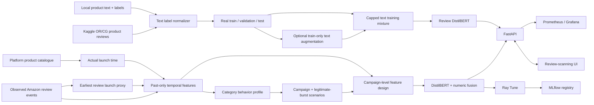

# Bot Review Campaign Detection

An ecommerce trust demo that keeps two decisions separate:

- **Review risk** classifies review text using observed product-review labels.
- **Campaign risk** looks for coordinated user, product, rating, text, and time patterns.

Neither score proves that a user is a bot. Individual review risk creates moderator
evidence only. Campaign restrictions require separate evidence and human confirmation.

## What is implemented

- Role-separated dataset bundle for text labels, observed behavior, and campaigns.
- Local and Kaggle ecommerce text-label normalization.
- Amazon Reviews 2023 temporal profiling with past-only features.
- Actual product launch times when a catalogue is supplied; otherwise a clearly marked
  earliest-review proxy.
- Amazon-profile-driven campaign and legitimate-burst scenarios.
- DistilBERT individual-review risk, a hybrid DistilBERT campaign model, and a retained
  TF-IDF comparison/fallback baseline.
- Ray Tune search, MLflow experiment lineage/registry packaging, and held-out test gate.
- Kafka replay, Spark event-time candidate windows, and an idempotent streaming scorer.
- Explainable campaign detection, FastAPI endpoints, review-scanning UI, metrics, Docker,
  Kubernetes, DVC, Ray, Spark, MLflow, Prometheus, and Grafana scaffolding.

The UI's **Scan review** path prefers `review-risk-distilbert-v1`; the small TF-IDF
model remains only a baseline and fallback. **Replay campaign** uses a separate hybrid
model that fuses DistilBERT embeddings with temporal and behavioral group features.
TensorRT export remains a later optimization.

## Compulsory project requirements

| Requirement | Implementation in this repository | Verification |
|---|---|---|
| Version control | Git history, protected-branch workflow, Conventional Commits, GitHub Actions | `git log --oneline`, `.github/workflows/ci.yml` |
| Automated orchestration | Airflow 3 DAG submits temporal ETL and sequential Ray training jobs | `orchestration/dags/bot_campaign_training.py` |
| Data engineering | Kafka transports replayable events; Spark performs event-time windows and watermarks | `streaming/producer.py`, `spark/review_stream.py` |
| Data processing | Canonicalization, missing-value defaults, duplicate rejection, feature contracts, group-safe splits, class weights | `src/bot_campaign/data.py`, `temporal.py`, `campaign_features.py` |
| Two ML models | TF-IDF/style Logistic Regression baseline and DistilBERT review model; hybrid DistilBERT campaign model | `src/bot_campaign/model.py`, `training/ray_review_train.py`, `training/ray_train.py` |
| Evaluation and tracking | PR-AUC/ROC-AUC/precision/recall/F1/Brier/log loss; Ray trials and selected runs in MLflow | MLflow at `http://localhost:5001` |
| Dataset/model versioning | DVC manifests/hashes, MLflow registered models, Git SHA and immutable image tags | `dvc.yaml`, model lineage endpoints |
| Deployment | FastAPI API/UI, Docker Compose, Kubernetes and Argo CD manifests | `Dockerfile`, `docker-compose.yml`, `k8s/`, `deploy/` |
| Monitoring | Prometheus metrics, Grafana dashboards, structured logs, drift/latency/lag alert definitions | `monitoring/`, `/metrics` |
| CI/CD | GitHub Actions quality gates, immutable GHCR images, Trivy scan, Kubernetes staging rollout | `.github/workflows/ci.yml`, `.github/workflows/cd.yml` |
| Documentation | Setup, architecture, script call graph, operations, report and demonstration sequence | `docs/`, this README |

The report-ready explanation is in [`docs/TECHNICAL_REPORT.md`](docs/TECHNICAL_REPORT.md).
Airflow setup and its ETL → Ray task sequence are in
[`orchestration/README.md`](orchestration/README.md).
The single command-by-command execution guide is
[`docs/END_TO_END_RUNBOOK.md`](docs/END_TO_END_RUNBOOK.md).
The complete technology, script-call, trigger-command, streaming, deployment, and
troubleshooting guide is [`docs/COMPLETE_PROJECT_GUIDE.md`](docs/COMPLETE_PROJECT_GUIDE.md).

## Data architecture

Text datasets and behavioral datasets deliberately have different schemas. A labelled
text row is not forced to pretend that it has a user, product, timestamp, or launch date.



## Dataset choices

| Source | Role | Label policy |
|---|---|---|
| Local `product_reviews.jsonl` | Review-text classification | Preserve `is_deceptive` |
| Mexwell Kaggle product reviews | Review-text classification | `OR=0`, `CG=1` proxy |
| Amazon Reviews 2023 | Temporal and graph baseline | Never invent fake labels |
| Learned campaign scenarios | Controlled campaign evaluation | Explicit synthetic membership |
| Platform product catalogue | Actual product launch time | Observed platform value |

Controlled scenarios cover organic traffic, legitimate launch bursts, coordinated
positive/negative attacks, paraphrased campaigns, unusual-hour bursts, slow-drip
activity, and campaigns spanning several product IDs.

Not included by default:

- Amazon 2018, because Amazon 2023 already covers the behavioral role.
- Yelp, because business-review domain shift and filter-proxy labels are unnecessary for
  the initial ecommerce baseline.
- Third-party synthetic 100K data, because the local generator is versioned and learned
  from the selected Amazon sample.
- Direct-evidence Amazon research data, because no verified public download was found.

Kaggle `CG` means computer-generated; it does not establish bot accounts or campaign
membership.

## Generated temporal dataset

For the complete source-to-output explanation, schema definitions, quality assessment,
and inspection commands, see [`data/README.md`](data/README.md).

The completed full temporal run writes:

```text
data/processed/temporal_bundle/
|-- manifest.json
|-- behavior/
|   |-- events.jsonl
|   |-- products.jsonl
|   |-- profile.json
|   `-- manifest.json
`-- campaign/
    |-- train.jsonl
    |-- validation.jsonl
    |-- test.jsonl
    `-- manifest.json
```

The independent review-text files remain under `data/processed/dataset_bundle/text/`
when that optional pipeline is built. They are not inputs to `temporal_bundle`.

### Text label schema

```text
review_id, text, label, category?, rating?, source, group_id,
label_provenance, field_provenance, synthetic, split
```

It intentionally has no `user_id`, `product_id`, `timestamp`, verification, helpful
votes, or launch time unless the source actually supplied those fields for another role.

### Timestamp-aware campaign schema

The separate campaign train, validation, and test files contain review text, UTC
timestamp, user/product IDs, launch provenance, rating, verification, past-only temporal
features, `scenario_group_id`, and the `expected_campaign` target. Complete scenario
groups remain in one split to prevent campaign leakage. Generated timestamps are bounded
to the product/category observation window, preventing future dates outside the Amazon
source period.

### Behavioral event schema

Observed Amazon fields:

```text
review_id, user_id, product_id, text, rating, timestamp,
verified_purchase, helpful_votes, category, source,
source_revision, metadata_provenance
```

Derived past-only fields:

```text
launch_time
launch_time_provenance
hours_since_launch
launch_phase
is_pre_launch_review
review_hour_utc
review_weekday_utc
is_weekend_utc
minutes_since_product_review
minutes_since_user_review
product_reviews_previous_1h
user_reviews_previous_24h
```

Amazon has no reviewer timezone, so hour-of-day is UTC. Production should derive local
hour upstream from an approved coarse timezone when available.

### Product launch policy

If the platform catalogue supplies a launch time:

```text
launch_time_provenance = catalog_actual
```

Otherwise:

```text
launch_time = earliest timestamp observed for that product
launch_time_provenance = earliest_observed_review_proxy
```

The proxy is never described as an actual launch date.

## Install

Python 3.11 is recommended.

```powershell
py -3.11 -m venv .venv
.\.venv\Scripts\Activate.ps1
python -m pip install --upgrade pip
python -m pip install -e ".[dev]"
```

Install optional Kafka support only when running the Kafka producer:

```powershell
python -m pip install -e ".[streaming]"
```

Install campaign training dependencies for DistilBERT, Ray, and MLflow:

```powershell
python -m pip install -e ".[campaign-training,streaming]"
```

## Prepare raw inputs

The labeled inputs below are needed only for the independent review-text model:

```text
data/raw/product_reviews.jsonl
```

Download the CC BY 4.0 Kaggle corpus:

```powershell
python -m pip install kaggle
kaggle datasets download -d mexwell/fake-reviews-dataset `
  -p data/raw/kaggle_fake_reviews `
  --unzip
```

The temporal build uses a restartable downloader for all 33 Amazon categories. It reads
the pinned raw JSONL directly and stops after the configured per-category limit without
caching the complete remote category:

```powershell
powershell.exe -NoProfile -ExecutionPolicy Bypass -File `
  ".\scripts\download_amazon_categories.ps1" `
  -Limit 25000
```

The public dataset provides timestamps, users, parent products, ratings, verification
and helpful votes, but no campaign labels. `Subscription_Boxes` contains only 16,216
source records, so the verified raw total is 816,216 rather than 825,000. Rows are never
duplicated to satisfy a requested limit.

## Optional product catalogue

Provide CSV, JSON, or JSONL with a product identifier and actual launch field:

```json
{"product_id":"B00EXAMPLE","launch_time":"2024-05-01T09:00:00Z"}
```

Accepted identifiers:

```text
product_id, parent_asin, asin
```

Accepted launch fields:

```text
launch_time, launched_at, release_date, created_at
```

## Build the temporal dataset

If only Amazon timestamp enrichment and controlled campaign splits are needed, skip
the independent text-classifier pipeline entirely:

```powershell
powershell.exe -NoProfile -ExecutionPolicy Bypass -File `
  ".\scripts\download_amazon_categories.ps1" `
  -Limit 25000 `
  -BuildTemporalBundle `
  -CampaignScenarioCount 0 `
  -BundleOutputDirectory "data/processed/temporal_bundle"
```

This creates `behavior/` and `campaign/` outputs without labeled-text preparation or
text augmentation. Amazon rows retain observed timestamps; campaign rows are separate
controlled examples whose timestamps are generated from the learned Amazon profiles.
`0` makes the controlled scenario count match the actual observed total. The pinned
`Subscription_Boxes` source has only 16,216 reviews, so the 33-category total is
816,216 rather than duplicating records to force 825,000.

The completed manifests report:

```text
Raw rows:                   816,216
Rejected invalid rows:       2,834
Duplicate review IDs:        1,088
Valid observed events:     812,294
Controlled scenario rows:  816,216
Campaign train:            571,315
Campaign validation:       122,406
Campaign test:             122,495
```

Inspect the current temporal outputs:

```powershell
Get-Content data/processed/temporal_bundle/manifest.json
Get-Content data/processed/temporal_bundle/behavior/manifest.json
Get-Content data/processed/temporal_bundle/campaign/manifest.json
```

### Optional complete text and temporal smoke build

Smoke build using the current Amazon sample:

```powershell
python -m bot_campaign.cli build-dataset-bundle `
  --labeled-input data/raw/product_reviews.jsonl data/raw/kaggle_fake_reviews `
  --behavioral-input data/raw/amazon_all_beauty_sample.jsonl `
  --output-dir data/processed/dataset_bundle `
  --augmentation-count 7000 `
  --campaign-scenario-count 2000 `
  --max-synthetic-fraction 0.25 `
  --seed 42
```

With real platform launch data, add:

```powershell
--product-catalog data/raw/product_catalog.jsonl
```

Inspect the optional smoke-build manifest:

```powershell
Get-Content data/processed/dataset_bundle/manifest.json
```

Inspect its learned temporal distributions:

```powershell
Get-Content data/processed/dataset_bundle/behavior/profile.json
```

Inspect five derived behavioral events:

```powershell
Get-Content data/processed/dataset_bundle/behavior/events.jsonl -TotalCount 5 |
    ForEach-Object { $_ | ConvertFrom-Json } |
    Format-List
```

Inspect five timestamp-aware campaign training events:

```powershell
Get-Content data/processed/dataset_bundle/campaign/train.jsonl -TotalCount 5 |
    ForEach-Object { $_ | ConvertFrom-Json } |
    Format-List
```

## Train the independent review-text model

This command retains the TF-IDF regression baseline. It is useful for measuring whether
DistilBERT adds value and as a lightweight fallback, but it is not the promoted path:

```powershell
python -m bot_campaign.cli train `
  --data data/processed/dataset_bundle/text/training.jsonl `
  --test-data data/processed/dataset_bundle/text/real/test.jsonl `
  --baseline-data data/processed/dataset_bundle/text/real/train.jsonl `
  --min-pr-auc-lift 0.05 `
  --output artifacts/review_model.joblib
```

The augmented candidate must improve real-only test PR-AUC by at least 5% before it is
promoted. Both candidate and baseline metrics are written to:

```text
reports/generated/baseline_metrics.json
```

Train and tune the promoted individual-review DistilBERT with Ray and MLflow:

```powershell
docker compose up -d mlflow
python training/ray_review_train.py --smoke --gpus-per-trial 0
```

The trainer rejects exact normalized-text overlap across train/validation/test, keeps
synthetic reviews in training only, tunes against real validation data, and evaluates
the chosen trial once on real test data. The output is
`artifacts/review_distilbert/`. Full GPU commands and UI verification are in
[`docs/TRAIN_MODEL_AND_UI.md`](docs/TRAIN_MODEL_AND_UI.md).

## Train the hybrid campaign model

The campaign trainer aggregates each complete `scenario_group_id` into one example.
DistilBERT encodes up to eight reviews per group; the numeric branch receives burst,
inter-arrival, rating, verification, launch, UTC-hour, weekend, and recent-activity
features. Labels, scenario names, IDs, and provenance strings are not model inputs.

First run a small end-to-end CPU smoke test. MLflow must be listening on port 5001:

```powershell
docker compose up -d mlflow
python training/ray_train.py --smoke --gpus-per-trial 0
```

This downloads `distilbert-base-uncased` once, starts a local Ray runtime, trains on a
small group-safe subset, evaluates validation/test subsets, writes the selected bundle
to `artifacts/campaign_model`, logs all trial metrics, and registers the selected MLflow
PyFunc model. Inspect it at `http://localhost:5001`.

After the smoke run passes, use the complete splits on a CUDA machine:

```powershell
python training/ray_train.py `
  --train-data data/processed/temporal_bundle/campaign_v3/train.jsonl `
  --validation-data data/processed/temporal_bundle/campaign_v3/validation.jsonl `
  --test-data data/processed/temporal_bundle/campaign_v3/test.jsonl `
  --num-samples 12 `
  --epochs 4 `
  --cpus-per-trial 4 `
  --gpus-per-trial 1
```

Validation selects the decision threshold needed to meet the requested precision. The
test split is evaluated once after Ray chooses a trial. Do not promote the MLflow model
until campaign recall and legitimate-burst false-positive gates also pass.

## Schedule the pipeline with Airflow

Airflow is the outer scheduler; Ray Tune remains the inner hyperparameter scheduler.
Mount `orchestration/dags` into the Airflow 3 scheduler/worker and configure the Ray Jobs
and input variables described in [`orchestration/README.md`](orchestration/README.md).
The DAG runs:

```text
temporal ETL + campaign split generation
  -> review DistilBERT Ray job
  -> campaign hybrid Ray job
```

Each training output is written under `artifacts/candidates/`. The DAG never silently
promotes a model or changes the API mount. An approved MLflow version is promoted by a
reviewed deployment-manifest commit.

## Stream reviews through the campaign model

```powershell
# Infrastructure and event-time feature windows
docker compose up -d kafka spark-master spark-worker
docker compose --profile stream up -d spark-stream

# Scorer (requires artifacts/campaign_model from training)
docker compose --profile score up -d campaign-scorer

# Replay controlled held-out events; use --rate 0 only for load testing
python streaming/producer.py `
  --input data/processed/temporal_bundle/campaign_v3/test.jsonl `
  --bootstrap-servers localhost:9092 `
  --rate 100

# Inspect scored campaign windows
docker compose exec kafka /opt/kafka/bin/kafka-console-consumer.sh `
  --bootstrap-server kafka:29092 `
  --topic reviews.campaign-scores.v1 `
  --from-beginning `
  --max-messages 5
```

The topic sequence is `reviews.raw.v1` → `reviews.analysis-windows.v1` →
`reviews.campaign-scores.v1`. Spark uses a two-hour watermark and one-hour windows
sliding every ten minutes. Product, account, and semantic-token routes allow the
DistilBERT graph to join coordinated reviews across products and categories. The scorer commits a Kafka offset only
after its output is delivered. A campaign score is evidence for moderation; it is not
automatic proof.

## Run the API and UI

```powershell
python -m uvicorn bot_campaign.api:app --reload
```

Open:

- UI: `http://127.0.0.1:8000`
- API documentation: `http://127.0.0.1:8000/docs`
- Readiness: `http://127.0.0.1:8000/health/ready`
- Prometheus metrics: `http://127.0.0.1:8000/metrics`

The API serves the UI itself. Ports 3000 and 5001 are Grafana and MLflow only when those
services are started; they are not alternate UI ports.

## Test

```powershell
python -m ruff check src tests
python -m pytest -q -p no:cacheprovider -p no:tmpdir
```

Focused data tests:

```powershell
python -m pytest tests/test_labeled_datasets.py tests/test_temporal.py -v `
  -p no:cacheprovider -p no:tmpdir
```

## Reproduce the optional text-model DVC stages

```powershell
python -m pip install -e ".[mlops]"
dvc repro build_dataset_bundle
dvc repro train_product_model
```

Raw datasets and generated outputs remain ignored by Git. Commit source, tests, DVC
metadata, and manifests stored through DVC--not raw archives or model binaries.

## Main script relationships

| File | Responsibility |
|---|---|
| `src/bot_campaign/data.py` | Explicit text-label and review-event loaders |
| `src/bot_campaign/labeled_datasets.py` | Ecommerce label normalization and leakage-safe splits |
| `scripts/download_amazon_categories.ps1` | Restartable 33-category download, verification, and temporal build |
| `src/bot_campaign/amazon.py` | Direct bounded HTTP JSONL download, source revision, and canonical mapping |
| `src/bot_campaign/temporal.py` | Launch provenance, past-only temporal features, profiles, scenarios |
| `src/bot_campaign/dataset_bundle.py` | Separate temporal-only and complete-bundle orchestrators |
| `src/bot_campaign/synthetic.py` | Deterministic, train-only text augmentation |
| `src/bot_campaign/model.py` | Review-text model training, evaluation, and inference |
| `src/bot_campaign/review_transformer.py` | Promoted review DistilBERT bundle, leakage checks, and inference |
| `src/bot_campaign/campaign.py` | Review coordination graph and campaign evidence |
| `src/bot_campaign/campaign_features.py` | Shared batch/stream group feature contract |
| `src/bot_campaign/hybrid_model.py` | DistilBERT and temporal-feature fusion, bundle, MLflow wrapper |
| `src/bot_campaign/cli.py` | Command-line entry point |
| `src/bot_campaign/api.py` | FastAPI application and static UI |
| `streaming/producer.py` | Canonical event replay to Kafka |
| `spark/review_stream.py` | Cross-product product/account/semantic routing windows |
| `src/bot_campaign/campaign_graph.py` | DistilBERT/account/burst graph connected components |
| `streaming/campaign_scorer.py` | Graph discovery, hybrid scoring and safe offset commits |
| `training/ray_train.py` | Ray Tune training, held-out evaluation, MLflow tracking/registry |
| `training/ray_review_train.py` | Ray Tune and MLflow training for individual-review DistilBERT |

## Deployment

Local services:

```powershell
docker compose up -d api prometheus grafana
docker compose ps
```

Full streaming/training services:

```powershell
docker compose up -d kafka spark-master spark-worker mlflow ray-head ray-worker
docker compose --profile stream up -d spark-stream
```

Operational and rollback instructions are in
[`docs/OPERATIONS.md`](docs/OPERATIONS.md). Distributed pipeline details are in
[`docs/DISTRIBUTED_PIPELINE.md`](docs/DISTRIBUTED_PIPELINE.md). The exact ETL-to-model
script call graph is in [`docs/ETL_STREAMING_MODEL.md`](docs/ETL_STREAMING_MODEL.md).
Exact leakage-safe training and UI verification commands are in
[`docs/TRAIN_MODEL_AND_UI.md`](docs/TRAIN_MODEL_AND_UI.md).
The beginner-friendly, function-by-function source map and current regeneration decision
are in [`docs/SCRIPT_FUNCTION_REFERENCE.md`](docs/SCRIPT_FUNCTION_REFERENCE.md).
Monitoring dashboards, alert thresholds, CI checks, CD releases, secrets, and rollback
procedures are in [`docs/MONITORING_AND_CICD.md`](docs/MONITORING_AND_CICD.md).
The complete Git and DVC command reference is in
[`docs/GIT_AND_DVC_COMMANDS.md`](docs/GIT_AND_DVC_COMMANDS.md).

## CI/CD workflow

Pull requests run [`.github/workflows/ci.yml`](.github/workflows/ci.yml). It installs the
project, runs smoke training, compiles the Airflow DAGs, checks lint, runs tests, builds
the Docker image, and blocks high/critical Trivy findings.

Pushing a semantic version tag such as `v1.1.0` starts
[`.github/workflows/cd.yml`](.github/workflows/cd.yml). It publishes an immutable
Git-SHA image, scans it, renders `k8s/base.yaml`, deploys to the protected `staging`
environment, waits for rollout, and calls `/health/ready` inside the cluster.

Configure the GitHub `staging` environment with a base64-encoded `KUBE_CONFIG_DATA`
secret before enabling deployment. Argo CD can watch `k8s/` and reconcile the same
immutable image. The public UI cannot trigger deployments.

```powershell
git switch -c feat/my-change
git add src web tests
git commit -m "feat(api): describe the change"
git push -u origin feat/my-change
gh pr create --fill

git switch main
git pull --ff-only
git tag -a v1.1.0 -m "Bot campaign detection v1.1.0"
git push origin v1.1.0
```

## Git workflow

```powershell
git status
git diff --cached
git commit -m "data: build role-separated temporal review dataset"
git push origin feature/njc
```

Do not commit directly to `main`, raw data, credentials, generated model binaries, or
local service volumes.
