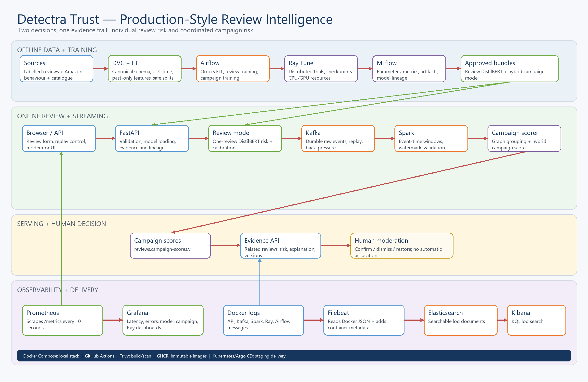
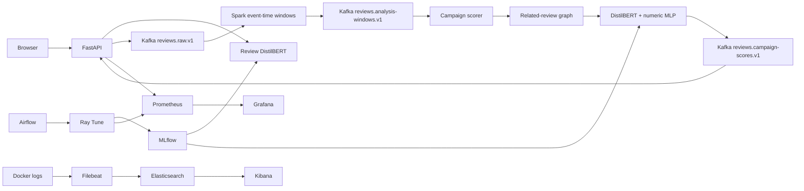

# Detectra — Bot Review Campaign Detection

Detectra is an ecommerce trust system that keeps two decisions separate:

- **Review risk** estimates whether one review should be inspected by a moderator.
- **Campaign risk** finds groups of reviews that may be coordinated across users,
  products, ratings, language and time.

Neither score proves that a person or account is a bot. The system returns evidence for
human review; it does not automatically delete reviews or ban users.

## Submission information

Complete the missing team values before final submission.

| Field | Value |
|---|---|
| Course | DA5402W — MLOps |
| Repository name | `DA5402W_project_28_DA25M558_DA25M584_DA25M572` |
| Evaluation branch | `main` |
| Team ID | 28 |
| Team members and roll numbers | Chathura N J (DA25M558), Likitha (DA25M584),Karthik(DA25M572) |
| GitHub evaluator | `mlopslabsubmission-2026` |
| Final report | `reports/Detectra_Report.pdf` |

### Start here

- For the complete operational runbook, continue through this README.
- For the dataset preparation story explained from the beginning in simple language,
  read [`data/BEGINNER_PROJECT_GUIDE.md`](data/BEGINNER_PROJECT_GUIDE.md). This is the
  canonical replacement for the former `DATASET_PREP_EXPLAINED.md`; there is no separate
  `DATASET_PREP_GUIDE.md` because duplicate guides become inconsistent.
- For Kubernetes-only commands and resource details, read
  [`k8s/README.md`](k8s/README.md).

## What is implemented

- Leakage-safe text and temporal dataset preparation with source provenance.
- TF-IDF/logistic-regression baseline and DistilBERT individual-review model.
- Hybrid campaign model combining DistilBERT embeddings and 15 behavioral features.
- Ray Tune hyperparameter search with ASHA early stopping and GPU scheduling.
- MLflow experiment tracking, artifacts and registered model versions.
- Airflow ETL → review training → campaign training orchestration.
- Kafka event transport and Spark Structured Streaming event-time windows.
- Graph-based related-review discovery and idempotent campaign scoring.
- FastAPI backend and responsive HTML/CSS/JavaScript moderation UI.
- DVC dataset versioning and Git LFS model artifact storage.
- Prometheus/Grafana metrics and Filebeat/Elasticsearch/Kibana log search.
- Docker Compose, Kubernetes/Kustomize and GitHub Actions CI/CD.

## Architecture





Kafka topics are asynchronous boundaries: the producer does not directly call Spark,
and Spark does not directly call the scorer. Airflow schedules work, Ray performs
training, and MLflow records experiments. The browser talks only to FastAPI.

## Technology stack

| Area | Technology | Responsibility |
|---|---|---|
| Frontend | HTML, CSS, JavaScript | Review scanner, campaign evidence and operations views |
| Backend | Python, FastAPI, Uvicorn | Validation, inference, APIs, static UI and metrics |
| Models | PyTorch, Transformers, DistilBERT, scikit-learn | Review and campaign models plus baseline |
| Training | Ray Tune, ASHA | Trials, early stopping and GPU/CPU scheduling |
| Tracking | MLflow | Parameters, metrics, artifacts and model versions |
| Orchestration | Airflow 3, PostgreSQL | Ordered DAGs and durable task metadata |
| Streaming | Kafka, Spark Structured Streaming | Events, watermarks, windows and routing |
| Data versioning | DVC | Dataset and reproducible-pipeline versions |
| Artifact versioning | Git LFS | Promoted model binaries |
| Monitoring | Prometheus, Grafana | Metrics and dashboards |
| Logging | Filebeat, Elasticsearch, Kibana | Log shipping, indexing and KQL search |
| Packaging | Docker, Docker Compose | Reproducible local services |
| Deployment | Kubernetes, Kustomize | Production-style workloads and overlays |
| CI/CD | GitHub Actions, Trivy, GHCR | Tests, scans, images and staging rollout |

## Repository layout

| Path | Responsibility |
|---|---|
| `src/bot_campaign/` | Schemas, data logic, models, inference, API and routes |
| `web/` | Static frontend served by FastAPI |
| `training/` | Ray Tune review and campaign training entrypoints |
| `streaming/` | Kafka producer and campaign-scoring consumer |
| `spark/` | Structured Streaming job |
| `orchestration/` | Airflow DAGs and local Airflow Compose stack |
| `monitoring/` | Prometheus, Grafana, Filebeat and alerts |
| `k8s/` | Kubernetes base, jobs and overlays |
| `docker/` | Ray/training and Airflow images |
| `scripts/` | PowerShell launch, data, report and deployment helpers |
| `data/` | DVC metadata, sources and prepared bundles |
| `artifacts/` | Promoted models, candidates and Ray results |
| `tests/` | Unit, API, pipeline and browser tests |
| `.github/workflows/` | CI and CD workflows |
| `docs/` and `reports/` | Technical references and submission deliverables |

## Prerequisites and installation

- Git and Git LFS.
- Python 3.11 or 3.12.
- Docker Desktop using the Linux/WSL2 engine.
- At least 12–16 GB RAM assigned to Docker for full DistilBERT training.
- NVIDIA drivers and Docker GPU support for GPU mode.
- `kubectl` and Kubernetes 1.27+ only for Kubernetes deployment.

```powershell
Set-Location "C:\Users\njcha\Desktop\My Files\IITM\SEM3\MLOPS\Bot_Campaign_Project"
git lfs install
git lfs pull
python --version
docker version
docker compose version

python -m venv .venv
Set-ExecutionPolicy -Scope Process -ExecutionPolicy Bypass
.\.venv\Scripts\Activate.ps1
python -m pip install --upgrade pip
python -m pip install -e ".[dev,mlops,streaming,nlp,distributed,ui]"
```

Restore data from the configured team DVC remote:

```powershell
python -m dvc remote list
python -m dvc pull
python -m dvc status
```

The checked-in local DVC remote is machine-specific. A new machine must configure the
team's shared remote before `dvc pull`. Never commit storage credentials.

## Quick start

CPU stack:

```powershell
.\scripts\start_detectra.ps1 -Observability -Build
.\scripts\start_airflow.ps1
```

NVIDIA GPU stack:

```powershell
.\scripts\start_detectra.ps1 -Gpu -Observability -Build
.\scripts\start_airflow.ps1 -Gpu
```

Omit `-Build` during ordinary restarts. GPU access is assigned only to `ray-worker`, so
Ray does not advertise one physical GPU twice.

Verify startup:

```powershell
docker compose --profile stream --profile observability ps
docker compose -f orchestration/docker-compose.airflow.yml ps
Invoke-RestMethod http://localhost:8000/health/live
Invoke-RestMethod http://localhost:8000/health/ready
Invoke-WebRequest http://localhost:8084 -UseBasicParsing
docker compose exec ray-head ray status --address=127.0.0.1:6379
```

For GPU mode:

```powershell
docker compose -f docker-compose.yml -f docker-compose.gpu.yml `
  exec ray-worker nvidia-smi
```

`0.0/1.0 GPU` means Ray sees one free GPU. A running GPU trial normally shows
`1.0/1.0 GPU`.

## Local service directory

| Service | URL | Expected result |
|---|---|---|
| Detectra | `http://localhost:8000` | Review and campaign UI |
| OpenAPI | `http://localhost:8000/docs` | Interactive API documentation |
| Readiness | `http://localhost:8000/health/ready` | Model and dependency status |
| Metrics | `http://localhost:8000/metrics` | Prometheus exposition |
| Spark master | `http://localhost:8082` | Streaming application |
| Spark worker | `http://localhost:8083` | Executor and resource state |
| Ray | `http://localhost:8265` | Jobs, nodes, logs and resources |
| MLflow | `http://localhost:5001` | Experiments and models |
| Prometheus | `http://localhost:9090/targets` | Scrape targets marked `UP` |
| Grafana | `http://localhost:3000` | Provisioned dashboards |
| Elasticsearch | `http://localhost:9200/_cluster/health` | Cluster health JSON |
| Kibana | `http://localhost:5601` | `filebeat-*` log discovery |
| Airflow | `http://localhost:8084` | DAG list and runs |

Local Grafana and Airflow credentials are `admin` / `admin`. Replace them before
exposing either service beyond the local machine.

## PowerShell launcher reference

| Script | Purpose | Example |
|---|---|---|
| `scripts/start_detectra.ps1` | Start app, stream, training and monitoring services | `.\scripts\start_detectra.ps1 -Gpu -Observability -Build` |
| `scripts/start_airflow.ps1` | Initialize PostgreSQL and start Airflow | `.\scripts\start_airflow.ps1 -Gpu` |
| `scripts/deploy_kubernetes.ps1` | Apply Kubernetes and pin GHCR images | `.\scripts\deploy_kubernetes.ps1 -ImageTag <GIT_SHA> -Gpu` |
| `scripts/download_amazon_categories.ps1` | Download Amazon data and build one bundle | `.\scripts\download_amazon_categories.ps1 -Limit 25000 -BuildTemporalBundle -CampaignScenarioCount 2000 -Seed 42` |

Use either `-BuildTemporalBundle` or `-BuildBundle`, never both. Do not redownload data
when DVC reports that the pipeline is current.

## Docker Compose runbook

Start individual services:

```powershell
# Kafka and topics
docker compose up -d kafka kafka-init

# Spark and continuous scorer
docker compose up -d spark-master spark-worker
docker compose --profile stream up -d spark-stream campaign-scorer

# API, experiments and metrics
docker compose up -d api mlflow prometheus grafana

# Searchable logs
docker compose --profile observability up -d elasticsearch kibana filebeat

# Ray CPU
docker compose up -d ray-head ray-worker

# Ray GPU recreation
docker compose -f docker-compose.yml -f docker-compose.gpu.yml `
  up -d --force-recreate ray-head ray-worker
```

Inspect and restart:

```powershell
docker compose --profile stream --profile observability ps -a
docker compose logs --tail 200 api
docker compose logs --tail 200 spark-stream campaign-scorer
docker compose logs --tail 200 ray-head ray-worker
docker compose logs -f campaign-scorer
docker compose restart api
docker compose --profile stream restart spark-stream campaign-scorer
```

Stop without deleting persistent data:

```powershell
docker compose --profile stream --profile observability stop
docker compose -f orchestration/docker-compose.airflow.yml stop
```

Remove containers and networks while preserving named volumes:

```powershell
docker compose --profile stream --profile observability down
docker compose -f orchestration/docker-compose.airflow.yml down
```

Do not add `--volumes` during routine cleanup. Named volumes contain MLflow,
Prometheus, Grafana, Elasticsearch, Filebeat and Airflow PostgreSQL state.

## Kafka and Spark end-to-end run

```text
streaming/producer.py
  -> reviews.raw.v1
  -> spark/review_stream.py
  -> reviews.analysis-windows.v1
  -> streaming/campaign_scorer.py
  -> reviews.campaign-scores.v1
  -> FastAPI/UI
```

List topics and publish held-out events:

```powershell
docker compose exec kafka `
  /opt/kafka/bin/kafka-topics.sh --bootstrap-server kafka:29092 --list

docker compose exec campaign-scorer python streaming/producer.py `
  --input data/processed/temporal_bundle/campaign_v3/test.jsonl `
  --bootstrap-servers kafka:29092 `
  --rate 10
```

Inspect each hand-off:

```powershell
docker compose exec kafka `
  /opt/kafka/bin/kafka-console-consumer.sh --bootstrap-server kafka:29092 `
  --topic reviews.raw.v1 --from-beginning --max-messages 5

docker compose exec kafka `
  /opt/kafka/bin/kafka-console-consumer.sh --bootstrap-server kafka:29092 `
  --topic reviews.analysis-windows.v1 --from-beginning --max-messages 5

docker compose exec kafka `
  /opt/kafka/bin/kafka-console-consumer.sh --bootstrap-server kafka:29092 `
  --topic reviews.campaign-scores.v1 --from-beginning --max-messages 5
```

Containers use `kafka:29092`; programs running on Windows use `localhost:9092`.

## API usage

```powershell
$review = @{
  review_id = "runbook-review-001"
  user_id = "runbook-user-001"
  product_id = "demo-smartwatch"
  text = "The product is excellent and works exactly as expected."
  rating = 5
  timestamp = (Get-Date).ToUniversalTime().ToString("o")
  verified_purchase = $false
  helpful_votes = 0
  language = "en"
} | ConvertTo-Json

Invoke-RestMethod -Method Post `
  -Uri http://localhost:8000/v1/reviews/score `
  -ContentType "application/json" `
  -Body $review

Invoke-RestMethod http://localhost:8000/v1/reviews/recent
Invoke-RestMethod http://localhost:8000/v1/campaigns
Invoke-RestMethod http://localhost:8000/v1/ops/summary
```

| Method | Endpoint | Purpose |
|---|---|---|
| `POST` | `/v1/reviews/score` | Score one review |
| `POST` | `/v1/reviews/batch-score` | Score up to 500 reviews |
| `GET` | `/v1/reviews/recent` | Recent scored reviews |
| `GET` | `/v1/campaigns` | Campaign candidates |
| `POST` | `/v1/campaigns/{id}/decision` | Confirm, dismiss or restore |
| `POST` | `/v1/demo/replay` | Start a controlled replay |
| `GET` | `/v1/ops/summary` | Deployment/service summary |
| `GET` | `/health/live` | Process liveness |
| `GET` | `/health/ready` | Model/dependency readiness |
| `GET` | `/metrics` | Prometheus metrics |

## Airflow, Ray and MLflow training

```text
submit_temporal_etl -> wait_for_temporal_etl
                    -> submit_review_training -> wait_for_review_training
                    -> submit_campaign_training -> wait_for_campaign_training
```

Airflow submits jobs; Ray Tune performs trials; MLflow records results. Training scripts
default to 12 trials, a maximum of 3 epochs and ASHA early stopping. Weak trials may
stop before epoch 20. GPU mode requests one GPU and one concurrent trial.

```powershell
docker compose -f orchestration/docker-compose.airflow.yml exec airflow-api-server `
  airflow dags list

docker compose -f orchestration/docker-compose.airflow.yml exec airflow-api-server `
  airflow dags trigger bot_campaign_model_retraining

docker compose -f orchestration/docker-compose.airflow.yml exec airflow-api-server `
  airflow dags trigger bot_campaign_streaming_smoke
```

Monitor Ray:

```powershell
docker compose exec ray-head ray job list --address=http://127.0.0.1:8265
docker compose exec ray-head ray status --address=127.0.0.1:6379
```

`Up for Reschedule` is normal sensor behavior. A second run remains queued while one is
active because `max_active_runs=1`. To stop a workflow, mark the DAG run **Failed** in
Airflow, then stop any remaining Ray submission:

```powershell
docker compose exec ray-head ray job stop <RAY_SUBMISSION_ID> `
  --address=http://127.0.0.1:8265
```

Candidate outputs go under `artifacts/candidates/`; training does not silently replace
the model bundles mounted by the serving API.

## Data and model versioning

```powershell
python -m dvc status
python -m dvc dag
python -m dvc repro
python -m dvc push
git lfs ls-files
```

- Git tracks code, tests, manifests, `dvc.yaml` and `dvc.lock`.
- DVC tracks datasets and reproducible pipeline outputs.
- Git LFS stores promoted model binaries while Git stores their pointers.
- MLflow tracks experiments and model versions.

## Kubernetes runbook

Preflight and render without changing the cluster:

```powershell
kubectl config current-context
kubectl cluster-info
kubectl get nodes
kubectl get storageclass
kubectl kustomize k8s
kubectl kustomize k8s/overlays/gpu
kubectl kustomize k8s/overlays/observability
kubectl kustomize k8s/overlays/full
kubectl kustomize k8s/overlays/full-gpu
kubectl kustomize k8s/jobs
```

Deployment choices:

```powershell
# Core CPU
kubectl apply -k k8s

# Core GPU
kubectl apply -k k8s/overlays/gpu

# Core plus Elasticsearch, Filebeat and Kibana
kubectl apply -k k8s/overlays/observability
```

Full overlays include Airflow. Copy
`k8s/secrets/airflow-secrets.example.yaml` to an ignored `*.local.yaml` file, replace
every placeholder, and apply the private Secret first:

```powershell
kubectl apply -f k8s/base/namespace.yaml
Copy-Item k8s/secrets/airflow-secrets.example.yaml `
  k8s/secrets/airflow-secrets.local.yaml
code k8s/secrets/airflow-secrets.local.yaml
kubectl apply -f k8s/secrets/airflow-secrets.local.yaml
kubectl apply -k k8s/overlays/full
kubectl apply -k k8s/overlays/full-gpu
```

Core DVC/Grafana credentials and optional private-GHCR authentication use
`k8s/secrets/core-secrets.example.yaml` and
`k8s/secrets/ghcr-pull-secret.example.yaml`. Example files contain placeholders only;
populated `k8s/secrets/*.local.yaml` files are ignored and must never be committed.

Deploy immutable GHCR images:

```powershell
$sha = "REPLACE_WITH_PUBLISHED_GIT_SHA"
.\scripts\deploy_kubernetes.ps1 -ImageTag $sha
.\scripts\deploy_kubernetes.ps1 -ImageTag $sha -Gpu
```

```text
ghcr.io/njchathura-boop/bot-review-campaign-api:<git-sha>
ghcr.io/njchathura-boop/bot-review-campaign-jobs:<git-sha>
```

Inspect and port-forward:

```powershell
kubectl -n bot-campaign get pods -w
kubectl -n bot-campaign get deployments,services,statefulsets,jobs,cronjobs,pvc
kubectl -n bot-campaign get events --sort-by=.lastTimestamp
kubectl -n bot-campaign logs deployment/detectra-api --tail=200
kubectl -n bot-campaign logs deployment/detectra-ray --tail=200

# Run each port-forward in its own PowerShell window
kubectl -n bot-campaign port-forward service/detectra-api 8000:8000
kubectl -n bot-campaign port-forward service/detectra-ray 8265:8265
kubectl -n bot-campaign port-forward service/detectra-mlflow 5001:5000
kubectl -n bot-campaign port-forward service/detectra-prometheus 9090:9090
kubectl -n bot-campaign port-forward service/detectra-grafana 3000:3000
kubectl -n bot-campaign port-forward service/detectra-kibana 5601:5601
kubectl -n bot-campaign port-forward service/detectra-airflow-api 8084:8080
```

ETL, training and rollout:

```powershell
$etlJob = "detectra-etl-$(Get-Date -Format yyyyMMddHHmmss)"
kubectl -n bot-campaign create job $etlJob --from=cronjob/detectra-etl
kubectl -n bot-campaign logs -f "job/$etlJob"

kubectl delete job detectra-review-training -n bot-campaign --ignore-not-found
kubectl apply -k k8s/jobs
kubectl -n bot-campaign logs -f job/detectra-review-training

kubectl -n bot-campaign rollout status deployment/detectra-api --timeout=600s
kubectl -n bot-campaign rollout restart deployment/detectra-api
kubectl -n bot-campaign rollout history deployment/detectra-api
kubectl -n bot-campaign rollout undo deployment/detectra-api
```

The Kubernetes review Job requests 20 trials, up to 3 epochs, one concurrent trial and
ASHA early stopping.

Remove an overlay only after inspecting persistent volumes:

```powershell
kubectl delete -k k8s/overlays/full-gpu
kubectl -n bot-campaign get pvc
```

## Testing

```powershell
python -m compileall -q src training streaming spark orchestration/dags
ruff check src tests training streaming spark scripts
pytest -q -p no:cacheprovider
docker compose config --quiet
docker compose -f orchestration/docker-compose.airflow.yml config --quiet
kubectl kustomize k8s | Out-Null
kubectl kustomize k8s/overlays/full | Out-Null
kubectl kustomize k8s/overlays/full-gpu | Out-Null
```

## CI/CD

### Deployment lifecycle in one picture

```text
Developer changes code, data metadata or promoted model pointers
                              |
                              v
                     Git commit and push
                              |
             +----------------+----------------+
             |                                 |
             v                                 v
       GitHub Actions CI                 Version tag v* or
  syntax + tests + image scan             manual CD trigger
             |                                 |
             v                                 v
       Build is accepted             Build three Docker images
                                               |
                                               v
                                  Push immutable Git-SHA images
                                             to GHCR
                                               |
                                               v
                                   Render and apply Kubernetes
                                               |
                                               v
                                  Wait for workload readiness
                                               |
                                               v
                                Run an in-cluster smoke-test pod
```

Git versions source and configuration, Git LFS materializes the promoted large model
binaries, and DVC identifies reproducible dataset/pipeline versions. DVC does not deploy
or trigger Airflow by itself: a person, CI job or scheduled workflow must execute the DVC
and Airflow operations.

### What triggers CI

Pull requests, pushes to `main`, and `v*` tags run
`.github/workflows/ci.yml`. CI performs:

1. Git LFS materialization and promoted-model bundle validation.
2. Python 3.11 dependency installation and a small model-backed smoke training run.
3. `python -m compileall -q orchestration/dags` for the Airflow DAG source.
4. Ruff static checks and Pytest tests.
5. A Docker API/UI image build.
6. Trivy vulnerability scanning and project policy enforcement.

`compileall` asks whether Python can convert every DAG source file to bytecode. It catches
syntax errors such as a missing colon or bracket without executing an expensive training
workflow. It does **not** prove that Ray, PostgreSQL or an external endpoint is reachable.
An additional runtime check such as `airflow dags list-import-errors` inside the Airflow
image is stronger because it asks Airflow to import the DAG with its real dependencies.

Trivy inspects the final container's operating-system packages and language dependencies
for published HIGH or CRITICAL vulnerabilities. The repository then runs
`scripts/enforce_trivy.py` against Trivy's JSON result. This is software-composition
analysis of known vulnerabilities; it is not proof that the application has no unknown
security flaws.

### What triggers CD

A `v*` tag or manual `workflow_dispatch` runs `.github/workflows/cd.yml`. It builds,
scans and publishes three images:

| Image | Purpose |
|---|---|
| `ghcr.io/njchathura-boop/bot-review-campaign-api:<git-sha>` | FastAPI, UI and promoted models |
| `ghcr.io/njchathura-boop/bot-review-campaign-jobs:<git-sha>` | DVC, ETL and Ray training |
| `ghcr.io/njchathura-boop/bot-review-campaign-airflow:<git-sha>` | Airflow and project DAGs |

The Git SHA is immutable and connects the running container to one exact source revision.
`latest` is convenient for local work but is not a reliable audit or rollback identity.

The `deploy-staging` job runs only after image publishing succeeds. It requires the
GitHub `staging` environment and the `KUBE_CONFIG_DATA` secret containing a base64-encoded
kubeconfig for a cluster reachable from the GitHub runner. A GitHub-hosted runner cannot
normally reach a private Docker Desktop cluster on a laptop; use a reachable staging
cluster or a deliberately configured self-hosted runner.

### What staging CD currently deploys

The committed staging workflow currently renders `k8s/base`. It deploys and verifies the
API, Ray, MLflow, Prometheus and Grafana. It publishes the Airflow image but does not
deploy Airflow, Elasticsearch, Kibana or Filebeat in this base-profile staging job.

That is an important scope statement for a viva: the full resources exist in Kustomize
overlays, while the automated staging job presently validates the smaller base profile.
If staging is intended to represent the entire platform, change CD to render
`k8s/overlays/full`. Use `k8s/overlays/full-gpu` only for a cluster with an NVIDIA GPU,
compatible container runtime and NVIDIA Kubernetes device plugin; otherwise the
GPU-requesting Ray pod remains Pending.

| Kustomize target | Adds |
|---|---|
| `k8s/base` | API, Ray, MLflow, Prometheus, Grafana, storage and suspended ETL CronJob |
| `k8s/overlays/observability` | Elasticsearch, Kibana and Filebeat |
| `k8s/overlays/full` | Observability plus Airflow and PostgreSQL |
| `k8s/overlays/full-gpu` | Full platform plus Ray/Airflow GPU configuration |

Kafka, Spark and the continuous campaign scorer remain part of the Docker Compose
streaming proof of concept; the current Kubernetes manifests do not deploy them. A future
full streaming deployment should add managed Kafka/Spark or operator-managed equivalents.

### Deployment, DaemonSet, StatefulSet and Job

| Controller | Question it answers | Detectra example |
|---|---|---|
| Deployment | How many replaceable application replicas should be running? | API, Ray, MLflow, Grafana, Kibana |
| DaemonSet | Should one agent run on every eligible node? | Filebeat reads each node's container logs |
| StatefulSet | Which stateful pods need stable identity and storage? | Elasticsearch and Airflow PostgreSQL |
| Job | Which finite task must run to completion? | Airflow migration, Kibana setup, training submission |
| CronJob | When should a new Job be created? | Weekly ETL, committed with `suspend: true` |

A Deployment with three replicas creates three pods anywhere suitable. A DaemonSet on a
five-node cluster normally creates five pods, one per eligible node. Filebeat is a
DaemonSet because logs exist on every node, whereas FastAPI is a Deployment because it
needs a chosen replica count rather than one copy per node.

### How CD waits for Kubernetes

`kubectl apply` only confirms that Kubernetes accepted the desired state; it does not
mean the application has loaded its image and model. CD therefore executes commands such
as:

```bash
kubectl -n bot-campaign rollout status deployment/detectra-api --timeout=600s
kubectl -n bot-campaign rollout status deployment/detectra-ray --timeout=600s
kubectl -n bot-campaign rollout status deployment/detectra-mlflow --timeout=300s
kubectl -n bot-campaign rollout status deployment/detectra-prometheus --timeout=300s
kubectl -n bot-campaign rollout status deployment/detectra-grafana --timeout=300s
```

Kubernetes creates the replacement pod, pulls the image, starts the process and evaluates
its readiness probe. `rollout status` succeeds only when the new Deployment revision is
available, or fails after the timeout. API and Ray receive longer timeouts because their
images and model/runtime initialization are heavier.

For a future `full` CD deployment, also wait for Airflow API/scheduler/DAG processor,
Kibana, the Filebeat DaemonSet, the Elasticsearch and PostgreSQL StatefulSets, and the
Airflow migration Job. Each controller has its matching `kubectl rollout status` or
`kubectl wait --for=condition=complete` check.

### The temporary smoke-test pod

After the base rollouts succeed, GitHub Actions automatically runs an ephemeral curl pod:

```bash
kubectl -n bot-campaign run cd-smoke-${GITHUB_RUN_ID} --rm -i --restart=Never \
  --image=curlimages/curl:8.10.1 -- \
  sh -ec 'curl -fsS http://detectra-api:8000/health/ready && \
          curl -fsS http://detectra-api:8000/metrics | grep review_scans_total'
```

`--restart=Never` makes it a one-time pod and `--rm` deletes it when the check finishes.
Because it runs inside the cluster, it verifies Kubernetes DNS, the `detectra-api`
Service, cluster networking, API readiness and the Prometheus endpoint. A failed curl or
missing metric returns a non-zero exit code and fails the GitHub Actions deployment.

### Training is not automatic model promotion

Deploying the Kubernetes services does not by itself begin retraining. Training starts
only when the separate Kubernetes training Job is applied or the Airflow DAG is manually
or programmatically triggered. Ray produces a candidate and MLflow records its parameters,
metrics and artifacts. The API continues serving the explicitly promoted model bundled in
its image. After evaluation, promotion requires updating the approved artifacts, storing
large binaries through Git LFS, committing/tagging the revision and allowing CD to build a
new API image. This boundary prevents an unsuccessful experiment from silently replacing
the production model.

```powershell
git switch main
git pull --ff-only
git tag -a v1.2.0 -m "Detectra v1.2.0"
git push origin v1.2.0
gh run list
gh run watch
```

The GitHub `staging` environment requires `KUBE_CONFIG_DATA`, containing a base64-encoded
kubeconfig.

## Troubleshooting

| Symptom | Check | Recovery |
|---|---|---|
| Docker pipe missing | `docker version` | Start Docker Desktop and wait for Linux engine |
| Ray `8265` refused | `docker compose ps -a ray-head ray-worker` | Recreate Ray in CPU/GPU mode |
| Airflow `8084` unavailable | Airflow Compose `ps` and logs | Run `start_airflow.ps1` |
| Airflow `No Status` | Older active DAG run | Wait or stop the older DAG/Ray job |
| `Up for Reschedule` | Ray job status | Usually normal sensor behavior |
| Spark runs but scores are empty | Topics and stream/scorer logs | Replay and inspect topics in order |
| Kibana has no fields | Filebeat and Elasticsearch | Start observability; refresh `filebeat-*` |
| Grafana is empty | Prometheus targets | Generate traffic and refresh time range |
| Kubernetes `ImagePullBackOff` | Pod events and GHCR access | Publish SHA or add pull secret |
| GPU trial pending | Ray, `nvidia-smi`, device plugin | Fix runtime or use CPU mode |

For Docker disk pressure:

```powershell
docker system df
docker builder prune --all --force
docker system df
```

Do not routinely use `docker volume prune`. If Ray stops during tuning, preserve
`artifacts/ray_results/` and restart training with `--resume` to reuse completed trials
and checkpoints.

## Documentation

| Document | Purpose |
|---|---|
| [`data/README.md`](data/README.md) | Dataset provenance, schemas and outputs |
| [`data/BEGINNER_PROJECT_GUIDE.md`](data/BEGINNER_PROJECT_GUIDE.md) | Plain-English project explanation |
| [`docs/ETL_STREAMING_MODEL.md`](docs/ETL_STREAMING_MODEL.md) | ETL, Kafka, Spark, graph and model flow |
| [`docs/SCRIPT_FUNCTION_REFERENCE.md`](docs/SCRIPT_FUNCTION_REFERENCE.md) | Source and function reference |
| [`docs/TRAIN_MODEL_AND_UI.md`](docs/TRAIN_MODEL_AND_UI.md) | Training and UI verification |
| [`docs/MONITORING_AND_CICD.md`](docs/MONITORING_AND_CICD.md) | Metrics, CI, CD and rollback |
| [`docs/GIT_AND_DVC_COMMANDS.md`](docs/GIT_AND_DVC_COMMANDS.md) | Git and DVC commands |
| [`docs/LIVE_STREAMING_PIPELINE.md`](docs/LIVE_STREAMING_PIPELINE.md) | Focused live-stream test |
| [`docs/TECHNICAL_REPORT.md`](docs/TECHNICAL_REPORT.md) | Editable technical-report source |
| [`orchestration/README.md`](orchestration/README.md) | Airflow configuration |
| [`k8s/README.md`](k8s/README.md) | Kubernetes deployment reference |

Final editable report:
[`reports/Detectra_Report.docx`](reports/Bot_Review_Campaign_Technical_Report_Professional.docx).
Export it as `reports/Bot_Review_Campaign_Technical_Report_Professional.pdf` before
submission.


