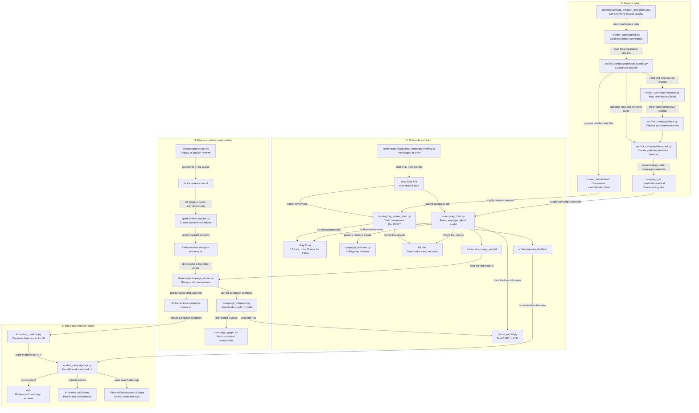

# Detectra: Plain-English Project Guide

This guide explains the project as simply as possible: where the data comes from, what
we create, how the AI learns, and how Kafka/Spark process many reviews.

## 1. What the project is trying to do

There are two different questions:

| Question | Example |
|---|---|
| Is **one review** suspicious? | “This product is absolutely perfect!!!” |
| Is a **group of reviews** acting together like a campaign? | Many similar reviews arrive close together |

One review and a group campaign are not the same problem. That is why the project has
two datasets and two AI models.

## 2. What was directly downloaded

Real Amazon review records are downloaded from the pinned Amazon Reviews 2023 source.
The downloaded facts include:

- review text;
- rating;
- product ID;
- reviewer/user ID;
- timestamp;
- verified-purchase flag;
- category.

These real Amazon rows are **not labelled as bot campaigns**. Amazon does not provide a
trustworthy sticker saying “this is definitely a campaign,” so the project must not
invent that claim.

## 3. What is cleaned and calculated

The project removes broken or duplicate rows, converts timestamps to UTC, and sorts
events from oldest to newest.

Then it calculates useful clues from real history:

- time since the product’s reference/launch time;
- hour and weekday of the review;
- time since the previous review for that product;
- time since the user’s previous review;
- earlier product reviews in the last hour;
- earlier user reviews in the last day.

### No-cheating rule

For a review on Tuesday, the program uses only Monday and earlier events. It does not
look at Wednesday. This prevents the model from secretly seeing the future.

## 4. What is synthetic, and how it is made

The campaign-practice data is **synthetic**: the project generated it. It is separate
from the real Amazon rows.

First, the program learns normal patterns from real Amazon reviews:

- usual review hours/days;
- rating distribution;
- verified-purchase rate;
- normal gaps between reviews;
- date range for each category.

Then it creates controlled practice situations using those patterns.

| Scenario | Created behaviour | `expected_campaign` |
|---|---|---|
| `organic` | Ordinary spread-out reviews | `false` |
| `legitimate_launch_burst` | Busy but believable launch activity | `false` |
| `coordinated_positive` | Closely timed positive-review group | `true` |
| `coordinated_negative` | Closely timed negative-review group | `true` |
| `paraphrased_campaign` | Similar campaign ideas with varied wording | `true` |
| `off_hour_campaign` | Suspicious activity at unusual hours | `true` |
| `slow_drip_campaign` | Suspicious activity spread over time | `true` |
| `multi_product_campaign` | Linked activity across products | `true` |

Generated timestamps stay inside the real date range observed for the relevant Amazon
category. Synthetic means “controlled practice example,” not “a claim about a real
customer.”

## 5. The two prepared datasets

| Dataset | Used for | Labels |
|---|---|---|
| Labelled text reviews | Train the one-review text model | Genuine/deceptive label from its labelled source |
| Amazon behaviour events | Study real timing/behaviour | No fake/campaign labels |
| Controlled campaign scenarios | Train the campaign model | `expected_campaign` created by the scenario generator |

All labelled data is split safely:

```text
Training (70%)   -> AI practices here
Validation (15%) -> choose settings and alert threshold
Test (15%)       -> final hidden exam
```

Whole campaign groups stay in only one pile. The model must not practise on half a
campaign and then see the other half in its final exam.

## 6. Which script does what

| File | Simple job |
|---|---|
| `scripts/download_amazon_categories.ps1` | Downloads Amazon categories and starts preparation. |
| `src/bot_campaign/cli.py` | Front door for commands such as download/build. |
| `src/bot_campaign/amazon.py` | Downloads rows and maps Amazon fields to the project format. |
| `src/bot_campaign/data.py` | Validates records and normalizes timestamps. |
| `src/bot_campaign/dataset_bundle.py` | Coordinates dataset creation. |
| `src/bot_campaign/labeled_datasets.py` | Cleans/splits the single-review labelled text data. |
| `src/bot_campaign/temporal.py` | Makes past-only behaviour clues and controlled campaign scenarios. |
| `training/ray_review_train.py` | Trains/tunes the single-review model. |
| `training/ray_train.py` | Trains/tunes the campaign model. |
| `streaming/producer.py` | Sends replayed review events to Kafka. |
| `spark/review_stream.py` | Makes time-based review bundles. |
| `streaming/campaign_scorer.py` | Finds campaign groups and scores them. |
| `src/bot_campaign/streaming_runtime.py` | The FastAPI-side Kafka consumer that receives final campaign scores and puts them in the UI's repository. |
| `src/bot_campaign/runtime.py` | Loads both model bundles, runs a review scan/replay, records evidence and audit logs, and materializes campaign alerts. |
| `src/bot_campaign/api.py` and `src/bot_campaign/routes/*.py` | The HTTP front door: starts the Kafka consumer, exposes API endpoints, serves the web UI, and measures API health. |
| `src/bot_campaign/observability.py` | Defines the real Prometheus counters, histograms, and gauges emitted by the API. |
| `orchestration/dags/bot_campaign_training.py` | Airflow's ordered timetable: data preparation, review-model training, then campaign-model training through Ray Jobs. |
| `orchestration/dags/bot_campaign_streaming_smoke.py` | Airflow's small end-to-end streaming test. |
| `scripts/start_detectra.ps1` | The safe Windows launcher for the local stack; optional switches add GPU support, log search, and image rebuilding. |
| `monitoring/filebeat.yml` | Chooses which Docker logs Filebeat sends to Elasticsearch for Kibana searches. |

### Detailed script-to-script flow

This is the complete “who calls whom” map. A solid arrow means one Python program or
command directly starts the next one. A Kafka arrow means the programs are separate:
one writes a message and another reads it later. The words on the arrows explain why
the hand-off exists.



The important idea is that Airflow starts work in order, Ray performs the expensive
training, Kafka carries live messages, Spark makes time windows, and the campaign scorer
does the final group-level decision. The browser never calls Spark or Ray directly; it
talks to FastAPI and receives the evidence that the backend has already processed.

## 7. The two AI models

### One-review model: DistilBERT

**DistilBERT** is a smaller, faster reading AI. It reads one review and estimates how
much its wording resembles deceptive examples from the labelled text dataset.

It is used for the browser’s **Scan review** button because it understands meaning
better than simple keyword matching but is lighter than full BERT.

### Campaign model: hybrid DistilBERT + behaviour clues

The campaign model looks at a **group**, not one review. It combines:

1. Text meaning from DistilBERT.
2. Fifteen behaviour clues: review count, unique users/products, duration, review rate,
   gaps, ratings, verification, helpful votes, off-hour/weekend activity, launch timing,
   and recent review activity.

This is called a **hybrid** model because it uses reading clues and behaviour clues
together. Words alone are not enough to identify coordinated behaviour.

### Exact hybrid neural-network structure

The hybrid model is **not only an MLP**. It has a pre-trained DistilBERT reading branch
and two small neural-network sections that handle behaviour and final decision-making.

The currently saved campaign-model configuration uses:

```text
Text encoder:                 distilbert-base-uncased
Maximum reviews per group:    6
Maximum tokens per review:    64
Numeric hidden size:          64
Fusion hidden size:           256
Dropout:                      0.2628 (about 26%)
```

#### Text branch: reads the review group

```text
Up to 6 review texts
        ↓
Each review is cut/padded to at most 64 tokens
        ↓
DistilBERT reads every review
        ↓
Mean-pool the meaningful tokens in each review
        ↓
One 768-number embedding for each review
        ↓
Average the non-empty review embeddings
        ↓
One group-text embedding: 768 numbers
```

DistilBERT is the part that understands language. It turns text such as “Amazing watch,
best purchase ever” into a set of numbers representing its meaning. Empty padded review
slots are ignored when the group average is calculated.

#### Behaviour branch: reads the 15 numeric clues

```text
15 normalized behaviour features
        ↓
Linear layer: 15 → 64
        ↓
Layer Normalization
        ↓
GELU activation
        ↓
Dropout (26.28%)
        ↓
Behaviour embedding: 64 numbers
```

The 15 inputs include review count, unique-user ratio, product count, duration,
review speed, time gaps, rating shape, verified-purchase share, helpful votes,
off-hour/weekend share, launch proximity, and recent activity.

#### Fusion/classification branch: makes one group decision

```text
Text embedding:        768 numbers
Behaviour embedding:    64 numbers
                         -----------
Joined vector:          832 numbers
        ↓
Linear layer: 832 → 256
        ↓
GELU activation
        ↓
Dropout (26.28%)
        ↓
Linear layer: 256 → 1
        ↓
Sigmoid conversion
        ↓
campaign_risk: a number from 0 to 1
```

The final `1` is called a **logit**: it is the raw neural-network answer. A sigmoid
conversion changes that raw answer into an easy-to-read campaign-risk value between
0 and 1.

### What the graph does before the neural network

Before the hybrid model is called, `campaign_graph.py` uses clear rules to decide which
reviews should be inspected as one group. It connects reviews using the same account,
very similar text with matching rating direction, or fast unverified same-product
bursts. A connected set with at least three reviews becomes a candidate group.

The graph is **not** another neural network. It is an explainable grouping step. The
hybrid neural network then calculates the risk for that group.

### What “related reviews” means

The project uses the word **related** in two stages. These stages should not be confused.

#### Stage 1: Spark makes a broad possible-review window

Spark makes one-hour windows that update every ten minutes. It puts each review into
possible windows using three broad routes:

| Spark route | Why a review is placed there |
|---|---|
| Product route | It has the same `product_id` as other reviews. |
| Account route | It has the same `user_id` as other reviews. |
| Meaningful-word route | It shares an important normalized text word with other reviews. |

This stage says only: “These reviews might be worth looking at together.” It does **not**
say they are a campaign.

For example, 20 people reviewing the same popular product can all enter the same product
window. That alone is normal and is not enough to call them related campaign members.

#### Stage 2: the graph creates a strong review-to-review connection

Inside one Spark window, `campaign_graph.py` connects two reviews when at least one of
these rules is true:

| Strong connection rule | Exact meaning |
|---|---|
| Same account | The two reviews have the same `user_id`. This can connect activity across products. |
| Similar wording + same rating direction | DistilBERT cosine similarity is at least `0.88`, and both reviews are positive (4–5 stars) or both negative (1–2 stars). |
| Rapid unverified same-product burst | Both reviews are for the same product, both have the same rating direction, both are not verified purchases, and their timestamps are no more than 15 minutes apart. |

Ratings of 3 stars are neutral. They do not match the positive/negative direction rule.

#### When a possible campaign group exists

Connected reviews form a graph component. Only a component with at least **three**
reviews becomes a possible campaign group and is sent to the hybrid model.

```text
same product only
      ↓
Spark window only — not automatically a campaign

same product + unverified + same rating direction + rapid timing
      ↓
strong graph connections
      ↓
3 or more connected reviews
      ↓
hybrid model calculates campaign risk
```

The group can be a single-product campaign or a cross-product campaign. The final score
still needs to reach the model threshold before it is shown as a moderation candidate.

## 8. How campaign risk is calculated

Spark first makes a time-based bundle of related reviews. The graph code joins reviews
when there is a strong reason, for example:

- the same account reviewed more than one product;
- text is very similar and ratings have the same direction;
- unverified reviews for the same product have similar ratings and arrive in a rapid
  burst (within 15 minutes).

A connected group with at least three reviews becomes a possible campaign.

```text
connected review group
        ↓
text meaning + 15 behaviour clues
        ↓
hybrid campaign model
        ↓
campaign_risk from 0.00 to 1.00
```

The risk is compared with the selected threshold. Example:

```text
campaign_risk = 0.66
threshold     = 0.59

0.66 >= 0.59 -> candidate = true
```

`candidate = true` means “show this evidence to a moderator.” It does **not** mean
“this person is definitely a bot” or “automatically punish this user.”

## 9. Ray Tune, MLflow, and Airflow

| Tool | Like a... | Project job |
|---|---|---|
| Ray Tune | Many-experiment helper | Tries different training settings and keeps the best validation result. |
| MLflow | Science notebook | Saves settings, metrics, dataset/code lineage, and model files. |
| Airflow | Timetable manager | Runs dataset build → review training → campaign training in order. |

Ray Tune chooses the best trial using validation PR-AUC. MLflow records what happened.
Airflow schedules the jobs but does not itself train models or process live Kafka events.

### Exactly how Ray, MLflow, and the UI communicate

Think of this as two separate roads.

#### Road A: the slow training road

This road is used when we build or improve a model. It can take a long time.

```text
Airflow (optional timetable)
        ↓ tells Ray to start a training job
Ray cluster
        ↓ runs many Tune trials
Each trial sends settings + scores to MLflow
        ↓
MLflow saves the experiment history
        ↓
Best Ray trial is saved as a model bundle
        ↓
The selected bundle is also logged/registered in MLflow
```

In the project, a Ray training script such as `training/ray_train.py` connects to the
Ray cluster. Ray Tune gives it different settings to try. After every trial/epoch, the
training code reports numbers such as PR-AUC, precision, recall, and loss. The
`MLflowLoggerCallback` sends those trial details to MLflow.

At the end:

1. Ray Tune chooses the best validation PR-AUC trial.
2. The trainer saves its files in `artifacts/campaign_model` or
   `artifacts/review_distilbert`.
3. The trainer logs the selected model, settings, metrics, and lineage to MLflow.
4. MLflow registers a named model version for experiment tracking.

#### Road B: the fast UI scoring road

This road is used when someone clicks **Scan review** or when the campaign stream
scores a group. It must be fast.

```text
Browser/UI
    ↓ HTTP request
FastAPI
    ↓ loads the local approved model bundle
review or campaign prediction
    ↓ HTTP response
Browser/UI shows the score and evidence
```

The UI does **not** wait for MLflow every time it scores a review. That would be slow
and would fail if the experiment server were temporarily unavailable.

Instead, FastAPI loads local model files mounted from:

```text
artifacts/review_distilbert
artifacts/campaign_model
```

The streaming campaign scorer also loads `artifacts/campaign_model` locally. MLflow is
the training record and model registry; the local bundle is the fast prediction copy.

### What each connection looks like

| From | To | How | Why |
|---|---|---|---|
| Airflow | Ray Jobs endpoint | HTTP job submission | Starts scheduled dataset/training work |
| Training script/Ray Tune | MLflow | MLflow tracking URI | Records trial settings and metrics |
| Training script | Local `artifacts/` folder | Saves model bundle files | Gives API/scorer a local model to load |
| Training script | MLflow Model Registry | MLflow log/register call | Records an approved candidate/version |
| Browser | FastAPI | HTTP | Requests a score or campaign view |
| FastAPI | Local model bundle | Files mounted in the container | Makes fast predictions |
| UI button “Open MLflow” | MLflow web page | Browser link | Lets a human inspect experiments; it does not score reviews |

### A 10-year-old version

- **Ray** is a team of students trying different ways to teach the robot.
- **MLflow** is the big notebook where every student writes what they tried and how well
  it worked.
- **FastAPI** takes the best finished robot from the shelf and uses it to answer users
  quickly.
- **The UI** is the screen where the answer is shown.

The UI talks to FastAPI, not directly to Ray. Ray talks to MLflow while training, not
while a customer is waiting for a score.

## 10. Campaign hyperparameters Ray Tune searches

Both `training/ray_review_train.py` and `training/ray_train.py` now use **20 as the
maximum epoch count** for a normal run. Ray's ASHA (Async Successive Halving)
scheduler is enabled with `max_t=20`, `grace_period=1`, and `reduction_factor=2`.
Weak trials are stopped early; 20 is a ceiling, not a promise that every trial runs
all 20 epochs. Smoke runs remain one trial and one epoch.

For a final campaign training job, Ray Tune can test these settings:

| Setting | Search values/range |
|---|---|
| Encoder learning rate | `0.000005` to `0.00005` |
| Head learning rate | `0.00005` to `0.001` |
| Weight decay | `0`, `0.01`, `0.05` |
| Dropout | `0.10` to `0.40` |
| Numeric hidden size | `32`, `64`, `128`, `256` |
| Fusion hidden size | `64`, `128`, `256` |
| Batch size | `8`, `16` |
| Frozen DistilBERT layers | `0`, `2`, `4` |
| Maximum reviews/group | `6`, `8`, `10` |
| Maximum tokens/review | `96`, `128`, `192` |
| Warmup ratio | `0`, `0.05`, `0.10` |
| Gradient clipping | `0.5`, `1.0`, `2.0` |
| Campaign-class weight | `0.75`, `1.0`, `1.25` |

The campaign trainer now defaults to **20 epochs** for a real final run. An epoch means
one full pass through the training data. Weak trials may stop early through ASHA.
`--smoke` deliberately uses one small epoch to check that the pipeline works.

### Current saved campaign artifact: important honest status

The currently mounted campaign artifact is from trial `cb158_00000`, a **one-epoch smoke
run** with 80 training and 80 validation groups. Its selected values are:

| Setting | Value |
|---|---:|
| Base model | `distilbert-base-uncased` |
| Encoder learning rate | `0.0000179031` |
| Head learning rate | `0.0005344925` |
| Weight decay | `0.05` |
| Dropout | `0.2628052` |
| Batch size | `4` |
| Frozen layers | `6` |
| Max reviews | `6` |
| Max tokens | `64` |
| Numeric hidden size | `64` |
| Fusion hidden size | `256` |
| Warmup ratio | `0.05` |
| Gradient clipping | `1.0` |
| Campaign class weight | `1.0` |
| Alert threshold | `0.5912147` |

The local Ray and MLflow records currently show four historical 4-epoch campaign
trials and this one one-epoch smoke result. They do **not** currently contain a saved
completed 20-epoch campaign run. A real 20-epoch result must finish, be recorded in
MLflow, and be approved before replacing the mounted model.

## 11. Kafka and Spark: what they do

Kafka is a safe message conveyor belt. Spark is the fast sorting team.

```text
review source or replay file
        ↓
Kafka: reviews.raw.v1
        ↓
Spark validates/parses events and builds time windows
        ↓
Kafka: reviews.analysis-windows.v1
        ↓
campaign scorer finds groups and scores them
        ↓
Kafka: reviews.campaign-scores.v1
        ↓
campaign sink → API → Live Campaigns screen
```

Kafka keeps messages long enough for a consumer to restart and continue from where it
stopped. That is **replay**. Replay also lets us send controlled historical examples
through the same pipeline before real high-volume users depend on it.

### One-review button versus streaming campaign replay

The browser **Scan review** button is fast and direct:

```text
browser form → FastAPI → one-review DistilBERT → result
```

It does not currently publish the typed review to Kafka.

The Kafka replay sends many related reviews because a campaign detector needs a group.

## 12. Start services with Docker

From the project root, the easiest option is:

```powershell
Set-ExecutionPolicy -Scope Process Bypass -Force
.\scripts\start_detectra.ps1
```

After images already exist:

```powershell
.\scripts\start_detectra.ps1
```

To start the main parts manually:

```powershell
docker compose up -d api mlflow prometheus grafana kafka spark-master spark-worker ray-head ray-worker
docker compose --profile stream up -d spark-stream
docker compose --profile score up -d campaign-scorer
docker compose --profile observability up -d elasticsearch kibana filebeat
docker compose ps
```

Airflow is separate:

```powershell
# One-time setup: creates/migrates Airflow's database and local admin user
docker compose -f orchestration/docker-compose.airflow.yml up airflow-init

# Starts the DAG parser, scheduler, and Airflow website/API
docker compose -f orchestration/docker-compose.airflow.yml up -d airflow-dag-processor airflow-scheduler airflow-api-server

# Confirm all Airflow services are running
docker compose -f orchestration/docker-compose.airflow.yml ps
```

The Airflow website/API endpoint for this project is:

```text
http://localhost:8084
```

Port `8084` is used because port `8080` is already occupied by a separate local Airflow
stack on this machine.

Airflow 3's local task workers use the internal Compose address
`http://airflow-api-server:8080/execution/`; this lets scheduled task workers talk to
the Airflow API server even though the browser uses host port `8084`.

### Where Airflow is used, and how to trigger it

Airflow is used for **scheduled training work**, not for the fast review-scanning page.
It is the project’s timetable manager.

```text
Airflow starts a job
        ↓
Ray rebuilds/validates campaign data
        ↓
Ray trains the one-review model
        ↓
Ray trains the campaign model
        ↓
MLflow records metrics and candidate model files
```

Airflow does **not** run forever as Kafka, Spark, or the live campaign scorer. Docker
Compose runs those always-on local services. Airflow only starts and watches finite jobs.

There are two useful Airflow DAGs:

| DAG | What it does |
|---|---|
| `bot_campaign_model_retraining` | Rebuilds campaign data, then submits review-model and campaign-model training jobs to Ray. |
| `bot_campaign_streaming_smoke` | Sends a small replay through Kafka → Spark → scorer → FastAPI to check the online path. |

#### Trigger from the Airflow website

1. Open `http://localhost:8084`.
2. Sign in with username `admin` and password `admin`. This project mounts a local
   development-only password file so the login remains stable after container restarts.
3. Find `bot_campaign_model_retraining`.
4. Turn its toggle on if it is paused.
5. Click the play/trigger button and choose **Trigger DAG**.
6. Open the new run and use **Graph** view to watch the steps.

The expected training DAG order is:

```text
submit temporal ETL
→ wait for temporal ETL
→ submit review training
→ wait for review training
→ submit campaign training
→ wait for campaign training
```

#### Trigger from PowerShell

```powershell
# Full rebuild and model-retraining workflow
docker compose -f orchestration/docker-compose.airflow.yml exec `
  airflow-api-server airflow dags trigger bot_campaign_model_retraining

# Small end-to-end Kafka/Spark/FastAPI smoke check
docker compose -f orchestration/docker-compose.airflow.yml exec `
  airflow-api-server airflow dags trigger bot_campaign_streaming_smoke
```

After triggering, confirm the run was created:

```powershell
docker compose -f orchestration/docker-compose.airflow.yml exec `
  airflow-api-server airflow dags list-runs -d bot_campaign_model_retraining
```

The stable local development password file is
`orchestration/airflow_simple_auth_passwords.json`. Do not use this simple
development authentication setup for a shared or production Airflow service.

The training DAG writes new results under `artifacts/candidates/`. It records/registers
them in MLflow but deliberately does not overwrite the model currently used by FastAPI.
A human must inspect the results and approve a candidate before deployment.

### Airflow schedule: current setting and sensible future setting

Right now the retraining DAG is **manual only**. Its schedule is empty (`None`), so it
runs only when a person clicks **Trigger DAG** or runs the PowerShell command above.

This is deliberate: full DistilBERT/Ray tuning is expensive, and retraining without
enough new reviewed/labelled data does not help.

A sensible future schedule is **once per week during quiet hours**, but only after a
full manual run has passed checks. For example:

```text
0 2 * * 0
```

This means Sunday at 02:00 UTC (07:30 Sunday in India). It is not sensible to run the
full training DAG every hour or every day.

To enable that weekly schedule, add this to the Airflow environment in
`orchestration/docker-compose.airflow.yml`, then recreate the DAG processor, scheduler,
and API server:

```yaml
BOT_CAMPAIGN_RETRAIN_CRON: "0 2 * * 0"
```

Keep `bot_campaign_streaming_smoke` manual-only. It is a small Kafka/Spark pipeline
check, not a retraining workflow.

### Where DVC fits

**DVC is the project’s data-version notebook.** It remembers exactly which input files
and code files were used to make each prepared dataset.

```text
raw data + preparation code
        ↓
DVC checks file hashes recorded in dvc.lock
        ↓
if something changed, rebuild the affected stage
        ↓
new processed dataset + updated dvc.lock
```

The project has these main DVC stages:

| DVC stage | Watches for changes in | Rebuilds |
|---|---|---|
| `build_temporal_bundle` | Raw Amazon review files and temporal/validation code | `data/processed/temporal_bundle` |
| `build_dataset_bundle` | Raw labelled reviews, Amazon data, and dataset-preparation code | `data/processed/dataset_bundle` |
| `train_product_model` | Prepared text files and baseline model code | Baseline TF-IDF model and metrics |

#### What happens when data changes

If a raw review file changes, or preparation code such as `temporal.py` changes, DVC
notices that its stored hash no longer matches. When you run:

```powershell
dvc repro build_temporal_bundle
```

DVC rebuilds that affected temporal dataset stage. If nothing changed, DVC skips it.

For all declared stages:

```powershell
dvc repro
```

#### Important: DVC does not automatically start itself

Saving a changed data file does **not** automatically start DVC, Airflow, Ray, or model
training. DVC is triggered when someone or some automation explicitly runs `dvc repro`.

Likewise, the current Airflow DAG does not call `dvc repro`; it directly submits the
project’s data-build and training commands to Ray. They are related but different:

| Tool | Main responsibility |
|---|---|
| DVC | Detects changed declared inputs and reproduces versioned data/model stages. |
| Airflow | Decides when a complete workflow runs and submits jobs to Ray. |
| Ray Tune | Tries model settings during a training job. |
| MLflow | Records the training experiments and selected model artifacts. |

The normal reproducible data-change workflow is:

```text
raw data or preparation code changes
        ↓
run dvc repro
        ↓
inspect updated dvc.lock and generated data
        ↓
commit Git + DVC metadata; push DVC data to remote storage if configured
        ↓
trigger Airflow/Ray retraining when the new data is approved
```

## 13. DVC, Prometheus, and Grafana: the notebook, meter reader, and screen

These three tools help the team **look after** the project. They do not decide whether
a review is suspicious. Think of the project as a busy review-detection school:

| Tool | Like a 10-year-old explanation | Its job here | What it does *not* do |
|---|---|---|---|
| **DVC** | A recipe book that remembers exactly which ingredients were used. | Keeps track of the data and preparation steps used for training. | It does not watch live reviews or make charts. |
| **Prometheus** | An automatic meter reader. | Collects small health numbers regularly and saves their history. | It does not train or score the model. |
| **Grafana** | The classroom dashboard screen. | Asks Prometheus for the saved numbers and draws easy-to-read graphs. | It does not collect the numbers itself. |

### Where each one sits

```text
NEW OR CHANGED TRAINING DATA
        |
        v
 DVC checks the recipe and rebuilds approved data
        |
        v
Airflow -> Ray Tune -> MLflow -> saved model


LIVE REVIEWS
Browser -> FastAPI -> Kafka -> Spark -> campaign model -> moderator UI
             |
             | "How busy/fast/healthy am I?"
             v
        Prometheus saves measurements every 10 seconds
             |
             v
        Grafana turns them into graphs for people
```

### 1. DVC: the memory for training ingredients

Imagine making the same cake again next month. DVC remembers which flour, recipe, and
steps were used, so we can make the same cake again instead of guessing.

For this project, DVC knows about the raw review files, the dataset-preparation code,
and the generated training bundles. When you run `dvc repro`, it compares those saved
fingerprints with the current files:

```text
Nothing changed?  -> reuse the existing prepared result.
Something changed? -> rebuild the affected data stage.
```

Then the team can inspect the new data, approve it, and trigger Airflow to train a new
model. DVC does **not** automatically retrain just because a file was saved. It gives
us a reliable, repeatable starting point for training.

### 2. Prometheus: the project health notebook

Prometheus visits the project every **10 seconds** and writes down numbers such as:

- how many API requests arrived;
- how long scans took;
- whether requests failed;
- API and Ray service metrics exposed by their `/metrics` pages.

The API exposes its numbers at `/metrics`. Prometheus collects the API metrics at
`api:8000/metrics`, and it also collects the Ray head and Ray worker metrics. Instead
of one number, it saves a timeline: "at 10:00 the app was fast; at 10:10 it became
slow." That history helps find a problem after it happens.

Prometheus is **not in the review's decision path**. If it is temporarily down, the
model can still score reviews; we simply lose monitoring history during that time.
Open its technical page at `http://localhost:9090`.

### 3. Grafana: pictures made from Prometheus numbers

Grafana does not measure anything by itself. It asks Prometheus questions like:

> "Show me API scan speed over the last hour."

Then it turns Prometheus's saved numbers into charts, gauges, and alerts that a person
can understand quickly. Open it at `http://localhost:3000`.

In a future large-user launch, a moderator or engineer could use Grafana to notice:

- a sudden rush of reviews;
- scans becoming slow;
- a rise in failed requests;
- Ray workers running out of CPU or memory.

That is valuable because the detection model may be correct, but the *system around it*
can still become too busy.

### One honest detail about the current demo

Some dashboard fields, especially example Kafka-lag or data-drift values, are currently
demo/configuration values until a dedicated live telemetry collector is connected. The
API and Ray metrics are real scraped metrics; do not present every dashboard number as
live Kafka production telemetry yet.

### Start the monitoring tools

```powershell
docker compose up -d api prometheus grafana
docker compose ps
```

You normally do not need to press a "run" button for Prometheus. Once it is running, it
keeps collecting at its configured 10-second interval. Grafana then reads that stored
history and shows the charts.

## 14. Replay a controlled campaign through Kafka and Spark

```powershell
docker compose exec -T campaign-scorer python streaming/producer.py `
  --input /opt/project/data/processed/temporal_bundle/campaign_v3/test.jsonl `
  --bootstrap-servers kafka:29092 `
  --rate 10
```

Expected result:

```text
published=340
```

This means 340 controlled test events were placed into Kafka. See scores directly:

```powershell
docker compose exec kafka /opt/kafka/bin/kafka-console-consumer.sh `
  --bootstrap-server kafka:29092 `
  --topic reviews.campaign-scores.v1 `
  --from-beginning `
  --timeout-ms 10000
```

## 15. Correct browser addresses

| Screen | Browser address |
|---|---|
| App/UI | `http://localhost:8000` |
| MLflow | `http://localhost:5001` |
| Ray Dashboard | `http://localhost:8265` |
| Airflow | `http://localhost:8084` |
| Spark Master | `http://localhost:8082` |
| Spark Worker | `http://localhost:8083` |
| Grafana | `http://localhost:3000` |
| Prometheus | `http://localhost:9090` |

Do not open `spark-worker:8081` or `spark-stream:4040` in Windows Chrome: those names
exist only inside Docker. Use `localhost:8082` for the Spark screenshot.

### Why the Deployment screen can say Kafka/Spark are “not configured”

That screen checks whether the API container has environment variables named
`KAFKA_BOOTSTRAP_SERVERS` and `SPARK_MASTER`. It does not ask Docker whether the Kafka
and Spark containers are alive. Therefore the UI can show `NOT_CONFIGURED` while the
actual Docker services are running. Confirm the real state with:

```powershell
docker compose ps
```

## 16. Best screenshots for a report or presentation

Take these five screenshots:

1. UI Live Campaigns page after a Kafka/Spark replay.
2. Spark Master at `http://localhost:8082`, showing the streaming application.
3. Ray Dashboard at `http://localhost:8265`, showing head/worker resources and a job.
4. MLflow selected run, showing metrics, parameters, and artifact/model version.
5. Airflow DAG `bot_campaign_model_retraining`, showing dataset build → review training
   → campaign training.

Useful presentation sentence:

> “I replay controlled review events into Kafka. Spark validates and groups related
> events by time and connection. The hybrid campaign model scores each group, and a
> moderator sees the evidence—not an automatic accusation.”

## 17. Monitoring guide: Prometheus + Grafana

Prometheus is the notebook that writes health numbers down every 10 seconds. Grafana is
the screen that turns those numbers into charts. Neither tool decides whether a review
is suspicious; they help people notice whether the system is healthy.

### Metrics that work now

The API exposes these metrics at `http://localhost:8000/metrics`:

| Metric | Meaning | Kind |
|---|---|---|
| `review_scans_total` | Reviews scored since this API start. | Counter |
| `review_scans_per_second` | Average review-scan rate since API start. | Gauge |
| `review_inference_p95_ms` | Recent p95 scan time. | Gauge |
| `api_requests_total`, `api_errors_total`, `api_error_rate` | API traffic and failed-request proportion. | Counter/Gauge |
| `api_request_latency_p50_ms`, `api_request_latency_p95_ms`, `api_request_latency_p99_ms` | API request speed. | Gauge |
| `campaign_alerts_total` | Campaigns currently materialized in the API. | Gauge |
| `review_needs_human_review_total` | Reviews sent for human review. | Counter |
| `campaign_moderation_*_total` | Confirmed, dismissed, and restored campaign actions. | Counter |
| `review_mean_risk`, `review_mean_confidence` | Recent model behaviour. | Gauge |
| `review_feature_drift` | Configured feature-drift value. | Gauge |
| `campaign_stream_scores_total` | Campaign-score messages consumed. | Counter |
| `campaign_stream_candidates_total` | Campaign candidates materialized from Kafka. | Counter |
| `campaign_stream_consumer_errors_total` | Stream-consumer errors since API start. | Counter |
| `review_language_reviews_total`, `review_invalid_requests_total` | Accepted language mix and API-rejected inputs. | Counter |
| `api_uptime_seconds`, `api_disk_free_bytes` | API process age and free container disk. | Gauge |

Prometheus also scrapes Ray's `/metrics` pages, so Grafana can show Ray target health,
CPU, memory, task state, and object-store memory. A **counter** goes up until a restart;
a **gauge** is a current reading that can rise or fall.

### Best metrics to add for a large-user launch

| Area | Metrics to measure | Why |
|---|---|---|
| API | request rate, p50/p95/p99 latency, 4xx/5xx errors | Is the app fast and reliable? |
| Campaign decisions | candidates, candidate rate, human dismissals/confirmations | Are alerts useful to moderators? |
| Kafka | messages in/out, producer errors, consumer lag by topic | Are reviews waiting in the queue? |
| Spark | input rows, cleaned rows, rejected/late rows, batch duration | Is the stream cleaner keeping up? |
| Model | risk-score distribution, confidence, drift, human-confirmed rate | Is the model behaving differently? |
| Data quality | missing text, invalid rating, duplicate rate, language mix | Did incoming data change or become broken? |
| Training | last successful run, PR-AUC, threshold, model version | Is the deployed model old or worse? |
| Infrastructure | Ray CPU/RAM/GPU, disk, container restarts | Are the computers running out of room? |

For real latency distributions, add a Prometheus **histogram**. A single p95 number is
helpful for a demo, but a histogram gives better production monitoring.

### Honest current boundary

The API metrics above and Ray metrics are real. Kafka lag, Spark throughput, and
training-quality metrics are not yet exported as Prometheus metrics.
The displayed drift and Kafka-lag defaults use `DEMO_FEATURE_DRIFT`,
`DEMO_EMBEDDING_DRIFT`, and `DEMO_KAFKA_LAG`; do not call them live production telemetry
until a dedicated collector is added.

### Configure Prometheus

`monitoring/prometheus.yml` already contains this configuration:

```yaml
global:
  scrape_interval: 10s
  evaluation_interval: 10s

scrape_configs:
  - job_name: bot-campaign-api
    metrics_path: /metrics
    static_configs:
      - targets: ["api:8000"]

  - job_name: ray
    metrics_path: /metrics
    static_configs:
      - targets: ["ray-head:8080"]
        labels: {ray_role: head}
      - targets: ["ray-worker:8080"]
        labels: {ray_role: worker}
```

`api`, `ray-head`, and `ray-worker` are Docker-network names. Keep them; `localhost`
would point Prometheus back to its own container instead.

Start it and check its targets:

```powershell
docker compose up -d api prometheus grafana
docker compose ps api prometheus grafana
```

Open `http://localhost:9090/targets`. The API and both Ray targets should be **UP**.
After changing `monitoring/prometheus.yml`, use:

```powershell
docker compose restart prometheus
```

After changing API metric code, rebuild the API before checking the dashboard:

```powershell
docker compose up -d --build api
docker compose restart prometheus grafana
```

To add a separate Kafka exporter later, first run an exporter that offers `/metrics`,
then add a scrape job such as:

```yaml
  - job_name: kafka
    metrics_path: /metrics
    static_configs:
      - targets: ["kafka-exporter:9308"]
```

That tells Prometheus where to collect—not how to invent Kafka numbers. The exporter or
a collector program must exist first.

### Add a new API metric

The API already has a `/metrics` route. For a new number:

1. Record it in `src/bot_campaign/observability.py` when the event happens.
2. Add it to `prometheus_text()` in the same file.
3. Rebuild the API and inspect `http://localhost:8000/metrics`.

For example, the runtime already counts `stream_candidates`. Add this to the `values`
list in `prometheus_text()`:

```python
(
    "campaign_stream_candidates_total",
    "Candidate campaign messages consumed from Kafka.",
    summary["streaming"]["candidates_materialized"],
    "counter",
),
```

Then run:

```powershell
docker compose up -d --build api
docker compose restart prometheus
```

### Make charts in Grafana

Grafana is already connected to a data source named **Prometheus** at
`http://prometheus:9090`. Open `http://localhost:3000`, then use:

```text
Dashboards -> New -> New dashboard -> Add visualization -> Prometheus
```

This project also provisions **Detectra / API Operations** automatically. Refresh
Grafana after rebuilding the API and open that dashboard to see the ready-made panels.

Use one of these PromQL queries:

| Chart | PromQL | Best panel |
|---|---|---|
| API alive | `up{job="bot-campaign-api"}` | Stat |
| Total scans | `review_scans_total` | Stat |
| Scans per second | `rate(review_scans_total[5m])` | Time series |
| p95 scan speed | `review_inference_p95_ms` | Time series/Gauge |
| Current campaigns | `campaign_alerts_total` | Stat |
| Scores consumed | `rate(campaign_stream_scores_total[5m])` | Time series |
| Errors in 15 min | `increase(campaign_stream_consumer_errors_total[15m])` | Stat |
| Feature drift | `review_feature_drift` | Gauge |
| Ray targets alive | `sum(up{job="ray"})` | Stat |
| Ray CPU | `ray_node_cpu_utilization` | Time series |

Set red thresholds for error count above `0`, p95 latency above a chosen limit (for
example 1000 ms in a demo), and drift above a value learned from normal real data.

## 18. Exactly what DVC tracks here

DVC tracks the **recipe and fingerprints** for reproducible preparation—not each live
browser review. `dvc.yaml` is the recipe, while `dvc.lock` records hashes of the exact
inputs and outputs from the last reproduced run.

| DVC stage | Dependencies it watches | Output it creates |
|---|---|---|
| `build_temporal_bundle` | Declared Amazon behavioural files plus `cli.py`, `data.py`, `dataset_bundle.py`, and `temporal.py`. | `data/processed/temporal_bundle` |
| `build_dataset_bundle` | Product-review JSONL, Kaggle fake-review CSV, declared Amazon files, and preparation/label/synthetic/temporal code. | `data/processed/dataset_bundle` |
| `train_product_model` | Prepared text train/test files and `src/bot_campaign/model.py`. | `artifacts/review_model.joblib` and baseline metrics report. |

So DVC detects raw-data changes, preparation-code changes, and the old baseline
model-code/data changes. It then knows which declared stage needs rebuilding.

The current Ray DistilBERT and hybrid campaign training are **not** DVC stages. Airflow
submits those jobs to Ray and MLflow records their experiments. This is the honest split:
DVC versions preparation and the baseline; Airflow/Ray/MLflow run and record deep-model
training.

Use these commands from the activated virtual environment:

```powershell
dvc status
dvc repro build_dataset_bundle
dvc repro build_temporal_bundle
dvc repro train_product_model
dvc repro
```

`dvc status` asks “did an ingredient change?” `dvc repro` says “re-make only the recipe
steps affected by that change.” The configured DVC remote is local
(`../../bot-campaign-dvc-storage`), keeping large tracked content outside Git while Git
stores the small recipe and lock files.

## 19. Git, Git LFS, and DVC: who remembers what?

Think of three different cupboards:

| Tool | Like a 10-year-old explanation | What this project uses it for |
|---|---|---|
| **Git** | The small notebook containing instructions and history. | Source code, Docker files, documentation, configuration, DVC recipe/lock files, and Git-LFS pointer files. |
| **Git LFS** | A large-item ticket kept in the notebook; the real large item lives in the LFS store. | The trained DistilBERT review model and hybrid campaign-model artifacts. |
| **DVC** | A data recipe book with fingerprints. | Raw/processed training data and the declared baseline-training pipeline. |

### What ordinary Git tracks

Git tracks the small, human-readable project materials, including:

- `src/`, `training/`, `spark/`, `streaming/`, and `web/` code;
- `docker-compose.yml`, Dockerfiles, Airflow DAG/configuration, Prometheus/Grafana configuration;
- `README.md`, `docs/`, and this explanation guide;
- `dvc.yaml`, `dvc.lock`, `.dvc/config`, and `.gitattributes`.

Git does **not** directly store the ignored raw/processed data, Python environment,
temporary caches, Ray trial outputs, MLflow local database, logs, checkpoints, or normal
generated reports. The exact ignore rules are in `.gitignore`.

### What Git LFS tracks

`.gitattributes` sends these paths to Git LFS:

```text
artifacts/review_distilbert/**
artifacts/campaign_model/**
```

That includes the saved model weights, tokenizer files, configuration, and bundle metadata.
Git stores a tiny pointer for each LFS file; Git LFS stores/downloads the real large bytes.
This lets a person clone the code without putting large neural-network files into normal Git
history. Check them with:

```powershell
git lfs ls-files
```

### What DVC tracks

Raw and processed data folders are Git-ignored, but the DVC recipe names them as stage
dependencies and outputs. DVC records their content fingerprints in `dvc.lock`.

| DVC stage | Inputs whose fingerprints DVC compares | Output fingerprinted by DVC |
|---|---|---|
| `build_temporal_bundle` | Declared Amazon raw-review files plus temporal preparation code. | `data/processed/temporal_bundle` |
| `build_dataset_bundle` | Labeled reviews, Kaggle fake-review CSV, Amazon files, and preparation/synthetic code. | `data/processed/dataset_bundle` |
| `train_product_model` | Prepared text splits plus the legacy baseline model code. | `artifacts/review_model.joblib` and baseline metrics report. |

The configured DVC remote is currently local: `../../bot-campaign-dvc-storage`. In a team,
this can be replaced or supplemented with shared cloud/object storage. Use:

```powershell
dvc status       # compare current fingerprints with dvc.lock
dvc repro         # reproduce only declared stages affected by changes
dvc push          # upload DVC-tracked large data to its configured remote
dvc pull          # download DVC-tracked large data from that remote
```

### Important boundary

The deep-learning artifacts in `artifacts/review_distilbert/` and
`artifacts/campaign_model/` are **Git LFS**, not DVC. The current DVC pipeline tracks the
older `artifacts/review_model.joblib` baseline. Ray/MLflow produce and record the modern
DistilBERT/hybrid training runs; Git LFS keeps their selected saved artifacts versioned.

```text
Code/config change          -> Git commit
Selected trained neural model -> Git LFS pointer + LFS object
Raw/processed dataset change -> DVC lock fingerprint + DVC remote object
Experiment history           -> MLflow
```

## 20. Reading the Grafana dashboard: an example

Suppose the **Detectra / API Operations** dashboard shows these values:

| Panel | Example shown | What it means |
|---|---:|---|
| API healthy | `1` (green) | Prometheus successfully reached the API. `1` means reachable; `0` means unreachable. |
| Review scans / second | `0.0137 ops/s` | About one scan every 73 seconds. This is expected while one person is testing manually. |
| API p95 latency | `2.11 s` (red) | 95 out of 100 recent API requests took 2.11 seconds or less. Red means it crossed the dashboard's demo target of 1 second; it does **not** mean the API crashed. |
| API errors, 15 min | `1.01` | About one failed HTTP request occurred in the last 15 minutes. The small decimal comes from Prometheus estimating between 10-second samples. |
| Data quality: `en` | `4` | Four successfully scored reviews declared `language="en"`. |
| Data quality: invalid requests | `0` | No submitted review failed FastAPI validation with HTTP `422` in that period. |

### What a slow/red p95 latency means

The p95 panel measures overall API request time, not only the model's maths. A request
includes receiving the browser request, validating it, running DistilBERT, building the
response, and sending the answer back. On a laptop CPU, a 2.11-second p95 can be normal
for a small demonstration. For a large launch, we would investigate it if it stayed over
the agreed service target.

### Why `1.01` errors is not strange

The Grafana query is `increase(api_errors_total[15m])`. Prometheus samples every ten
seconds and estimates the counter change across the selected 15-minute period. Therefore
it can display `1.01` rather than exactly `1`. Read it as **about one error**, then look
at API logs to learn whether it was an invalid test input, a missing URL, or a real
server error.

### The three lower charts

| Chart | What it is showing |
|---|---|
| Review model behaviour | Mean risk and mean confidence from recent scored reviews. With only a few manual tests, these lines jump around and are not statistically meaningful yet. |
| Campaign and moderator workload | Current active campaigns, stream candidates, and reviews sent for human review. In the example, two active campaigns are in the API's current memory. |
| Moderator decisions | How many campaigns a moderator has confirmed, dismissed, or restored since the API started. A flat zero line means nobody has acted yet. |

### Important restart rule

Most current API counters live in the API process memory. Rebuilding or restarting the
API starts them again at zero. Prometheus still keeps old scraped samples for its
retention period, but the new API counter begins fresh. This is acceptable for the local
demo; a production deployment would aggregate persistent metrics from all API replicas.

## 21. Every dashboard metric, with examples

The project has two Grafana dashboards:

1. **Detectra / API Operations**: what the review API, campaign materializer, and Ray
   services are doing.
2. **Detectra / Ray Cluster**: what the Ray computers are doing while preparing data or
   training models.

### A. Detectra / API Operations

| Panel / metric | Example from the dashboard | Meaning in simple words | When to worry |
|---|---:|---|---|
| API healthy (`up{job="bot-campaign-api"}`) | `1`, green | Prometheus can reach the API. | `0`: API is down or Prometheus cannot reach it. |
| Review scans / second | `0 ops/s` | How quickly reviews are currently being scanned. A manual demo naturally has long periods at zero. | It stays low while a large real queue is waiting. |
| API p95 latency | `441 ms` | 95% of recent API requests completed in 441 ms or less. | It stays above the agreed target, e.g. 1 second. Red only means it crossed the chosen display threshold. |
| API errors, 15 min | `1.01` | About one HTTP 4xx/5xx response in the last 15 minutes. The decimal comes from Prometheus estimating between 10-second samples. | It keeps growing; inspect API logs and the invalid-request panel. |
| Review model mean risk | `44%` | Average fake-risk score for recent scanned reviews. It is a group average, not the probability that 44% of people are bots. | A sudden large change can mean the incoming mix changed. |
| Review model mean confidence | `64%` | Average certainty of the model's recent answers. | Confidence suddenly collapses or becomes strangely high for all reviews. |
| Active campaigns | `4` | Four campaign alerts currently live in the API's in-memory repository. | It rises rapidly or stays high without moderator action. |
| Stream candidates | about `41` | Number of Kafka campaign-score messages judged candidate campaigns since API start. | It rises much faster than normal traffic; investigate the campaign evidence. |
| Reviews needing human review | `0` | Individual review scans that crossed the review-model threshold and were sent to a person. | It increases unexpectedly or reaches moderator capacity. |
| Moderator confirmed/dismissed/restored | flat `0` lines | How many actions moderators took since API start. Confirm = temporary soft limit; dismiss = alert rejected; restore = soft limit removed. | A very high dismissal count can suggest too many noisy alerts. |
| Language mix (`review_language_reviews_total`) | `en = 4` | Four accepted scanned reviews declared English. Each language is a separate line. | A sudden new/unexpected language mix may require model/data review. |
| Invalid requests (`review_invalid_requests_total`) | `0` | Review submissions rejected with FastAPI `422`, e.g. missing text, bad timestamp, or rating outside 1–5. | It rises; clients may be sending malformed reviews. |
| Total reviews scanned | `4` | All successful individual review scans since the API container started. | It resets after API restart; compare rates, not only the absolute number. |
| API latency p50/p95/p99 | p50 near `0 ms`, p95 about `700 ms`, p99 about `3.2 s` | p50 is the middle request; p95 is a slow-but-usual request; p99 shows the slowest 1 in 100. | A very high p99 means a few users have a poor experience even if p50 looks good. |
| Kafka stream errors, 15 min | `0`, green | Failures in the API consumer reading scored campaign messages from Kafka. | Above zero: inspect API logs and Kafka/campaign-scorer health. |
| Campaign Kafka stream activity | candidates around `0.14/s` | Green is scored messages consumed per second; yellow is candidate campaigns per second. A short replay produces a short spike. | Scores stop while Kafka has a known replay/traffic input, or error count rises. |
| Ray services healthy (of 2) | `2`, green | Both Ray head and Ray worker Prometheus targets are reachable. | `1` means one is unavailable; `0` means both are unavailable. |
| Ray node CPU utilization | about `99%` | CPU utilization reported separately for `ray-head` and `ray-worker`. | Sustained near 100% together with queued tasks or very slow training; check Ray dashboard jobs. |
| API free disk | `898 GiB` | Free storage visible to the API container. | It approaches zero; writes, logs, and temporary work may fail. |
| API uptime | `23.7 min` | How long the current API process has been running. It returns to zero after rebuild/restart. | Unexpected repeated resets suggest container crashes/restarts. |

### B. Detectra / Ray Cluster

| Panel / metric | Example from the dashboard | Meaning in simple words | When to worry |
|---|---:|---|---|
| Ray targets healthy (`sum(up{job="ray"})`) | `2`, green | Prometheus can reach both the Ray head and worker metrics endpoints. | Less than 2 when both services are expected to run. |
| Ray node CPU utilization | head and worker near `99%` | Per-node CPU use reported by Ray. The two coloured lines are different containers. | Near 100% for a long time while jobs are queued or training is unexpectedly slow. |
| Ray node memory used | head about `3.08 GiB`, worker about `146 MiB` | Memory currently used by each Ray node. | It climbs close to Docker/Ray memory limits or grows continually after jobs finish. |
| Ray scheduler tasks by state | a line near `1` | Number of Ray tasks in states such as running, pending, or finished. | Pending tasks grow and do not become running: there may not be enough CPU/GPU. |
| Ray object-store memory | brief spike around `15 B` | Memory used for objects Ray shares between tasks. Tiny spikes during status checks are normal in this demo. | It grows continuously or approaches its configured object-store limit. |

### How the screenshots tell the story

```text
Kafka replay happens
    -> Campaign Kafka activity briefly rises
    -> stream candidates rise
    -> active campaigns appear for a moderator

Airflow starts a training job
    -> Ray scheduler shows running/pending tasks
    -> Ray CPU/memory may rise
    -> when work finishes, Ray task activity falls again
```

Do not use a single chart as proof that an account is a bot. These metrics describe
system health and workload; campaign evidence and moderator review decide what happens
to an alert.

## 22. Elasticsearch and Kibana: the searchable diary

Prometheus and Grafana answer: **“What number changed over time?”** For example,
“Was the API slow at 10:15?”

Elasticsearch and Kibana answer: **“Show me the exact records and messages.”** For
example, “Show every API error for campaign `online-abc`,” or “Find all Kafka consumer
errors from the last hour.”

| Tool | Like a 10-year-old explanation | Job in this architecture |
|---|---|---|
| Elasticsearch | A giant, very fast library catalogue. | Stores searchable log/event documents in indexes. |
| Kibana | The library's search screen. | Lets people search, filter, graph, and inspect Elasticsearch documents. |

### Where they fit

```text
FastAPI / Kafka / Spark / Ray / Airflow write Docker log messages
                         |
                         | Filebeat reads and labels the Docker logs
                         v
                  Elasticsearch filebeat-* indexes
                         |
                         v
              Kibana searches and visualises logs

Prometheus -> Grafana is for numerical health metrics.
Elasticsearch -> Kibana is for detailed event/log investigation.
```

### What is configured now

The Compose file provides an optional local `observability` profile:

```powershell
docker compose --profile observability up -d elasticsearch kibana filebeat
docker compose ps elasticsearch kibana filebeat
```

Open:

| Service | Address |
|---|---|
| Elasticsearch API | `http://localhost:9200` |
| Kibana | `http://localhost:5601` |

Elasticsearch saves its indexes in the Docker volume `elasticsearch-data`. Kibana connects
to Elasticsearch internally at `http://elasticsearch:9200`. Filebeat saves its read-state
in `filebeat-data`, reads Docker logs through the Docker socket, and sends matching project
logs to Elasticsearch. The API also checks Kibana's health page and shows its link on the
deployment screen.

### What Filebeat sends into Elasticsearch now

Filebeat watches Docker containers from both Compose projects named `bot-campaign` and
`bot-campaign-airflow`. It enriches each document with Docker container/Compose metadata
and writes it to Elasticsearch's `filebeat-*` data. The API now emits searchable audit
events for review scoring, replay publishing/completion, campaign materialization,
moderator actions, and failed HTTP requests. Kafka, Spark, Ray, and Airflow container
logs are also collected as Docker log messages.

In Kibana, create or select the `filebeat-*` data view, choose `@timestamp`, then search
or filter detailed events, for example:

```text
container.name : "bot-campaign-campaign-scorer-1" AND message : "ERROR"
message : "replay-c119838988ba"
message : "online-5f221b38cb516283"
```

This is useful after Grafana shows a warning. Grafana might say “Kafka stream errors
increased”; Kibana can then show the exact error message, container, timestamp, and
campaign/replay identifier that caused it.

### Local-demo security note

The local Compose configuration deliberately disables Elasticsearch security and TLS for
easy classroom use. Do not use that configuration on a public/production server. A real
deployment needs authentication, TLS, restricted network access, retention rules, and
careful removal/masking of review text or personal data from logs.

## 23. Complete local start guide: commands, screens, and why each part exists

Run these from the project root in PowerShell. Start Docker Desktop first. The first
command starts the normal working application; the second adds searchable logs; the
third starts the separate scheduling service.

```powershell
# Normal application: UI, API, Kafka, Spark, Ray, MLflow, Prometheus and Grafana.
.\scripts\start_detectra.ps1 -Build

# Add Elasticsearch + Kibana + Filebeat log collection when you need searchable logs.
.\scripts\start_detectra.ps1 -Observability

# One-time Airflow database/login creation, then start its three always-on parts.
docker compose -f orchestration/docker-compose.airflow.yml up airflow-init
docker compose -f orchestration/docker-compose.airflow.yml up -d `
  airflow-dag-processor airflow-scheduler airflow-api-server

# See the truth about what is running.
docker compose ps
docker compose -f orchestration/docker-compose.airflow.yml ps
```

When images are already built, leave off `-Build`. To use the NVIDIA GPU for Ray
training, Docker Desktop must be configured to expose the GPU to WSL2, then start the
normal stack with this extra switch:

```powershell
.\scripts\start_detectra.ps1 -Gpu
```

`-Gpu` uses `docker-compose.gpu.yml` and gives the one physical GPU to **ray-worker**
only. That is deliberate: giving the same laptop GPU to both `ray-head` and
`ray-worker` would make Ray count one GPU twice. It does not automatically make every
service a GPU service; only a Ray trial requesting `--gpus-per-trial 1` can use it.

### Every useful local screen and endpoint

| Technology / screen | Open or call | Why it exists in this project | Important local configuration |
|---|---|---|---|
| Detectra browser UI + FastAPI | `http://localhost:8000` | Lets a person scan one review, start a replay, inspect campaign evidence, and record a moderator decision. This is essential for the demo because it is the user-facing door. | Docker maps `8000:8000`; FastAPI serves `web/` and loads immutable review/campaign artifacts. |
| Interactive API reference | `http://localhost:8000/docs` | Lets developers test the same API without clicking the UI. Helpful for debugging and integration. | Automatically generated from FastAPI/Pydantic schemas. |
| API health | `http://localhost:8000/health/live` and `/health/ready` | Shows whether the API process is alive and whether its models/dependencies are ready. Without this, Docker and monitoring cannot distinguish “running” from “ready to score.” | Readiness is checked by deployment tooling; it is not a model score. |
| API metrics | `http://localhost:8000/metrics` | Gives Prometheus real counters and latency histograms. The model can work without it, but we would not know whether the service is slow or failing. | Prometheus format; excludes `/metrics` from normal request counting. |
| MLflow | `http://localhost:5001` | Keeps the experiment diary: parameters, metrics, artifacts, and candidate-model lineage. Training could technically run without it, but then we could not prove which run produced a model. | Container port `5000` is published as `5001`; SQLite metadata and artifacts are in `mlflow-data`. |
| Ray dashboard | `http://localhost:8265` | Shows the Ray cluster, submitted jobs, trials, CPU/GPU resources, and errors. Ray is required here because tuning/training jobs are distributed and Airflow submits jobs to it. | Head port `8265`; worker joins the head at `ray-head:6379`; metrics export port is `8080` inside each Ray container. |
| Spark master | `http://localhost:8082` | Shows the Spark worker and streaming application. Spark is the live-window cleaner/organizer between Kafka and campaign scoring. | Master web port `8080` is published as `8082`; cluster port `7077` is available to containers. |
| Spark worker | `http://localhost:8083` | Shows the worker that Spark master assigned work to. | Worker web port `8081` is published as `8083`; do not type `spark-worker:8081` in Windows Chrome. |
| Prometheus | `http://localhost:9090` | Stores a time history of API and Ray health numbers. It is not required to score a review, but is required to explain performance and failures. | `monitoring/prometheus.yml` scrapes API, Ray head, and Ray worker every 10 seconds. |
| Grafana | `http://localhost:3000` | Turns Prometheus numbers into the operations and Ray dashboards. | `admin/admin` for local editing; anonymous users are read-only. Provisioned dashboards live in `monitoring/grafana/provisioning/`. |
| Kafka broker | `localhost:9092` for host programs; `kafka:29092` for containers | A durable conveyor belt for replayed review events. Without it, a short traffic burst would have to be handled immediately and could be lost if a downstream service restarted. | One local KRaft broker, three partitions for the main replay topics; topics are created by `kafka-init`. There is no browser page. |
| Airflow | `http://localhost:8084` | Starts and watches the long retraining workflow in the correct order. It is not on the fast review-scanning path. | `LocalExecutor`, manual schedule by default, `max_active_runs=1`; development login is `admin/admin`. Browser port is `8084` because host `8080` is occupied. |
| Elasticsearch | `http://localhost:9200` | Stores searchable structured log documents. Kibana cannot work without an Elasticsearch store behind it. | Optional `observability` profile, one node, 512 MB Java heap, local security/TLS disabled only for classroom use. |
| Kibana | `http://localhost:5601` | Searches the exact log messages behind a Grafana warning: a replay ID, a campaign ID, an API failure, or an Airflow/Ray/Spark error. | Optional `observability` profile. In **Discover**, use the `filebeat-*` data view and `@timestamp`. |
| Filebeat | no browser endpoint | Reads Docker JSON logs, adds container metadata, and sends the project’s logs to Elasticsearch. Without it Kibana has an empty search screen. | `monitoring/filebeat.yml` reads `/var/lib/docker/containers/*/*-json.log`, filters project containers, stores progress in `filebeat-data`, and sends to `elasticsearch:9200`. |

### The important application API endpoints

| Endpoint | Method | Plain-English purpose |
|---|---|---|
| `/v1/reviews/score` | `POST` | Score one submitted review with the individual-review DistilBERT model. |
| `/v1/reviews/batch-score` | `POST` | Score several independent reviews in one call. |
| `/v1/reviews/recent` | `GET` | Retrieve recent UI-scanned reviews. |
| `/v1/reviews/{review_id}/trust` | `GET` | Retrieve stored risk, evidence, and trust record for one review. |
| `/v1/reviews/{review_id}/lineage` | `GET` | Show model/data/version lineage for that prediction. |
| `/v1/demo/replay` | `POST` | Start a controlled demo replay. It is not a real customer review submission. |
| `/v1/demo/replay/{job_id}` | `GET` | Check whether a replay is queued, running, completed, or failed. |
| `/v1/campaigns` | `GET` | List campaign alerts materialized from Kafka scores. |
| `/v1/campaigns/{campaign_id}` | `GET` | See a campaign group, its related reviews, and its evidence. |
| `/v1/campaigns/{campaign_id}/decision` | `POST` | Let a human confirm, dismiss, or restore a campaign alert. The model never performs this final moderation action by itself. |
| `/v1/ops/summary` | `GET` | Supplies the UI’s deployment/status screen. |
| `/v1/lineage/current` | `GET` | Shows the models and versions currently loaded by the API. |

### What each running script/service does in the full story

```text
Browser / API scan                 -> runtime.py -> review DistilBERT -> response
Replay file                        -> producer.py -> Kafka reviews.raw.v1
Kafka review events                -> review_stream.py -> analysis windows topic
Spark analysis windows             -> campaign_scorer.py -> campaign scores topic
Campaign scores topic              -> streaming_runtime.py -> UI campaign evidence
Airflow scheduled/manual DAG       -> Ray job -> ray_*_train.py -> MLflow + candidate artifact
Prometheus scrape                  -> observability.py / Ray metrics -> Grafana
Docker container logs              -> Filebeat -> Elasticsearch -> Kibana
```

The scripts are deliberately separated so a busy live replay does not need to wait for
training, and a failed dashboard does not stop a review score.

| File or configuration | What it is responsible for | Why this split/rationale was chosen |
|---|---|---|
| `scripts/start_detectra.ps1` | Starts only the right Compose profiles and prints the correct local links. | Prevents the common mistake of starting a container from an old checkout or forgetting the stream/score profile. |
| `docker-compose.yml` | Defines the local, repeatable containers, networks, ports, volumes, topics, and health checks. | One command gives every teammate the same stack instead of a machine-specific installation. |
| `docker-compose.gpu.yml` | Optional overlay that exposes the NVIDIA GPU to Ray worker. | Keeps the normal CPU demo portable while allowing real GPU training when available. |
| `streaming/producer.py` | Reads controlled JSONL test reviews and publishes them at a selected rate. | Provides repeatable burst testing; it never pretends the events are fresh customer reviews. |
| `spark/review_stream.py` | Validates/normalizes stream fields, applies event-time windows/watermark rules, and emits analysis windows. | Spark was chosen for scalable, stateful time-window work that becomes valuable when many users submit reviews together. |
| `streaming/campaign_scorer.py` | Consumes Spark windows, builds the related-review graph, calls hybrid inference, and publishes scored groups plus DLQ failures. | Keeps expensive group logic out of the browser/API request so the UI stays responsive. |
| `src/bot_campaign/streaming_runtime.py` | FastAPI Kafka consumer for the final scores topic. | Bridges the asynchronous stream back to the UI; the API can display a campaign without re-running Spark. |
| `training/ray_review_train.py` | Ray Tune training for one-review DistilBERT. | Tries settings reproducibly and reports each trial rather than trusting one guessed configuration. |
| `training/ray_train.py` | Ray Tune training for hybrid campaign model. | The campaign model has more choices (text, graph, behaviour and neural-head settings), so systematic tuning matters. |
| `orchestration/dags/bot_campaign_training.py` | Submits ETL, review training, then campaign training and waits using rescheduling sensors. | The order protects data/model dependencies and the rescheduling sensor does not waste an Airflow worker while Ray runs. |
| `monitoring/prometheus.yml` | Declares exactly what Prometheus scrapes and how often. | The 10-second interval is frequent enough for a local demo, while avoiding needless load from every-second scraping. |
| `monitoring/filebeat.yml` | Declares Docker log input, metadata/filter rules, and Elasticsearch output. | Kibana needs real delivered log documents; it is not a replacement for Grafana metrics. |

### Chosen configuration values and the reason for each

| Choice | Current value | Why it is sensible for this local project |
|---|---|---|
| Kafka broker | 1 broker, KRaft mode | The smallest modern Kafka setup for a laptop; production would use several brokers and replication. |
| Kafka topics | 3 partitions for raw/analysis/score topics; one DLQ partition | Allows limited parallel consumption and keeps bad messages separate without pretending this is a production cluster. |
| Spark window processing | Event-time windows plus watermarking | Groups reviews by when they happened and tolerates some late events, rather than grouping everything that happens to arrive together. |
| Ray cluster | 1 head + 1 worker | Separates coordination from compute and is easy to explain/demo locally. |
| Ray concurrency | one trial at a time by default | A DistilBERT trial is memory-heavy; this avoids a laptop running out of RAM/GPU memory. |
| GPU setting | `RAY_GPUS_PER_TRIAL=0` normally; `1` only with `-Gpu` | CPU works everywhere; GPU is opt-in because Docker must expose it correctly and the laptop has one GPU. |
| Airflow schedule | `None` / manual by default | Full tuning is expensive. Weekly quiet-hours retraining is a future option only after enough approved new labels exist. |
| Airflow run limit | `max_active_runs=1` | Stops two retraining runs from competing for the same Ray/GPU/data/artifact folders. |
| Prometheus scrape interval | 10 seconds | Fast enough to show a replay burst without creating excessive local monitoring traffic. |
| Elasticsearch memory | `-Xms512m -Xmx512m` | Keeps the optional local log search useful without taking most laptop memory; production sizing needs measured workload data. |
| Grafana credentials | local `admin/admin`, anonymous viewer | Makes classroom viewing simple; it is explicitly not production authentication. |
| Filebeat input | Docker `*-json.log` files only | Uses the actual Docker log format and avoids unrelated local files, so Kibana documents correspond to running project services. |

### Quick checks after starting

```powershell
# Is the application healthy?
Invoke-RestMethod http://localhost:8000/health/ready

# Is Prometheus successfully scraping its targets?
Start-Process http://localhost:9090/targets

# Are Ray head and worker joined?  The output shows CPU/GPU resources.
docker compose exec ray-head ray status --address=127.0.0.1:6379

# Did the replay producer actually send events?
docker compose exec -T campaign-scorer python streaming/producer.py `
  --input /opt/project/data/processed/temporal_bundle/campaign_v3/test.jsonl `
  --bootstrap-servers kafka:29092 --rate 10

# Did Filebeat write searchable documents?  Then refresh Kibana Discover.
docker compose --profile observability exec elasticsearch `
  curl -s http://localhost:9200/filebeat-*/_count
```

## 24. Filebeat, Elasticsearch, Kibana, Grafana, and KQL: the log-and-chart story

Think of every running container as a child writing messages in a diary:

```text
API, Kafka, Spark, Ray, Airflow containers
        | write normal Docker log lines
        v
Filebeat reads the log lines and adds a name tag
        v
Elasticsearch stores the labelled log documents and makes them searchable
        v
Kibana lets a person search/read the diary

API and Ray /metrics pages
        v
Prometheus saves numeric measurements over time
        v
Grafana draws charts from those measurements
```

Kibana and Grafana are friends, but they do **different jobs**:

| Tool | Answers this question | Example |
|---|---|---|
| Grafana | “Is the system becoming slow or busy?” | “API p95 latency rose to 3 seconds at 22:20.” |
| Kibana | “What exact message explains that change?” | “Show API/Ray/Spark error messages around 22:20.” |

Grafana does not read Filebeat logs in this project. It reads numeric time-series data
from Prometheus. Kibana does not calculate p95 API latency. It searches log documents
stored in Elasticsearch. Using both means the team gets both the alarm clock (Grafana)
and the detailed diary (Kibana).

### What goes into Filebeat

Filebeat does **not** receive review forms directly and it does not score reviews. It
reads the normal Docker JSON log files produced by the project’s containers:

```text
/var/lib/docker/containers/*/*-json.log
```

The `monitoring/filebeat.yml` configuration then does four things:

1. Reads each Docker JSON log line.
2. Uses the Docker socket to add metadata such as the container name and Compose labels.
3. Keeps only project containers whose name contains `bot-campaign`; it drops Filebeat's
   own messages so it cannot create an endless “I logged that I logged that” loop.
4. Adds `app.name=bot-campaign-detector` and `app.environment=local-compose`, then sends
   the document to `http://elasticsearch:9200` inside Docker.

A stored log document therefore contains a message plus useful labels. A simplified
example is:

```json
{
  "@timestamp": "2026-08-19T17:49:43Z",
  "message": "review_scored review_id=demo-17 risk=0.81 needs_review=true",
  "container.name": "bot-campaign-api-1",
  "container.labels.com_docker_compose_service": "api",
  "app.name": "bot-campaign-detector",
  "app.environment": "local-compose"
}
```

It may also collect service messages such as a Spark exception, a Ray training status,
Kafka consumer warning, or Airflow task failure. Log content can contain sensitive
information in a real system, so production should remove/mask review text and restrict
access. The classroom configuration is for local development only.

### How the three log tools are connected

```text
Docker container log file
     -> Filebeat container (portless collector)
     -> Elasticsearch container at elasticsearch:9200
     -> Elasticsearch published to this computer at localhost:9200
     -> Kibana container at localhost:5601
```

The concrete configuration is:

| Part | Configuration | Why |
|---|---|---|
| Filebeat input | `monitoring/filebeat.yml` reads Docker `*-json.log` files | It uses the real runtime logs; no fake demonstration records are invented. |
| Filebeat state | Docker volume `filebeat-data` | Remembers how far it has read, so it does not resend every old line after a normal restart. |
| Elasticsearch storage | Docker volume `elasticsearch-data` | Keeps indexed log documents across container recreation. |
| Elasticsearch | one local node, `9200:9200`, 512 MB heap | Small laptop-friendly search store; it is not a production cluster. |
| Kibana | `ELASTICSEARCH_HOSTS=http://elasticsearch:9200`, `5601:5601` | Kibana connects through the private Docker network; the browser connects through localhost. |
| Grafana | Prometheus datasource provisioned from `monitoring/grafana/provisioning/` | It deliberately reads Prometheus metrics, not Elasticsearch logs, so dashboards stay fast and numerical. |

Start this optional log-search chain with:

```powershell
.\scripts\start_detectra.ps1 -Observability
```

Then open `http://localhost:5601`, go to **Discover**, select the `filebeat-*` data
view, choose `@timestamp` as its time field, set a suitable time range, and click
**Refresh**. If it has just started, wait a few seconds for Filebeat to deliver logs.

### KQL: Kibana Query Language

**KQL** is the small search language in Kibana’s Discover search bar. It is not SQL and
does not change/delete data. It simply says which stored log documents you want to see.

| KQL query | Meaning |
|---|---|
| `container.name : "*api*"` | Show logs from containers whose name includes `api`. |
| `message : "review_scored"` | Show API audit logs created when a review was scored. |
| `message : "ERROR"` | Find log messages containing `ERROR`. |
| `container.name : "*spark*" AND message : "ERROR"` | Find Spark errors only. |
| `container.name : "*airflow*" AND message : "submit_temporal_etl"` | Find messages related to Airflow's temporal-data task. |
| `message : "replay-c119838988ba"` | Follow one particular replay ID through the services. |
| `app.environment : "local-compose"` | Show only documents tagged as this local project environment. |
| `NOT message : "health"` | Hide noisy health-check messages. |

Use `AND` when both things must match, `OR` when either is acceptable, `NOT` to hide
noise, and parentheses for groups, for example:

```text
(container.name : "*api*" OR container.name : "*campaign-scorer*")
AND (message : "ERROR" OR message : "failed")
```

The useful investigation pattern is: **see a bad chart in Grafana -> note the time ->
open Kibana -> set that time range -> use KQL to find the service and error text**.

## 25. Docker and Kubernetes: local practice versus a shared deployment

Both Docker and Kubernetes run the same packaged application code. They solve different
sizes of problem:

```text
YOUR LAPTOP / DEMO                         SHARED STAGING OR PRODUCTION CLUSTER
docker compose                             Kubernetes
one computer                               many worker computers
easy to start/stop                         keeps requested services running
localhost browser ports                    internal services + controlled public access
named Docker volumes                       PersistentVolumeClaims
Compose health checks                      startup/readiness/liveness probes
```

### Docker: how it is used here

Docker puts each tool in its own sealed “lunchbox” called a **container**. The API,
Kafka, Spark, Ray, MLflow, Prometheus, Grafana, and optional log-search tools have
different libraries and versions, but Docker lets them run together without installing
all of those libraries directly on Windows.

`docker-compose.yml` is the local map. It says:

- which containers to start;
- which internal names they use, such as `kafka:29092` and `ray-head:8265`;
- which ports are opened to your browser, such as `localhost:8000`;
- which folders/volumes should survive restarts, such as MLflow and Grafana data;
- which services must be healthy before another service starts.

The two project-built Docker images are:

| Image role | Dockerfile | Used for |
|---|---|---|
| API/UI image | `Dockerfile` | FastAPI, UI files, promoted model artifacts, API metrics, and the API-side Kafka consumer. |
| Jobs image | `docker/ray.Dockerfile` | Ray data preparation and the long DistilBERT/Ray Tune training jobs. |

The other local images (`apache/kafka`, `apache/spark`, `prom/prometheus`, and so on)
are trusted upstream product images pinned to explicit versions. We do not rebuild Kafka
or Spark ourselves.

Why Docker matters: without it, each teammate would need to manually install and align
Kafka, Spark, Java, Ray, MLflow, Prometheus, Grafana, and their compatible versions.
The ML logic can run without Docker, but the **repeatable full-system demo cannot**.

### Kubernetes: how it is used here

Kubernetes is the larger-school version of Docker. It tells a cluster: “keep this API
running, restart it if it breaks, give it this much memory, wait until it is ready, and
connect it to the other services.” It runs **images**; it does not replace model code.

The manifests under `k8s/` describe the staging/cluster version:

| Manifest | What Kubernetes creates | Why it is included |
|---|---|---|
| `namespace.yaml` | isolated `bot-campaign` namespace | Keeps this project separate from other cluster applications. |
| `api.yaml` | `detectra-api` Deployment and Service | Keeps one API/UI pod running, exposes it internally, and uses startup/readiness/liveness probes. One replica is intentional because campaign state is currently in-process; replicas would disagree until state moves to shared storage. |
| `ray-training.yaml` | `detectra-ray` Deployment and Service | Runs the Ray head/training environment with CPU/memory limits and shared workspace storage. |
| `etl-cronjob.yaml` | scheduled ETL CronJob | Gives Kubernetes a place for periodic data-preparation work. |
| `mlflow.yaml` | MLflow Deployment/Service | Hosts the experiment-tracking server in the cluster. |
| `monitoring/prometheus.yaml` | Prometheus Deployment/Service | Scrapes cluster API/Ray measurements. |
| `monitoring/grafana.yaml` | Grafana Deployment/Service | Displays those measurements. |
| `storage.yaml` | PersistentVolumeClaims | Preserves workspace/artifact/MLflow/monitoring data beyond one pod restart. |
| `config.yaml` and `secret.example.yaml` | ConfigMap and secret template | Separates non-secret runtime settings from real secrets. Never commit a filled-in real secret. |
| `overlays/gpu/` | GPU Kustomize patch | Adds GPU-specific Ray configuration only to clusters with approved NVIDIA GPU support. |

Kubernetes gives the project self-healing and repeatable staging deployment. It is not
needed to run `localhost` on one laptop; Docker Compose is the right tool for that.

### The image repository we publish to

The repository is **GitHub Container Registry (GHCR)**. The exact configured image
repositories in `.github/workflows/cd.yml` are:

```text
ghcr.io/njchathura-boop/bot-review-campaign-api
ghcr.io/njchathura-boop/bot-review-campaign-jobs
```

Important wording: we **commit source code, Dockerfiles, and Kubernetes manifests to
GitHub**. We do **not** commit a built Docker image into the Git repository. The CD
workflow builds the image and **pushes** it to GHCR, which is made for large images.

For a release tag or a manually started CD run, the workflow makes two tags for each
image:

```text
ghcr.io/njchathura-boop/bot-review-campaign-api:<full-git-sha>
ghcr.io/njchathura-boop/bot-review-campaign-api:latest
ghcr.io/njchathura-boop/bot-review-campaign-jobs:<full-git-sha>
ghcr.io/njchathura-boop/bot-review-campaign-jobs:latest
```

The **full Git SHA tag** is the important immutable identity. It says exactly which
source version made the running image. `latest` is only a convenience pointer and can
move, so it must not be the proof of what was deployed.

```text
git tag v1.0.0
git push origin v1.0.0
        -> GitHub Actions checks out code + Git LFS model bundles
        -> builds API/UI image and jobs image
        -> scans both with Trivy
        -> pushes SHA-tagged images to GHCR
        -> renders Kustomize with those SHA tags
        -> kubectl applies them to the staging cluster
        -> readiness + metrics smoke check
```

This needs the GitHub repository’s `GITHUB_TOKEN` package-write permission and the
staging `KUBE_CONFIG_DATA` secret. Without a configured cluster secret, the workflow
can still build/push images but cannot deploy to a real staging cluster.

### How Kubernetes receives the published images

The base Kustomize file is `k8s/kustomization.yaml`. It maps the short development
names `detectra-api` and `detectra-jobs` to the two GHCR repositories. During CD, GitHub
Actions copies the manifests to a temporary folder and replaces `latest` with the
current full Git SHA **before** running `kubectl apply`.

That is why the cluster gets a fixed image such as:

```text
ghcr.io/njchathura-boop/bot-review-campaign-api:abc123...full-sha
```

instead of an ambiguous moving image.

`deploy/argocd-application.yaml` is also provided for an Argo CD GitOps setup. Argo CD
watches the `main` branch’s `k8s/` folder and synchronizes it to the `bot-campaign`
namespace. Before enabling automatic production sync, the manifest in Git should be
updated to an approved immutable SHA tag (or managed by a controlled image-updater),
not left relying on `latest`.

### Safe cluster commands (only after a Kubernetes cluster is configured)

```powershell
# Render what Kubernetes would receive; this changes nothing.
kubectl kustomize k8s

# Apply the base manifests to the currently selected cluster context.
kubectl apply -k k8s

# Check rollout and pods.
kubectl -n bot-campaign get pods,services,cronjobs
kubectl -n bot-campaign rollout status deployment/detectra-api --timeout=600s

# Roll back API to the previously recorded Kubernetes revision if needed.
kubectl -n bot-campaign rollout undo deployment/detectra-api
```

Do not run `kubectl apply` against an unknown/currently selected cluster. First inspect
it with `kubectl config current-context` and confirm it is the intended staging cluster.

## 26. Complete Docker and Kubernetes command sheet

Run Docker commands from the repository root with Docker Desktop running. Each command
starts one service or one well-defined service group.

```powershell
# Project API/UI image and service
docker compose build api
docker compose up -d api

# Kafka broker and topic initializer
docker compose up -d kafka kafka-init

# Spark master and worker
docker compose up -d spark-master spark-worker

# Spark streaming job (stream profile)
docker compose --profile stream up -d spark-stream

# MLflow, Prometheus, and Grafana
docker compose up -d mlflow
docker compose up -d prometheus
docker compose up -d grafana

# Ray cluster
docker compose up -d ray-head ray-worker

# Campaign scorer (score profile)
docker compose --profile score up -d campaign-scorer

# Or run scorer with the streaming profile
docker compose --profile stream up -d campaign-scorer

# Optional Elasticsearch + Kibana + Filebeat log-search chain
docker compose --profile observability up -d elasticsearch kibana filebeat

# Finite Ray training jobs
docker compose --profile train up ray-trainer
docker compose --profile train-review up ray-review-trainer
```

The profiles are deliberate: `stream` is the long-running Kafka/Spark/scorer path,
`score` starts only the scorer, `train` and `train-review` run finite expensive jobs,
and `observability` starts searchable logs. There is no `campaign-sink` service in this
repository; the API consumes final campaign scores through
`src/bot_campaign/streaming_runtime.py`.

Start the full local stack with the project launcher:

```powershell
.\scripts\start_detectra.ps1 -Build
.\scripts\start_detectra.ps1 -Observability
# Add -Gpu only after Docker Desktop exposes the NVIDIA GPU to WSL2.
.\scripts\start_detectra.ps1 -Gpu
```

Inspect, log, stop, and remove Docker services:

```powershell
docker compose ps
docker compose --profile stream --profile score --profile observability ps
docker compose logs -f api
docker compose logs -f kafka
docker compose logs -f spark-stream
docker compose logs -f campaign-scorer
docker compose logs -f ray-head
docker compose logs -f mlflow
docker compose logs -f filebeat
docker compose top api
docker compose port api 8000
docker compose stop spark-stream
docker compose stop
docker compose down
```

`docker compose down` removes containers and networks but keeps named volumes. Do not
add `-v` unless you deliberately want to remove local MLflow, Grafana, Elasticsearch,
Prometheus, and Filebeat state.

Check the API and Ray cluster from inside Docker:

```powershell
docker compose exec api python -c "import urllib.request; print(urllib.request.urlopen('http://localhost:8000/health/ready').read().decode())"
docker compose exec ray-head ray status --address=127.0.0.1:6379
```

### Airflow commands

Airflow uses its separate Compose file and browser port `8084`:

```powershell
docker compose -f orchestration/docker-compose.airflow.yml up airflow-init
docker compose -f orchestration/docker-compose.airflow.yml up -d airflow-api-server airflow-scheduler airflow-dag-processor
docker compose -f orchestration/docker-compose.airflow.yml ps
docker compose -f orchestration/docker-compose.airflow.yml exec airflow-api-server airflow dags list
docker compose -f orchestration/docker-compose.airflow.yml exec airflow-api-server airflow dags trigger bot_campaign_model_retraining
docker compose -f orchestration/docker-compose.airflow.yml exec airflow-api-server airflow dags trigger bot_campaign_streaming_smoke
docker compose -f orchestration/docker-compose.airflow.yml exec airflow-api-server airflow dags list-runs -d bot_campaign_model_retraining
```

Use `http://localhost:8084` and the local development credentials `admin/admin`.
An Airflow sensor shown as **Up For Reschedule** is normally waiting for Ray and has
released its Airflow worker; it is not automatically a failure.

For a repeatable CPU/GPU choice, use the helper script. The GPU option only changes
what Airflow requests from Ray; Ray must already have been started with the GPU Compose
overlay.

```powershell
# CPU-triggered Airflow run
.\scripts\start_airflow.ps1

# GPU-triggered Airflow run
.\scripts\start_airflow.ps1 -Gpu

# After the chosen mode starts, trigger from the browser or CLI:
docker compose -f orchestration/docker-compose.airflow.yml exec airflow-api-server `
  airflow dags trigger bot_campaign_model_retraining
```

The helper sets `BOT_CAMPAIGN_GPUS_PER_TRIAL=1` for GPU mode and recreates the Airflow
API/scheduler/DAG-processor containers so the DAG submits `--gpus-per-trial 1` to Ray.
It leaves CPU mode at `0` and limits concurrent trials to `1`, which is safe for a
single laptop GPU.

### Kubernetes commands

These commands write to the currently selected cluster, so inspect the target first:

```powershell
kubectl version --client
kubectl config current-context
kubectl cluster-info
kubectl get nodes
```

Render manifests without changing the cluster:

```powershell
kubectl kustomize k8s
kubectl kustomize k8s/overlays/gpu
kubectl kustomize k8s/jobs
```

Apply the CPU base and check rollout:

```powershell
kubectl apply -k k8s
kubectl -n bot-campaign get pods,deployments,services,cronjobs,pvc
kubectl -n bot-campaign rollout status deployment/detectra-api --timeout=600s
kubectl -n bot-campaign rollout status deployment/detectra-ray --timeout=600s
```

Apply the GPU overlay only when the cluster has NVIDIA drivers and the NVIDIA device
plugin:

```powershell
kubectl apply -k k8s/overlays/gpu
kubectl -n bot-campaign get pods -o wide
kubectl -n bot-campaign describe pod -l app.kubernetes.io/name=detectra-ray
```

For an immutable GHCR image tag, use the deployment helper:

```powershell
powershell.exe -NoProfile -ExecutionPolicy Bypass -File .\scripts\deploy_kubernetes.ps1 -ImageTag REPLACE_WITH_GIT_SHA
powershell.exe -NoProfile -ExecutionPolicy Bypass -File .\scripts\deploy_kubernetes.ps1 -ImageTag REPLACE_WITH_GIT_SHA -Gpu
```

Port-forward cluster services in separate PowerShell windows:

```powershell
kubectl -n bot-campaign port-forward service/detectra-api 8000:8000
kubectl -n bot-campaign port-forward service/detectra-ray 8265:8265
kubectl -n bot-campaign port-forward service/detectra-mlflow 5001:5000
kubectl -n bot-campaign port-forward service/detectra-prometheus 9090:9090
kubectl -n bot-campaign port-forward service/detectra-grafana 3000:3000
```

Inspect workloads, logs, events, and readiness:

```powershell
kubectl -n bot-campaign get pods -w
kubectl -n bot-campaign logs deployment/detectra-api --tail=200 -f
kubectl -n bot-campaign logs deployment/detectra-ray --tail=200 -f
kubectl -n bot-campaign describe deployment/detectra-api
kubectl -n bot-campaign get events --sort-by=.lastTimestamp
kubectl -n bot-campaign exec deployment/detectra-api -- wget -qO- http://localhost:8000/health/ready
```

Run ETL or training on demand:

```powershell
$job = "detectra-etl-$(Get-Date -Format yyyyMMddHHmmss)"
kubectl -n bot-campaign create job $job --from=cronjob/detectra-etl
kubectl -n bot-campaign logs -f "job/$job"
kubectl -n bot-campaign delete job detectra-review-training --ignore-not-found
kubectl apply -k k8s/jobs
kubectl -n bot-campaign logs -f job/detectra-review-training
```

Rollback a deployment or remove the project objects:

```powershell
kubectl -n bot-campaign rollout history deployment/detectra-api
kubectl -n bot-campaign rollout undo deployment/detectra-api
kubectl -n bot-campaign rollout status deployment/detectra-api --timeout=600s
kubectl delete -k k8s
```

The final command is destructive to the cluster objects and should only be used when
tearing down this project.

## 27. GitHub Actions: exactly how CI and CD are triggered

The repository has two workflows under `.github/workflows/`.

### CI quality workflow

`.github/workflows/ci.yml` runs automatically for every pull request, every push to
`main`, and every pushed tag matching `v*`. It checks out Git LFS objects, runs lint and
tests, validates Airflow/DVC/configuration, builds Docker images, and runs vulnerability
checks. A pull request is the normal trigger for proposed work; pushing the merged
change to `main` runs the quality gate again on the protected branch.

```powershell
git switch -c feature/my-change
git add .
git commit -m "feat: improve campaign evidence"
git push -u origin feature/my-change
# Open a pull request: CI starts automatically.

git switch main
git pull --ff-only
git merge --ff-only feature/my-change
git push origin main
# Push to main: CI starts again.
```

### CD release/deployment workflow

`.github/workflows/cd.yml` has two triggers:

1. A pushed tag matching `v*`, such as `v1.0.0`.
2. A manual `workflow_dispatch` from the GitHub Actions page, with an optional
   `image_sha` input.

For a release, the exact sequence is:

```powershell
git switch main
git pull --ff-only
git lfs pull
git tag -a v1.0.0 -m "release: v1.0.0"
git push origin v1.0.0
```

The CD workflow then performs this chain:

```text
checkout source + Git LFS model bundles
        -> verify model files are real (not LFS pointer text)
        -> build API/UI and jobs Docker images
        -> scan both images with Trivy
        -> push immutable Git-SHA images to GHCR
        -> render Kustomize with those exact SHA tags
        -> kubectl apply to the staging cluster
        -> wait for API/Ray/MLflow/Prometheus/Grafana rollouts
        -> call /health/ready and /metrics smoke checks
```

The published repositories are:

```text
ghcr.io/njchathura-boop/bot-review-campaign-api:FULL_GIT_SHA
ghcr.io/njchathura-boop/bot-review-campaign-jobs:FULL_GIT_SHA
```

The full Git SHA is the deployment identity. `latest` is also pushed for convenience,
but a staging or production deployment should use the immutable SHA tag so rollback and
lineage identify exactly which source produced the image.

### Manually trigger CD from GitHub

1. Open the repository on GitHub and select **Actions**.
2. Select the **cd** workflow.
3. Click **Run workflow**.
4. Choose the branch or tag to package.
5. Leave `image_sha` empty to package the selected ref, or enter a full commit SHA.
6. Click **Run workflow** and watch `publish`, then `deploy-staging`.

If GitHub CLI is installed and authenticated:

```powershell
gh workflow run cd.yml --ref main
gh run list --workflow cd.yml
gh run watch

# Package a particular full commit SHA:
gh workflow run cd.yml --ref main -f image_sha=FULL_GIT_SHA
```

CD needs the repository `GITHUB_TOKEN` package-write permission and the staging
environment secret `KUBE_CONFIG_DATA`. If the secret is missing, the workflow can build
and push images but cannot deploy them to Kubernetes. The public UI never triggers CI,
CD, Docker, or Kubernetes; these remain controlled repository/release operations.

## 28. Frontend and backend: how the UI is built

### Frontend technology

The frontend is a lightweight browser application in the `web/` folder. It does not use
React, Angular, Vue, or a separate Node build server. This was chosen to keep the demo
small, easy to run in Docker, and easy to inspect for a reviewer.

| File/technology | Job |
|---|---|
| `web/index.html` | Defines the page structure, forms, navigation sections, cards, tables, and accessible labels. |
| `web/styles.css` | Defines the responsive visual design: colors, panels, cards, layout grids, buttons, mobile breakpoints, and status styles. |
| `web/app.js` | Adds behavior: loads examples, validates form interaction, calls the API with `fetch`, animates scan steps, renders evidence, refreshes feeds, and handles moderator actions. |
| Browser DOM APIs | Build result cards with `createElement`/`textContent`; this avoids injecting review text as raw HTML. |
| `fetch` and JSON | Connect the browser to FastAPI endpoints without a frontend framework or proxy server. |

The page is a single-page console with hash navigation. The top navigation moves between
these sections:

- **Product & Reviews**: enter a review, select an example, and scan it.
- **Live Campaigns**: view campaign groups, related reviews, risk, and evidence.
- **Deployment**: see API/model/service health, version identity, and links to tools.
- **Monitoring**: view application-level operational measurements and dashboards.
- **Versions**: inspect model, data, feature, schema, Git, and image lineage.
- **How it works**: see the review scan and streaming architecture in plain language.

The scanner form collects review ID, user ID, product ID, text, language, rating,
helpful votes, timestamp, and verified-purchase context. Example buttons make the demo
repeatable: genuine review, promotional review, subtle AI-style review, coordinated
campaigns, cross-product activity, and legitimate launch burst.

When **Scan review** is clicked, JavaScript sends JSON to `POST /v1/reviews/score`.
While waiting, the UI animates the visible steps: validate input, analyze language,
create embedding, load behavioral features, find similar reviews, calculate risk, check
campaign membership, and return evidence/versions. The animation explains the pipeline
to a human; the actual decision remains in the FastAPI backend.

The result card displays:

- calibrated review-risk probability and confidence;
- processing latency and warm/cold inference note;
- model, dataset, feature, and schema versions;
- campaign ID if the review is associated with one;
- number of similar reviews;
- evidence bullets and the warning that risk is not proof of a bot.

The audit feed can filter recently scanned reviews by all, needs-review, campaign,
verified, unverified, positive, or negative. Live campaign cards show related reviews,
users/products, campaign risk, and moderator actions such as confirm, dismiss, or
restore. The deployment and monitoring sections poll the operations endpoints so the
page can show whether API, models, Kafka, Spark, Ray, MLflow, Prometheus, Grafana, and
Kibana are configured/healthy.

### Backend technology

The backend is Python **FastAPI** in `src/bot_campaign/api.py`. Uvicorn runs the ASGI
application inside the API Docker container. FastAPI was chosen because it provides
typed Pydantic request/response validation, automatic OpenAPI documentation, async
lifespan hooks, and good performance for an inference API.

The backend composition is:

```text
api.py
  -> routes/reviews.py       review scoring and lineage endpoints
  -> routes/demo.py          replay start/status endpoints
  -> routes/campaigns.py     campaign list/detail/moderator decisions
  -> routes/operations.py    health, operations, lineage, and Prometheus metrics
  -> runtime.py              model loading, scoring, evidence, replay, moderation
  -> streaming_runtime.py    Kafka scores consumer that updates the UI repository
  -> repository.py            in-process recent reviews/campaign/replay state
```

At startup, FastAPI creates `TrustRuntime`, loads service settings, and checks whether
streaming is enabled. If Kafka streaming is enabled, the lifespan hook starts a
`KafkaCampaignAlertConsumer` subscribed to `reviews.campaign-scores.v1`. When the API
shuts down, that consumer is stopped cleanly. This is how asynchronous Spark/scorer
results appear in the browser without the browser connecting directly to Kafka.

The backend routes are grouped by responsibility:

| Route | Backend behavior |
|---|---|
| `POST /v1/reviews/score` | Pydantic-validates one `Review`, runs the review model and campaign context, stores the result, and returns typed prediction/evidence. |
| `POST /v1/reviews/batch-score` | Validates and scores multiple reviews through the same runtime. |
| `POST /v1/demo/replay` | Starts a controlled replay through the configured Kafka path; it is not a live customer-write endpoint. |
| `GET /v1/demo/replay/{job_id}` | Returns replay state from the repository. |
| `GET /v1/campaigns` and `/{campaign_id}` | Returns materialized campaign evidence for the UI. |
| `POST /v1/campaigns/{campaign_id}/decision` | Records a moderator confirm/dismiss/restore decision. |
| `/health/live` and `/health/ready` | Kubernetes/Docker liveness and model-readiness checks. |
| `/metrics` | Prometheus exposition for request latency/errors, scans, model behavior, campaigns, and resource signals. |

The API middleware records request duration and status codes, logs failed HTTP requests,
and excludes `/metrics` from normal request counting to avoid monitoring the monitor.
Pydantic schemas reject invalid ratings, missing required text, malformed timestamps,
and oversized input before model inference. The backend also returns lineage fields so a
moderator can see exactly which model/data/feature/schema version produced a result.

### Why the browser talks only to FastAPI

The browser never receives model files and never connects directly to Ray, Kafka, Spark,
MLflow, or the database-like repositories. FastAPI is the controlled boundary:

```text
Browser -> FastAPI validation -> model/runtime -> typed JSON response -> browser render
```

This keeps credentials and model artifacts out of the browser, makes the API usable by
future mobile/admin clients, centralizes audit logging and rate/latency metrics, and
allows Kafka/Spark/Ray to be replaced or scaled without rewriting the frontend.

### How the UI is served in Docker

The API image copies or mounts `web/` and `src/`. FastAPI mounts the directory with
`StaticFiles(directory=settings.web_dir, html=True)`, so `http://localhost:8000/` serves
`index.html`, while `/app.js` and `/styles.css` are static assets. There is no separate
frontend container in the local Compose stack. This reduces deployment moving parts and
ensures the UI and API are released together with the same Git/image lineage.


### DVC Stuff
 python -m dvc remote add -d local_storage "C:\Users\njcha\Desktop\My Files\IITM\SEM3\MLOPS\bot-campaign-dvc-storage"
Setting 'local_storage' as a default remote.
(.venv) PS C:\Users\njcha\Desktop\My Files\IITM\SEM3\MLOPS\Bot_Campaign_Project> git add .dvc/config
(.venv) PS C:\Users\njcha\Desktop\My Files\IITM\SEM3\MLOPS\Bot_Campaign_Project> git commit -m "Configure local DVC storage path"
[feature/njc f3a9e80] Configure local DVC storage path
 1 file changed, 3 insertions(+), 1 deletion(-)
(.venv) PS C:\Users\njcha\Desktop\My Files\IITM\SEM3\MLOPS\Bot_Campaign_Project> python -m dvc add data/raw
100% Adding...|█████████████████████████████████████████████████████████████|1/1 [00:00, 15.65file/s]
                                                                                                     
To track the changes with git, run:

        git add 'data\raw.dvc'

To enable auto staging, run:

        dvc config core.autostage true
(.venv) PS C:\Users\njcha\Desktop\My Files\IITM\SEM3\MLOPS\Bot_Campaign_Project> git add data/raw.dvc .gitignore .dvc/config
(.venv) PS C:\Users\njcha\Desktop\My Files\IITM\SEM3\MLOPS\Bot_Campaign_Project> git commit -m "Track raw dataset via DVC"
On branch feature/njc
Your branch is ahead of 'origin/feature/njc' by 1 commit.
  (use "git push" to publish your local commits)

Changes not staged for commit:
  (use "git add <file>..." to update what will be committed)
  (use "git restore <file>..." to discard changes in working directory)
        modified:   docs/KUBERNETES_DEMO_RUNBOOK.md
        modified:   k8s/secrets/airflow-secrets.example.yaml
        modified:   k8s/secrets/core-secrets.example.yaml
        modified:   k8s/secrets/ghcr-pull-secret.example.yaml

no changes added to commit (use "git add" and/or "git commit -a")
(.venv) PS C:\Users\njcha\Desktop\My Files\IITM\SEM3\MLOPS\Bot_Campaign_Project> python -m dvc push
Collecting                                                                 |63.0 [00:00,  520entry/s]
WARNING: Some of the cache files do not exist neither locally nor on remote. Missing cache files:
md5: 4987a96931ba3d4d1547888f96ec3555.dir                                                            
Pushing
37 files pushed                                                                                      
(.venv) PS C:\Users\njcha\Desktop\My Files\IITM\SEM3\MLOPS\Bot_Campaign_Project> 
python -m dvc remote list
local   C:\Users\njcha\Desktop\My Files\IITM\SEM3\MLOPS\bot-campaign-dvc-storage
local_storage   C:\Users\njcha\Desktop\My Files\IITM\SEM3\MLOPS\bot-campaign-dvc-storage        
(default)