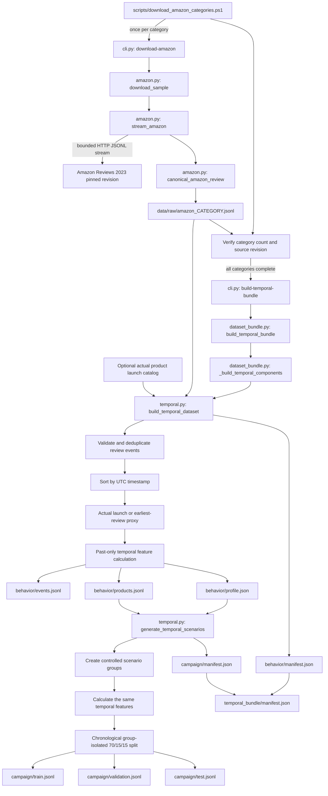

# Dataset Generation and Temporal Campaign Flow

This document describes the dataset that is currently generated and the exact scripts
that create it.

The authoritative temporal output is:

```text
data/processed/temporal_bundle/
```

It contains two deliberately separate datasets:

| Dataset | Meaning | Labels |
|---|---|---|
| `behavior/events.jsonl` | Observed Amazon reviews enriched with past-only temporal features | No fake or campaign labels |
| `campaign/*.jsonl` | Controlled campaign and legitimate scenarios generated from learned Amazon timing profiles | `expected_campaign` |

The independent labeled-text dataset and its optional text augmentation are not used by
this temporal-only build.

## Why the datasets remain separate

An individual suspicious review and a coordinated campaign are different prediction
problems.

- Amazon provides observed review text, users, products, ratings and timestamps, but it
  does not provide verified campaign labels.
- Assigning invented fake labels to Amazon rows would make evaluation misleading.
- Controlled scenarios provide known campaign membership without changing the original
  Amazon events.
- Text augmentation is relevant only to the separate review-text classifier. It does
  not add temporal information and was skipped for this run.

## Complete script and data flow



## What each script does

| File | Responsibility |
|---|---|
| `scripts/download_amazon_categories.ps1` | Iterates through all 33 categories, resumes safely, verifies revision/counts and starts the temporal build |
| `src/bot_campaign/cli.py` | Parses `download-amazon` and `build-temporal-bundle` commands |
| `src/bot_campaign/amazon.py` | Streams only the requested JSONL rows directly over HTTP and maps them to the canonical event schema |
| `src/bot_campaign/data.py` | Normalizes timestamps and validates canonical review events |
| `src/bot_campaign/dataset_bundle.py` | Orchestrates observed behavior and controlled scenario generation |
| `src/bot_campaign/temporal.py` | Deduplicates events, calculates launch/time features, learns profiles and creates scenario splits |

The downloader does not materialize an entire remote Amazon category in a local cache.
It stops reading the HTTP response after the requested number of JSONL records.

## Source selection and exact counts

The source is pinned to the immutable Amazon Reviews 2023 revision:

```text
2b6d039ed471f2ba5fd2acb718bf33b0a7e5598e
```

The run requests 25,000 records from each of 33 categories. The pinned
`Subscription_Boxes` source contains only 16,216 records. The pipeline keeps all of
them and does not duplicate 8,784 rows merely to force the requested limit.

```text
32 categories x 25,000 = 800,000
Subscription_Boxes     =  16,216
Raw source total       = 816,216
```

Each raw record contains `source_revision` and `metadata_provenance`. The PowerShell
script skips a completed file only when its count and pinned revision are correct. A
valid completed `.partial` file can be promoted without another download.

## Current completed build

These values come from the generated manifests, not estimates:

| Measure | Count |
|---|---:|
| Raw Amazon rows | 816,216 |
| Rejected invalid events | 2,834 |
| Duplicate review IDs removed | 1,088 |
| Valid unique observed events | 812,294 |
| Unique products | 531,153 |
| Unique users | 159,617 |
| Products with actual catalog launch | 0 |
| Products using earliest-review proxy | 531,153 |
| Controlled scenario events | 816,216 |
| Campaign training events | 571,315 |
| Campaign validation events | 122,406 |
| Campaign test events | 122,495 |

The observed-event count is calculated as:

```text
816,216 raw - 2,834 rejected - 1,088 duplicates = 812,294 observed events
```

The controlled dataset contains:

| Scenario | Records | Target |
|---|---:|---:|
| `organic` | 326,491 | `false` |
| `legitimate_launch_burst` | 163,243 | `false` |
| `coordinated_positive` | 97,945 | `true` |
| `coordinated_negative` | 65,297 | `true` |
| `paraphrased_campaign` | 40,810 | `true` |
| `off_hour_campaign` | 40,810 | `true` |
| `slow_drip_campaign` | 40,810 | `true` |
| `multi_product_campaign` | 40,810 | `true` |

Overall labels:

```text
Normal or legitimate: 489,734
Controlled campaign:  326,482
Total:                816,216
```

## Timestamp handling

### Observed Amazon timestamps

Amazon millisecond Unix timestamps are preserved and normalized to UTC ISO 8601:

```text
1997-09-10T19:22:25Z
```

No timestamp is generated for an observed Amazon review.

### Product launch time

When a trusted catalog supplies a launch time:

```text
launch_time_provenance = catalog_actual
```

No catalog was supplied for the current build. The earliest valid observed review for
each product is therefore used as a reference point:

```text
launch_time_provenance = earliest_observed_review_proxy
```

This is a relative timing proxy, not a claim about the product's real commercial launch.

### Controlled scenario timestamps

Controlled scenario timestamps are generated separately using:

- the learned per-category UTC-hour distribution;
- observed rating and verified-purchase distributions;
- observed time-since-reference quantiles;
- explicit burst, slow-drip and unusual-hour scenario rules;
- the pinned generator seed.

The learned profile stores a minimum and maximum observed timestamp for every category.
After applying launch-relative scenario rules, a generated value outside that category's
source window is deterministically reflected back into:

```text
[max(product launch/reference, category observed minimum), category observed maximum]
```

Reflection retains relative spacing better than clamping many overflow records to one
identical boundary timestamp. Consequently, controlled timestamps cannot drift into
years not represented by their Amazon category. For the current complete source, the
global observed window is 1997-09-10 through 2023-08-30.

Every generated row records:

```text
timestamp_provenance = generated_from_amazon_profile_and_scenario_rule_with_observed_bounds
```

Each generated row also records:

```text
timestamp_bound_policy = reflect_into_product_and_category_observation_window
```

## Past-only behavioral features

Each observed and controlled event includes:

| Feature | Meaning |
|---|---|
| `hours_since_launch` | Hours since actual launch or the documented proxy |
| `launch_phase` | First 24 hours, days 2–7, days 8–30 or established |
| `is_pre_launch_review` | Whether the timestamp precedes an actual supplied launch |
| `review_hour_utc` | UTC hour from 0 to 23 |
| `review_weekday_utc` | Monday=`0` through Sunday=`6` |
| `is_weekend_utc` | Saturday/Sunday indicator |
| `minutes_since_product_review` | Time since the preceding review for this product |
| `minutes_since_user_review` | Time since the preceding review by this user |
| `product_reviews_previous_1h` | Earlier product reviews in the rolling hour |
| `user_reviews_previous_24h` | Earlier user reviews in the rolling day |

Events are sorted by timestamp. The current event is added to rolling history only after
its features are calculated, preventing future-data leakage.

## Output structure

```text
data/processed/temporal_bundle/
|-- manifest.json
|-- behavior/
|   |-- events.jsonl
|   |-- products.jsonl
|   |-- profile.json
|   `-- manifest.json
`-- campaign/
    |-- train.jsonl
    |-- validation.jsonl
    |-- test.jsonl
    `-- manifest.json
```

| File | Correct use |
|---|---|
| `behavior/events.jsonl` | Observed behavior analysis, feature research and stream replay |
| `behavior/products.jsonl` | Launch/reference value and provenance for each product |
| `behavior/profile.json` | Learned category timing, rating and verification distributions |
| `campaign/train.jsonl` | Train a dedicated campaign model |
| `campaign/validation.jsonl` | Select thresholds without touching the final test set |
| `campaign/test.jsonl` | One-time final controlled evaluation |
| `manifest.json` | Counts, versions, policies, inputs and checksums |

Do not train the existing text-only `bot_campaign.cli train` command on campaign files.
That command expects the separate labeled-text schema and does not consume temporal
features.

The `campaign/` files above are the base temporal-bundle outputs. The current Ray,
Airflow and streaming runbook uses the separately generated, leakage-safe
`temporal_bundle/campaign_v3/{train,validation,test}.jsonl` splits. Generate them with
`bot_campaign.cli generate-campaign-splits`; do not substitute the older path in current
training or replay commands.

## Reproduce the current temporal build

From the repository root:

```powershell
powershell.exe -NoProfile -ExecutionPolicy Bypass -File `
  ".\scripts\download_amazon_categories.ps1" `
  -Limit 25000 `
  -BuildTemporalBundle `
  -CampaignScenarioCount 0 `
  -BundleOutputDirectory "data/processed/temporal_bundle"
```

`-CampaignScenarioCount 0` means that the controlled scenario count matches the actual
raw source total after per-category availability is applied. Completed inputs are
skipped, making the command restartable.

If the raw category files are already present, the CLI can be called directly with all
of those files as `--behavioral-input` values. The PowerShell wrapper is preferred
because it constructs and validates the complete list automatically.

## Inspect the completed outputs

Top-level counts and provenance:

```powershell
Get-Content "data/processed/temporal_bundle/manifest.json"
```

Behavior quality report:

```powershell
Get-Content "data/processed/temporal_bundle/behavior/manifest.json"
```

Controlled split and label counts:

```powershell
Get-Content "data/processed/temporal_bundle/campaign/manifest.json"
```

Example observed event:

```powershell
Get-Content "data/processed/temporal_bundle/behavior/events.jsonl" -TotalCount 1 |
  ConvertFrom-Json |
  Format-List
```

Example controlled campaign-training event:

```powershell
Get-Content "data/processed/temporal_bundle/campaign/train.jsonl" -TotalCount 1 |
  ConvertFrom-Json |
  Format-List
```

## Separate optional review-text pipeline

The text classifier uses:

```text
data/raw/product_reviews.jsonl
data/raw/kaggle_fake_reviews/fake reviews dataset.csv
```

Its outputs belong under `data/processed/dataset_bundle/text/`. It may optionally use
train-only text augmentation, but that process is independent of Amazon temporal data
and was not run to create `temporal_bundle`.

## Limitations and next stage

- Amazon reviews have no verified campaign ground truth.
- No actual launch catalog was supplied, so launch-based fields use an explicit proxy.
- UTC hour is used because reviewer timezone is unavailable.
- Controlled scenarios support pipeline development but do not replace human-reviewed
  real campaign examples.
- A dedicated timestamp-aware campaign trainer is the next implementation stage.
- The existing heuristic campaign detector and text-only review model are not substitutes
  for that trained campaign model.

Before production claims, evaluate campaign precision, recall, PR-AUC, false-alert rate,
detection delay, performance by scenario/category/time slice and performance on
human-reviewed real campaign cases.

## Git and data policy

Raw downloads and generated JSONL files remain outside Git. Commit source code, tests,
documentation and DVC metadata. Store versioned datasets in an approved DVC/MinIO
artifact store rather than the Git repository.
