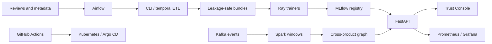

# Bot Review Campaign Detection — Complete Project Guide

This is the end-to-end operator guide. It explains the architecture, the responsibility
of every major technology, the script call graph, exact trigger commands, testing,
monitoring, versioning, and deployment.

## 1. Product behavior

The platform produces two intentionally separate outputs:

- **Review risk:** DistilBERT estimates whether one review should receive moderator attention.
- **Campaign risk:** a hybrid model evaluates coordinated groups using language, accounts,
  products, ratings, timestamps, launch proximity, and burst behavior.

An individual score is evidence, not proof. Only an authorized moderator can confirm a
campaign and apply a temporary reversible soft limit.

## 2. Architecture in one sentence

Airflow schedules ETL and training; Python canonicalizes data; Spark aggregates event-time
windows; Kafka transports replayable events; Ray trains models; MLflow tracks experiments;
FastAPI serves the final bundles and UI; Docker packages local services; Prometheus,
Grafana, and Evidently monitor them; GitHub Actions and Kubernetes/Argo CD release them.

## 3. Technology responsibilities

| Technology | Responsibility in this project |
|---|---|
| Git/GitHub | Code, tests, documentation, configuration, deployment manifests, release tags |
| DVC | Dataset/model content hashes, lockfiles, and object-store synchronization |
| Apache Airflow | Outer scheduler, retries, dependency ordering, and manual/cron triggers |
| Apache Kafka | Durable review-event transport, replay, back-pressure, and offsets |
| Apache Spark | Event-time parsing, watermarks, windows, and candidate aggregation |
| scikit-learn | TF-IDF/style Logistic Regression baseline and fallback |
| PyTorch/DistilBERT | Contextual review and campaign text representations |
| Ray Tune | Distributed hyperparameter search, ASHA decisions, and checkpoint resume |
| MLflow | Trial parameters, metrics, artifacts, registry, and model lineage |
| FastAPI | Scoring, replay, campaign, health, lineage, metrics, and static UI endpoints |
| Docker | Reproducible API and infrastructure packaging |
| Kubernetes/Argo CD | Immutable production-style rollout, probes, HPA, PDB, and rollback |
| Prometheus/Grafana | Metrics collection, dashboards, and alerting |
| Evidently | Feature, embedding, and prediction drift reports |
| GitHub Actions/Trivy | Quality gates, image builds, security scans, and staging deployment |

## 4. Folder and script map

`src/bot_campaign/data.py` loads and canonicalizes labelled text and behavioral events.
`labeled_datasets.py` normalizes ecommerce labels and creates leakage-safe text splits.
`temporal.py` creates UTC past-only features, product profiles, launch proxies, and
controlled scenarios. `synthetic.py` creates deterministic train-only text augmentation.
`dataset_bundle.py` orchestrates complete and temporal-only bundle builds.

`model.py` trains the TF-IDF Logistic Regression baseline. `review_transformer.py` loads
and scores the promoted DistilBERT bundle. `hybrid_model.py` fuses DistilBERT embeddings
with campaign numeric features. `campaign_features.py` defines the shared batch/stream
feature contract. `campaign_graph.py` discovers cross-product account/product groups.

`training/ray_review_train.py` tunes the individual review model. `training/ray_train.py`
tunes the hybrid campaign model. `streaming/producer.py` publishes Kafka events.
`spark/review_stream.py` creates event-time candidate windows. `streaming/campaign_scorer.py`
scores windows and publishes campaign alerts.

`orchestration/dags/bot_campaign_training.py` submits ETL, review training, and campaign
training Ray jobs in sequence. `src/bot_campaign/api.py` starts the FastAPI application.
`runtime.py` selects the DistilBERT bundle, stores predictions, joins campaign evidence,
and exposes monitoring/lineage data. `web/index.html`, `web/app.js`, and `web/styles.css`
implement the framework-free review console.

## 5. First-time installation

Create a Python 3.11 environment with `py -3.11 -m venv .venv`, activate it using
`.venv\Scripts\Activate.ps1`, then install with `python -m pip install -e ".[dev,nlp,campaign-training,streaming,ui]"`.

Verify Python, Docker, Git, and DVC with `python --version`, `docker --version`,
`git --version`, and `dvc doctor`. Docker Desktop needs enough WSL2 memory for Ray and
DistilBERT. The Ray Compose runtime reserves four GB shared memory.

## 6. Data flow and trigger commands

### Validate sources

Run `python -m bot_campaign.cli validate data/raw/product_reviews.jsonl --labeled` for
text labels or `python -m bot_campaign.cli validate data/raw/amazon_all_beauty_sample.jsonl`
for behavioral events. Invalid rows, duplicate IDs, missing metadata, timestamp errors,
and label problems are reported before training.

### Download Amazon behavior

Run `python -m bot_campaign.cli download-amazon --category All_Beauty --limit 25000 --output data/raw/amazon_all_beauty.jsonl`.
The adapter preserves observed products, accounts, ratings, verification, helpful votes,
categories, and timestamps. It never invents fake labels for Amazon rows.

### Build the complete bundle

Run `python -m bot_campaign.cli build-dataset-bundle --labeled-input data/raw/product_reviews.jsonl data/raw/kaggle_fake_reviews --behavioral-input data/raw/amazon_all_beauty.jsonl --product-catalog data/raw/product_catalog.jsonl --output-dir data/processed/dataset_bundle --augmentation-count 7000 --campaign-scenario-count 2000 --max-synthetic-fraction 0.25 --seed 42`.

The call chain is `cli.py -> dataset_bundle.py -> labeled_datasets.py/data.py ->
temporal.py -> synthetic.py -> manifests and JSONL outputs`.

### Build only temporal/campaign data

Run `python -m bot_campaign.cli build-temporal-bundle --behavioral-input data/raw/amazon_all_beauty.jsonl --product-catalog data/raw/product_catalog.jsonl --output-dir data/processed/temporal_bundle --campaign-scenario-count 2000 --seed 42`.
Then run `python -m bot_campaign.cli generate-campaign-splits --profile data/processed/temporal_bundle/behavior/profile.json --products data/processed/temporal_bundle/behavior/products.jsonl --output-dir data/processed/temporal_bundle/campaign_v3 --count 816216 --seed 42`.

Campaign groups remain intact in exactly one of train, validation, or test. Review text
splits use normalized-text hash guards to prevent duplicate leakage.

## 7. Model training

### Baseline

Run `python -m bot_campaign.cli train --data data/processed/dataset_bundle/text/training.jsonl --test-data data/processed/dataset_bundle/text/real/test.jsonl --baseline-data data/processed/dataset_bundle/text/real/train.jsonl --output artifacts/review_model.joblib --min-pr-auc-lift 0.05`.
This trains TF-IDF plus style features and writes `reports/generated/baseline_metrics.json`.

### Review DistilBERT

Start services with `docker compose -f docker-compose.yml -f docker-compose.gpu.yml up -d mlflow ray-head ray-worker`.
Submit the review job with the Ray Jobs API using the command in
`docs/END_TO_END_RUNBOOK.md` or `docs/TRAIN_MODEL_AND_UI.md`; it calls
`training/ray_review_train.py` with `--train-data`, `--validation-data`, `--test-data`,
`--mlflow-uri http://mlflow:5000`, `--num-samples 20`, `--epochs 2`,
`--gpus-per-trial 1`, and `--max-concurrent-trials 1`.

`--num-samples 20` means twenty hyperparameter trials, not twenty records. Ray searches
learning rate, weight decay, dropout, batch size, token length, frozen layers, warm-up,
gradient clipping, class weighting, label smoothing, and epochs. Validation PR-AUC picks
the winner; calibration and the threshold are stored in `artifacts/review_distilbert/bundle.json`.
Use `--resume` to restore an interrupted experiment from `artifacts/ray_results`.

### Hybrid campaign model

After campaign splits exist, run `training/ray_train.py` through the Ray service with
the campaign train/validation/test paths and `--output /opt/project/artifacts/campaign_model`.
It encodes up to six review texts and fuses them with group features such as burst rate,
inter-arrival variation, rating concentration, verification ratio, off-hour ratio,
weekend ratio, and launch proximity.

Open MLflow at `http://localhost:5001` to compare trials and registered models. Open Ray
at `http://localhost:8265` to inspect jobs, resources, logs, and checkpoints. Ray manages
distributed execution; MLflow records experiment lineage.

## 8. API and UI

The Compose API mounts `./artifacts/review_distilbert` read-only at
`/models/review_distilbert`. Start it with `docker compose up -d --build --force-recreate api`.
Open the UI at `http://localhost:8000`; Swagger is at `/docs`; readiness is at
`/health/ready`; operations are at `/v1/ops/summary`; metrics are at `/metrics`.

The main UI flow is: choose an example, edit the review and metadata, click **Scan review**,
watch eight progress stages, inspect risk/evidence/latency/lineage, and optionally click
**Replay campaign**. One review cannot prove a campaign; replay creates related events.

The key endpoints are `POST /v1/reviews/score`, `POST /v1/reviews/batch-score`,
`GET /v1/reviews/recent`, `GET /v1/campaigns`, `GET /v1/campaigns/{id}`,
`POST /v1/campaigns/{id}/decision`, `POST /v1/demo/replay`, `GET /v1/monitoring`,
`GET /v1/lineage`, `GET /health/live`, `GET /health/ready`, and `GET /metrics`.

## 9. Streaming flow

Start the stream profile with `docker compose --profile stream up -d kafka spark-master spark-worker spark-stream`.
The call chain is `producer.py -> Kafka reviews.raw.v1 -> review_stream.py ->
event-time watermark/window -> candidate topic -> campaign_scorer.py -> campaign_graph.py
and campaign_features.py -> hybrid_model.py -> Kafka reviews.campaign-scores.v1`.

Kafka provides durable replay and back-pressure. Spark provides distributed event-time
aggregation. The scorer commits offsets after output delivery. Inspect with
`docker compose logs -f kafka`, `docker compose logs -f spark-stream`, and the Spark UI at
`http://localhost:8082`.

## 10. Airflow scheduler

Airflow is the outer scheduler; Ray Tune is the inner hyperparameter scheduler. The DAG
sequence is `temporal ETL Ray Job -> wait -> review Ray Job -> wait -> campaign Ray Job`.
Start it using `docker compose -f orchestration/docker-compose.airflow.yml up airflow-init`
then `docker compose -f orchestration/docker-compose.airflow.yml up -d airflow-scheduler airflow-api-server`.
Open `http://localhost:8080`, enable `bot_campaign_model_retraining`, and trigger it.
The DAG defaults to manual execution because full DistilBERT training is expensive.

## 11. Monitoring

Start `docker compose up -d prometheus grafana mlflow`. Use the UI Monitoring section for
throughput, p95 latency, errors, campaign alerts, drift, and soft limits. Use Prometheus at
`http://localhost:9090` for metrics, Grafana at `http://localhost:3000` for dashboards,
MLflow at `http://localhost:5001` for training lineage, and `docker compose logs -f api`
for logs. Monitor API p95 above 150 ms, errors above 1%, Kafka lag, Spark checkpoints,
model availability, drift, alert spikes, dismissal rate, and resource saturation.

## 12. Git, DVC, and CI/CD

Use `git switch -c feat/change`, inspect `git diff`, stage explicit files, commit one
logical concern, push the branch, and open a pull request. GitHub Actions CI runs smoke
training, Airflow compilation, lint, tests, Docker BuildKit, and Trivy.

`dvc.yaml` owns processed bundle outputs. Do not run `dvc add` on those stage outputs;
run `dvc repro` to create `dvc.lock`, then commit metadata and run `dvc push` to a configured
remote such as `..\dvc-storage` or `s3://bucket/prefix`. Details are in
`docs/GIT_AND_DVC_COMMANDS.md`.

Tag a reviewed release with `git tag -a v1.1.0 -m "Bot campaign detection v1.1.0"` and
`git push origin v1.1.0`. CD builds a Git-SHA GHCR image, scans it, renders Kubernetes,
deploys staging, waits for rollout, and calls `/health/ready`. Configure the protected
GitHub `staging` environment with `KUBE_CONFIG_DATA`. Argo CD watches the deployment
manifest. Roll back with `kubectl -n bot-campaign rollout undo deployment/bot-campaign-api`.

## 13. Tests and demonstration

Run `python -m ruff check src tests training streaming spark`,
`python -m pytest -q -p no:cacheprovider`, and `python -m compileall -q orchestration/dags`.

The ten-minute demonstration should show Git history, Airflow, Ray, MLflow, Docker health,
the review UI, campaign replay, Kafka/Spark logs, Prometheus/Grafana, and GitHub Actions.
Explain the difference between real labelled text, unlabelled Amazon behavior, controlled
campaign scenarios, review risk, and campaign risk.

## 14. Troubleshooting

Model unavailable means check `bundle.json`, `model/`, `tokenizer/`, and recreate API.
First-score latency is expected lazy DistilBERT loading. Ray OOM requires stopping
unrelated containers, increasing WSL memory, using one GPU trial, and preserving four GB
shared memory. Ray Windows execution-policy errors are avoided by running Ray in Docker.
Kafka/Spark not configured means the stream profile or API environment is absent. MLflow
uses `http://mlflow:5000` inside containers and `http://localhost:5001` from the host.
DVC overlap means the path belongs to `dvc.yaml`; use `dvc repro`, not `dvc add`.

## 15. Related documents

`docs/END_TO_END_RUNBOOK.md` contains the complete command-by-command run. `docs/ETL_STREAMING_MODEL.md` explains function-level ETL, Spark, Kafka, graph, and model calls.
`docs/TECHNICAL_REPORT.md` is the end-term report. `docs/MONITORING_AND_CICD.md` covers
alerts and release operations. `docs/GIT_AND_DVC_COMMANDS.md` is the beginner Git/DVC
reference. `orchestration/README.md` covers Airflow configuration.
