# Data preparation, Kafka, and Spark

This document explains the data-engineering portion of the bot-review campaign project:
the exact inputs and outputs, scripts and call flow, local configuration, processing
guarantees, known weaknesses, and screenshots needed for a report or demonstration.

## 1. Two different data paths

1. **Offline data preparation** builds versioned training, validation, and test files.
   It uses Python, Pydantic validation, deterministic feature engineering, Airflow
   orchestration, and DVC versioning.
2. **Online stream processing** receives live review events through Kafka. Spark
   Structured Streaming creates campaign candidate windows; the hybrid model scores graph
   components; FastAPI materializes campaign alerts.

Spark does not currently build the offline training bundle. Do not state in the report
that Spark cleaned or split the offline dataset. Its implemented responsibility is live
event-time validation, routing, watermarking, windowing, and aggregation.

```mermaid
flowchart TB
    subgraph OFFLINE[Offline preparation]
        L1[Local labelled reviews] --> N[Python normalization]
        L2[Kaggle OR and CG reviews] --> N
        A[Amazon Reviews 2023] --> T[Temporal preparation]
        C[Optional product catalogue] --> T
        N --> S[Leakage-safe text splits]
        S --> X[Optional train-only augmentation]
        X --> M[Review training mixture]
        T --> P[Amazon behavior profile]
        P --> G[Controlled campaign scenarios]
        M --> DVC[DVC-versioned bundle]
        G --> DVC
    end

    subgraph ONLINE[Online campaign detection]
        R[Live review] --> K1[Kafka reviews.raw.v1]
        K1 --> SP[Spark Structured Streaming]
        SP --> K2[Kafka reviews.analysis-windows.v1]
        K2 --> GR[Cross-product graph]
        GR --> HM[Hybrid campaign model]
        HM --> K3[Kafka reviews.campaign-scores.v1]
        K3 --> API[FastAPI materializer]
        API --> UI[Campaign UI]
    end
```



## 2. Component and script map

| Component | Main file | Responsibility |
|---|---|---|
| CLI | `src/bot_campaign/cli.py` | Parses commands and invokes builders |
| Common reader | `src/bot_campaign/data.py` | Reads CSV/JSON/JSONL, maps aliases, validates rows |
| Text preparation | `src/bot_campaign/labeled_datasets.py` | Normalizes labels and creates leakage-safe splits |
| Augmentation | `src/bot_campaign/synthetic.py` | Optional deterministic train-only text variants |
| Temporal preparation | `src/bot_campaign/temporal.py` | Past-only fields, launch provenance, profiles, scenarios |
| Bundle coordinator | `src/bot_campaign/dataset_bundle.py` | Calls builders and writes top-level manifests |
| DVC | `dvc.yaml` | Declares commands, dependencies, and versioned outputs |
| Kafka producer | `streaming/producer.py` | Publishes canonical review events |
| Spark query | `spark/review_stream.py` | Creates event-time routing windows |
| Graph | `src/bot_campaign/campaign_graph.py` | Connects reviews using account, semantic, and burst edges |
| Feature contract | `src/bot_campaign/campaign_features.py` | Aggregates campaign numeric features |
| Scorer | `streaming/campaign_scorer.py` | Loads and applies the hybrid campaign model |
| API consumer | `src/bot_campaign/streaming_runtime.py` | Materializes scored Kafka candidates for the API/UI |

### 2.1 Exact function call order

The full offline bundle command follows this call chain:

```text
cli.main
  -> dataset_bundle.build_dataset_bundle
       -> labeled_datasets.prepare_product_reviews
            -> data.read_records
            -> labeled_datasets.canonical_product_review
            -> labeled_datasets._split_name
       -> synthetic.augment_product_reviews
       -> labeled_datasets.build_training_set
       -> dataset_bundle._build_temporal_components
            -> temporal.build_temporal_dataset
                 -> data.read_records
                 -> data.canonicalize_review_event
                 -> temporal._add_temporal_features
                 -> temporal._profile
            -> temporal.generate_temporal_scenarios
                 -> temporal._scenario_plan
                 -> temporal._reflect_into_observed_window
                 -> temporal._campaign_splits
```

`build-temporal-bundle` skips the labelled-text and augmentation branches and calls only
`build_temporal_bundle -> _build_temporal_components`. `generate-campaign-splits` skips
Amazon ingestion too: it reuses an existing behavior profile and product file to produce
a new campaign split such as `campaign_v3`.

The live route follows this call chain:

```text
UI or API replay
  -> streaming_runtime.publish_reviews
  -> Kafka reviews.raw.v1
  -> review_stream.main
       -> review_stream.build_analysis_windows
  -> Kafka reviews.analysis-windows.v1
  -> campaign_scorer.run
       -> campaign_inference.score_campaign_window
            -> HybridCampaignScorer.embed_texts
            -> campaign_graph.discover_campaign_groups
            -> HybridCampaignScorer.predict_with_review_embeddings
  -> Kafka reviews.campaign-scores.v1
  -> KafkaCampaignAlertConsumer
       -> campaign_alert_from_score
  -> FastAPI /v1/campaigns and UI
```

This distinction matters: Spark creates candidates; `discover_campaign_groups` creates
connected components; the trained hybrid scorer assigns risk; FastAPI only materializes
and presents the result.

## 3. Offline data preparation

### 3.1 Inputs

#### Labelled review text

Typical inputs:

```text
data/raw/product_reviews.jsonl
data/raw/kaggle_fake_reviews/fake reviews dataset.csv
```

Accepted formats are CSV, JSON, and JSONL. Common aliases are normalized:

| Canonical field | Accepted examples |
|---|---|
| Review ID | `review_id`, `id` |
| Text | `text`, `text_`, `review_text`, `reviewText`, `content` |
| Label | `label`, `is_deceptive`, `fake`, `is_fake`, `is_fake_review` |
| Rating | `rating`, `overall`, `stars`, `star_rating` |
| Category | `category`, `product_category` |

The normalized label is `0 = genuine/original` and `1 = deceptive/computer-generated`.
For the Mexwell Kaggle source, `OR` maps to 0 and `CG` maps to 1. `CG` does not prove a
bot account or coordinated campaign; it is a text-label proxy.

#### Behavioral review events

Typical inputs are `data/raw/amazon_<category>.jsonl`. Required fields are:

```text
review_id, user_id, product_id, text, rating, timestamp
```

Optional fields include verification, helpful votes, category, source, launch time, and
provenance. Amazon behavior is never given an invented fake label. It supplies realistic
time, rating, account, product, verification, and category distributions.

#### Optional product catalogue

The catalogue supplies actual launch timestamps. Without it, the earliest observed review
becomes a clearly marked proxy:

```text
launch_time_provenance = earliest_observed_review_proxy
```

That proxy must not be described as the true product launch date.

### 3.2 Validation and cleaning

`data.py` maps source fields into canonical names. Pydantic then enforces non-empty IDs,
text length, rating 1–5, non-negative helpful votes, and valid UTC-normalized timestamps.
Duplicate review IDs are rejected.

Text preparation also collapses whitespace, normalizes category names, validates labels,
rejects out-of-range ratings, removes exact case-insensitive normalized-text duplicates,
and records label/field provenance. It does not fabricate user IDs, product IDs,
timestamps, or behavior for text-only sources.

The executable project currently uses Pydantic and custom validation. Great Expectations
is not wired into the dependency set, so describe it as a future improvement rather than
an implemented component.

### 3.3 Leakage-safe splitting

The default text split is approximately 70% train, 15% validation, and 15% test. A
SHA-256 hash of the seed and normalized text-family ID selects the split, keeping
equivalent text together.

Campaign reviews are split by complete `scenario_group_id`; a generated campaign cannot
cross train, validation, and test. Campaign sentence families are also disjoint.

### 3.4 Optional augmentation

Augmentation is train-only and includes sentence reordering, same-label clause
recombination, and controlled synonym substitution. The final mixture respects
`--max-synthetic-fraction`; validation and test remain real-only. `synthetic=true` is
provenance metadata, not a feature sent to DistilBERT.

### 3.5 Temporal features

Events are sorted by timestamp. Each row receives values calculated only from earlier
events:

```text
hours_since_launch
launch_phase
is_pre_launch_review
review_hour_utc
review_weekday_utc
is_weekend_utc
minutes_since_product_review
minutes_since_user_review
product_reviews_previous_1h
user_reviews_previous_24h
```

This past-only rule prevents future information from leaking into earlier rows.

### 3.6 Behavior profile and scenarios

The Amazon profile summarizes timestamp bounds, UTC hour/weekday distributions, ratings,
verification rate, helpful-vote quantiles, launch proximity, and product/user activity.
The generator samples those distributions and applies controlled rules for organic
traffic, legitimate launch bursts, positive/negative attacks, paraphrases, off-hour
campaigns, slow drips, and multi-product campaigns.

Generated timestamps are reflected into the observed product/category time window so
they do not drift into unsupported future years.

### 3.7 Outputs

```text
data/processed/dataset_bundle/
|-- manifest.json
|-- text/
|   |-- real/train.jsonl
|   |-- real/validation.jsonl
|   |-- real/test.jsonl
|   |-- augmented_train.jsonl
|   `-- training.jsonl
|-- behavior/
|   |-- events.jsonl
|   |-- products.jsonl
|   |-- profile.json
|   `-- manifest.json
`-- campaign/
    |-- train.jsonl
    |-- validation.jsonl
    |-- test.jsonl
    `-- manifest.json
```

`temporal_bundle` contains only behavior and campaign branches. `campaign_v3` is the
separately regenerated large campaign set used by the latest campaign model. Manifests
record counts, source paths, seed, versions, split policy, timestamp bounds, provenance,
and SHA-256 digests.

The text JSONL contract contains:

```text
review_id, text, label, category, rating, source, group_id,
label_provenance, field_provenance, synthetic, split
```

The observed behavior JSONL keeps the original canonical event fields and adds the
past-only temporal fields listed in section 3.5. The campaign JSONL adds controlled
ground-truth fields such as scenario type, scenario group ID, campaign label, event role,
and generation provenance. The manifest—not a filename or assumption—is the authority
for the exact count and version of each generated output.

The completed text manifest reports 61,374 normalized labelled reviews: 42,946 real
training rows, 9,260 validation rows, and 9,168 test rows. With 7,000 train-only variants,
the review training mixture has 49,946 rows and a 14.0151% synthetic fraction.

The small example temporal manifest contains 100 Amazon events and 2,000 scenarios. Do
not use that sample as evidence that a later full multi-category bundle was built; show
the manifest from the exact full output directory.

### 3.8 Commands

```powershell
python -m bot_campaign.cli validate data/raw/product_reviews.jsonl --labeled
python -m bot_campaign.cli validate data/raw/amazon_all_beauty.jsonl
```

```powershell
python -m bot_campaign.cli build-dataset-bundle `
  --labeled-input data/raw/product_reviews.jsonl data/raw/kaggle_fake_reviews `
  --behavioral-input data/raw/amazon_all_beauty.jsonl `
  --product-catalog data/raw/product_catalog.jsonl `
  --output-dir data/processed/dataset_bundle `
  --augmentation-count 7000 `
  --campaign-scenario-count 2000 `
  --max-synthetic-fraction 0.25 `
  --seed 42
```

```powershell
python -m bot_campaign.cli build-temporal-bundle `
  --behavioral-input data/raw/amazon_all_beauty.jsonl `
  --product-catalog data/raw/product_catalog.jsonl `
  --output-dir data/processed/temporal_bundle `
  --campaign-scenario-count 2000 `
  --seed 42
```

### 3.9 DVC

`dvc.yaml` declares `build_temporal_bundle`, `build_dataset_bundle`, and
`train_product_model`.

```powershell
dvc dag
dvc status

# Full temporal/campaign branch only
dvc repro build_temporal_bundle

# Complete text + behavior + campaign bundle only
dvc repro build_dataset_bundle
```

The checked-in DVC stages now explicitly depend on all 33 downloaded Amazon category
files and request 816,216 controlled campaign events. `Subscription_Boxes` contains only
16,216 source reviews at the pinned revision, so the observed raw total is 816,216 rather
than an artificially duplicated 825,000. This is a full-data pipeline and can require
substantial disk, memory, and runtime. Run only the stage you need instead of assuming a
plain `dvc repro` will be a quick smoke test. The first successful reproduction creates
or updates `dvc.lock`; commit that lock file to record the exact dependency and output
hashes, but keep the large JSONL outputs in DVC storage rather than Git.

## 4. Kafka

### 4.1 Purpose

Kafka separates the ecommerce producer from Spark and the model scorer. It supplies a
durable ordered log per partition, replay from stored offsets, burst buffering,
independent consumer groups, measurable lag, and consumer recovery. Kafka transports
events; it does not clean offline datasets, train models, or decide campaigns.

### 4.2 Local configuration

`docker-compose.yml` runs one Kafka 4.1 broker in KRaft mode:

```text
Host listener:      localhost:9092
Container listener: kafka:29092
Controller:         kafka:29093
Replication factor: 1
Auto-create topics: enabled
```

`kafka-init` explicitly creates the main topics with three partitions and the dead-letter
topic with one partition.

| Topic | Producer | Consumer | Payload |
|---|---|---|---|
| `reviews.raw.v1` | API/platform producer | Spark | One canonical review |
| `reviews.analysis-windows.v1` | Spark | Campaign scorer | Related reviews in a route/time window |
| `reviews.campaign-scores.v1` | Campaign scorer | FastAPI | Model score and evidence |
| `reviews.campaign-scores.dlq.v1` | Campaign scorer | Operator | Invalid window and error context |

### 4.3 Raw input contract

```json
{
  "schema_version": "reviews.raw.v1",
  "review_id": "r-1001",
  "user_id": "u-22",
  "product_id": "p-phone-a",
  "text": "Excellent performance and highly recommended",
  "rating": 5,
  "timestamp": "2026-08-18T10:03:00Z",
  "verified_purchase": false,
  "helpful_votes": 0,
  "category": "electronics"
}
```

`streaming/producer.py` verifies required fields, adds `reviews.raw.v1`, keys messages by
product ID, enables idempotence, uses `acks=all`, checks delivery callbacks, and fails if
delivery is incomplete.

### 4.4 Delivery guarantee

The pipeline is **at-least-once**, not exactly-once. The scorer commits its input offset
only after the score is delivered. A crash between delivery and commit can repeat a
window. FastAPI upserts an exactly repeated graph group using its stable `group_id`.
Malformed analysis windows go to the DLQ and are committed so one poison message cannot
block a partition.

## 5. Spark Structured Streaming

### 5.1 Input validation

Spark subscribes to `reviews.raw.v1`, decodes JSON using an explicit schema, and accepts
ISO timestamps or numeric epoch seconds/milliseconds. It filters missing IDs, invalid
timestamps, text shorter than three characters, and ratings outside 1–5.

Missing category becomes `unknown`, verification becomes `false`, helpful votes become
zero, and missing launch proximity receives a large neutral default.

### 5.2 Event-time configuration

Compose uses Spark `4.0.1` with Scala 2.13 and Java 17. The master listens inside Docker
at `spark://spark-master:7077`; its browser UI is mapped to host port `8082`, and the
worker UI to `8083`. `spark-stream` submits `spark/review_stream.py` to that master and
downloads `spark-sql-kafka-0-10_2.13:4.0.1` for Kafka integration. The repository is
mounted at `/opt/project`, so the checkpoint resolves to the host project under
`data/checkpoints`. No explicit executor count, worker memory limit, or high-availability
Spark master is configured in the local Compose file.

```text
Timezone:          UTC
Watermark:         2 hours
Window:            1 hour
Slide:             10 minutes
Minimum events:    3
Max emitted events: 1,000 per window
Checkpoint:        data/checkpoints/analysis-windows-v1
Output mode:       update
```

The overlapping windows allow a campaign near a window boundary to appear in another
window. The watermark accepts delayed events for two hours; later events may be dropped.
Update mode emits active windows during a live demo. Append mode previously waited for a
later event to advance the watermark and made short replays appear stuck.

### 5.3 Cross-product routing

Every valid review is copied into three route types:

1. `product`: reviews for the same product meet.
2. `account`: the same user can connect reviews across products.
3. `semantic_token`: reviews sharing meaningful normalized tokens can meet across
   products and categories.

Up to six unique tokens of at least five characters are used. Generic review words are
excluded. Spark groups by route type, route key, and event-time window.

### 5.4 Spark output contract

Spark publishes `campaign.window.v1` to `reviews.analysis-windows.v1`:

```json
{
  "schema_version": "campaign.window.v1",
  "group_id": "semantic_token|recommended|2026-08-18 10:00:00",
  "route_type": "semantic_token",
  "route_key": "recommended",
  "event_count": 4,
  "window_start": "2026-08-18T10:00:00Z",
  "window_end": "2026-08-18T11:00:00Z",
  "events": [],
  "truncated": false
}
```

The actual `events` array contains review/user/product IDs, text, rating, timestamp,
launch context, verification, helpful votes, category, and an optional replay job ID.

### 5.5 Graph and model handoff

Spark creates candidate windows; it does not declare a campaign. The scorer embeds all
window texts with DistilBERT. The graph adds an edge for:

- the same account;
- high embedding similarity with the same rating polarity; or
- a same-product, same-polarity, unverified burst within 15 minutes.

Connected components with at least three reviews become groups. Shared aggregation
creates these numeric features:

```text
review_count
unique_user_ratio
unique_product_count
duration_minutes
reviews_per_minute
mean_interarrival_minutes
interarrival_cv
mean_rating
rating_stddev
extreme_rating_ratio
verified_purchase_ratio
mean_helpful_votes
off_hour_ratio
weekend_ratio
near_launch_ratio
```

The hybrid model produces `campaign_risk` and `candidate`, publishes the score to
`reviews.campaign-scores.v1`, and commits the analysis-window offset. FastAPI consumes the
score and exposes candidates through `/v1/campaigns` and the campaign UI.

## 6. Run the complete live path

Start Docker Desktop and run from the updated repository copy:

```powershell
docker compose --profile stream up -d --build `
  kafka kafka-init spark-master spark-worker spark-stream campaign-scorer api
```

Verify services and topics:

```powershell
docker compose ps

docker compose exec kafka `
  /opt/kafka/bin/kafka-topics.sh `
  --bootstrap-server localhost:9092 `
  --list
```

Trigger the cross-product stream:

```powershell
$body = @{
  scenario = "coordinated-cross-product"
  mode = "stream"
} | ConvertTo-Json

$job = Invoke-RestMethod -Method Post `
  -Uri "http://localhost:8000/v1/demo/replay" `
  -ContentType "application/json" `
  -Body $body

do {
  Start-Sleep -Seconds 5
  $result = Invoke-RestMethod `
    -Uri "http://localhost:8000/v1/demo/replay/$($job.job_id)"
  $result
} while ($result.status -eq "queued")
```

Inspect the handoffs:

```powershell
docker compose logs --tail 100 spark-stream campaign-scorer api

docker compose exec kafka `
  /opt/kafka/bin/kafka-console-consumer.sh `
  --bootstrap-server localhost:9092 `
  --topic reviews.campaign-scores.v1 `
  --from-beginning `
  --max-messages 5

Invoke-RestMethod http://localhost:8000/v1/campaigns
Invoke-RestMethod http://localhost:8000/v1/monitoring/summary
```

Spark UI is `http://localhost:8082`.

## 7. Current loopholes and honest limitations

### Data preparation

1. Amazon behavior has no verified campaign ground truth. Controlled scenarios cannot
   prove real-world campaign precision.
2. Kaggle `CG` is a generated-text proxy, not verified bot/campaign membership.
3. Earliest-review launch time may be later than the real product launch.
4. Hour-of-day is UTC because reviewer timezone is unavailable.
5. Missing verification/helpful-vote values are defaulted, which can blur unknown and
   observed-negative values.
6. Deduplication catches exact normalized text, not every semantic paraphrase.
7. Generated scenario/template bias can still be learned by the model.
8. The Python temporal builder materializes substantial data in memory; full-scale ETL
   should eventually be chunked or moved to Spark batch processing.
9. The full DVC stages are expensive and currently repeat temporal preparation when both
   `build_temporal_bundle` and `build_dataset_bundle` are reproduced. Run a named stage
   when only one output bundle is required.
10. Great Expectations is planned but not implemented.

### Kafka

1. The local single broker and replication factor one provide no broker failover.
2. Local Kafka has no TLS or authentication.
3. There is no Schema Registry; compatibility depends on version strings and code.
4. At-least-once processing can duplicate messages. Exact stable groups are idempotent,
   but growing partial-window membership may produce related campaign IDs.
5. No explicit local retention policy is configured, so topics can consume disk.
6. Product-key partitioning can create a hot partition for extremely popular products.
7. FastAPI stores campaigns in memory. API restart loses UI state even though Kafka
   offsets remain committed. Production needs shared PostgreSQL persistence.

### Spark and graph routing

1. Semantic pre-routing is token-based. DistilBERT only compares reviews that first meet
   through product, account, or shared-token routing. Fully paraphrased cross-product
   reviews with none of those links can be missed.
2. The one-hour candidate horizon can miss very slow campaigns even though slow-drip
   examples exist in offline training.
3. Pairwise graph similarity is O(n²) inside a window.
4. The 1,000-event slice is applied after `collect_list`; it limits the emitted payload
   but does not fully protect Spark state from a huge hot window.
5. Update mode emits evolving windows. Identical memberships share an ID, but a component
   growing from three to four reviews obtains a different stable ID.
6. Events later than the two-hour watermark may be dropped.
7. Local checkpoints are not durable distributed storage.
8. `failOnDataLoss=false` favors availability but can hide missing Kafka segments unless
   external monitoring detects them.
9. Invalid raw Spark events are filtered but are not yet written to a raw-event DLQ with
   a validation reason.

Accurate review statement:

> Python builds leakage-safe offline datasets. Kafka supplies replayable live transport.
> Spark performs event-time validation, watermarking, overlapping windows, and
> cross-product candidate routing. Graph logic and the hybrid model then score connected
> review groups. Shared persistence, Schema Registry, stronger semantic routing, and
> distributed fault tolerance remain production improvements.

## 8. Report screenshot guide

Create one folder for the evidence so that screenshots do not become mixed with source
code or datasets:

```powershell
New-Item -ItemType Directory -Force reports/screenshots/data-streaming
```

Use a terminal width that shows the full command and output. Hide usernames, tokens,
private repository URLs, and local paths if the report will be public. Add a one-line
caption under every screenshot explaining what it proves.

### Screenshot 1: source data and input schema

```powershell
Get-Content data/raw/product_reviews.jsonl -TotalCount 2
Get-Content data/raw/amazon_all_beauty.jsonl -TotalCount 2
```

Capture one labeled review and one Amazon behavioral review. The caption should say that
text supervision and temporal behavior have different sources and are not assigned the
same kind of label.

### Screenshot 2: validation and cleaning gate

```powershell
python -m bot_campaign.cli validate `
  data/raw/product_reviews.jsonl `
  --labeled

python -m bot_campaign.cli validate `
  data/raw/amazon_all_beauty.jsonl
```

Capture the accepted/rejected counts. If the exact path differs, substitute one of the
actual downloaded Amazon files. This screenshot proves that input is checked before it
is used downstream.

### Screenshot 3: dataset manifest and split sizes

```powershell
Get-Content data/processed/dataset_bundle/manifest.json |
  ConvertFrom-Json |
  ConvertTo-Json -Depth 10

Get-ChildItem data/processed/dataset_bundle/text -Recurse -Filter *.jsonl |
  ForEach-Object {
    [PSCustomObject]@{
      File = $_.FullName
      Rows = (Get-Content -LiteralPath $_.FullName | Measure-Object -Line).Lines
    }
  }
```

Capture the real train/validation/test counts, augmentation count, seed, and synthetic
fraction. This is the strongest screenshot for reproducibility and leakage-safe splits.

### Screenshot 4: one temporal feature row

```powershell
Get-Content data/processed/temporal_bundle/behavior/events.jsonl -TotalCount 1 |
  ConvertFrom-Json |
  ConvertTo-Json -Depth 10
```

The image should visibly include `event_timestamp`, product and user identifiers,
rating, verification context, and derived launch/temporal fields. Explain that these are
signals, not proof that a review is deceptive.

### Screenshot 5: one generated campaign scenario

```powershell
$campaignTest = if (Test-Path data/processed/temporal_bundle/campaign_v3/test.jsonl) {
  "data/processed/temporal_bundle/campaign_v3/test.jsonl"
} else {
  "data/processed/temporal_bundle/campaign/test.jsonl"
}

Get-Content $campaignTest -TotalCount 1 |
  ConvertFrom-Json |
  ConvertTo-Json -Depth 10
```

Capture the scenario type, campaign label, timestamps, product/account relationship, and
seed/provenance fields. The command prefers the large `campaign_v3` set used by the
trained campaign model and falls back to the standard bundle. State clearly that it is
controlled synthetic campaign ground truth used for campaign-model testing.

### Screenshot 6: DVC lineage

```powershell
dvc dag
dvc status
git status --short
```

Capture the DAG and the clean/up-to-date status. If `dvc status` reports changes, do not
claim that the displayed dataset is committed; run the relevant DVC stage and commit
`dvc.lock` first.

### Screenshot 7: Kafka and Spark services

```powershell
docker compose --profile stream ps
```

Capture Kafka, Spark master/worker, Spark stream, campaign scorer, and API as running or
healthy. Container existence alone proves deployment status, not message correctness.

### Screenshot 8: Kafka topics

```powershell
docker compose exec kafka `
  /opt/kafka/bin/kafka-topics.sh `
  --bootstrap-server localhost:9092 `
  --list
```

The result should include all four topics:

- `reviews.raw.v1`
- `reviews.analysis-windows.v1`
- `reviews.campaign-scores.v1`
- `reviews.campaign-scores.dlq.v1`

### Screenshot 9: live Spark application

Open `http://localhost:8082` and capture:

- one alive worker;
- the `cross-product-routing-windows` application in `RUNNING` state;
- cores and executor memory.

Click the application if you need evidence of active jobs and executors. A Spark master
page with no running application does not prove that Structured Streaming is active.

### Screenshot 10: live pipeline logs

```powershell
docker compose logs --tail 100 spark-stream campaign-scorer api
```

Capture the Spark query start, model load, Kafka consumption, and API consumer messages.
Avoid using a stack trace by itself; pair errors with the later successful log lines.

### Screenshot 11: scored Kafka message

First replay a campaign from the UI or API. Then run:

```powershell
docker compose exec kafka `
  /opt/kafka/bin/kafka-console-consumer.sh `
  --bootstrap-server localhost:9092 `
  --topic reviews.campaign-scores.v1 `
  --from-beginning `
  --max-messages 1
```

Capture the JSON containing the campaign ID, risk score, model/version fields, member
review IDs, and evidence. This proves the Spark-to-model handoff produced an output.

### Screenshot 12: API and UI materialization

```powershell
Invoke-RestMethod http://localhost:8000/v1/campaigns |
  ConvertTo-Json -Depth 10
```

Also capture `http://localhost:8000/#campaigns` showing the same campaign. Use matching
campaign IDs to prove that the API consumed the scored Kafka event instead of rendering
an unrelated static example.

### Screenshot 13: monitoring evidence

```powershell
Invoke-RestMethod http://localhost:8000/v1/monitoring/summary |
  ConvertTo-Json -Depth 10

Invoke-WebRequest http://localhost:8000/metrics -UseBasicParsing |
  Select-Object -ExpandProperty Content
```

In Prometheus at `http://localhost:9090`, query a real exported series such as:

```promql
campaign_alerts_total
```

Capture the API metric and its Prometheus result. This connects application activity to
monitoring rather than showing an empty Prometheus screen.

### Screenshot 14: Airflow orchestration

Open the Airflow UI, trigger `bot_campaign_streaming_smoke`, and capture its graph view
with both tasks successful:

1. `publish_cross_product_replay`
2. `wait_for_campaign_materialization`

This DAG validates and tests the streaming path. It does not permanently operate Kafka
or Spark, and the report should describe that boundary accurately.

## 9. Minimum evidence set for a short report

If the report has room for only eight images, use these:

1. Dataset manifest and real/synthetic split counts.
2. One timestamp-rich temporal event.
3. DVC DAG/status.
4. Running Compose services.
5. Kafka topic list.
6. Spark UI with the streaming application running.
7. One scored message from `reviews.campaign-scores.v1`.
8. Matching campaign in the API/UI plus one Prometheus metric.

Do not use screenshots of empty Grafana, empty Prometheus queries, the Spark master with
no application, or Kafka topics without messages as proof that the end-to-end pipeline
worked. Those show installed tools, not a functioning data flow.
