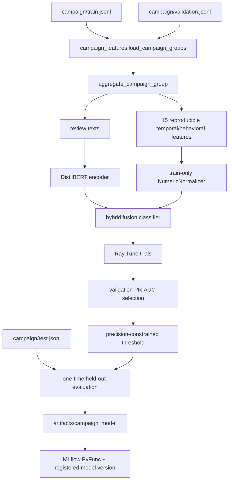
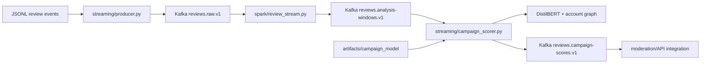

# Distributed campaign-model pipeline

## Separation of decisions

The UI review classifier and the campaign classifier solve different problems. The
small TF-IDF model estimates individual text risk. The campaign model detects group
coordination and is the only model eligible to produce campaign-level moderation
evidence. Neither model directly enforces a restriction.

## Training call graph



`training/ray_train.py` is the orchestrator. Every Ray trial loads the training and
validation split, fits numeric normalization on training groups only, fine-tunes a
DistilBERT branch and numeric branch, and reports epoch metrics to Ray. The MLflow Ray
callback records every configuration and metric. Only the selected trial touches the
test split. The saved bundle contains the encoder configuration, tokenizer, complete
state dictionary, feature order, normalization values, threshold, and lineage.

## Streaming call graph



The producer validates required fields, adds the raw schema version, uses idempotent
Kafka publishing, and fails if delivery does not complete. Spark validates events,
normalizes epoch or ISO timestamps, applies a two-hour watermark, and produces
one-hour product, account, and semantic-token routing windows every ten minutes. These
routes have no category boundary. The scorer loads model weights once,
builds semantic/account/burst connected components that may span products, calls the
same final feature aggregator used in training, publishes scores, then commits the
consumed offset synchronously.

## Smoke then full run

```powershell
python -m pip install -e ".[campaign-training,streaming]"
docker compose up -d mlflow
python training/ray_train.py --smoke --gpus-per-trial 0
```

Inspect MLflow at `http://localhost:5001` and confirm a local bundle exists. Then run
the full command in the main README on a CUDA-capable Ray cluster. CPU smoke validates
plumbing; it is not an accuracy result.

For streaming:

```powershell
docker compose up -d kafka spark-master spark-worker
docker compose --profile stream up -d spark-stream
docker compose --profile score up -d campaign-scorer
python streaming/producer.py `
  --input data/processed/temporal_bundle/campaign_v3/test.jsonl `
  --rate 100
```

## Production gates

Before assigning an MLflow `champion` alias, require campaign precision at least 0.95,
recall at least 0.80, legitimate-burst false-alert rate at most 1%, acceptable temporal
holdout/calibration results, and load tests at the target latency. Add a schema registry,
TLS/SASL, dead-letter handling, replicated Kafka/storage, and Prometheus metrics before
calling the local Compose topology production-ready.
