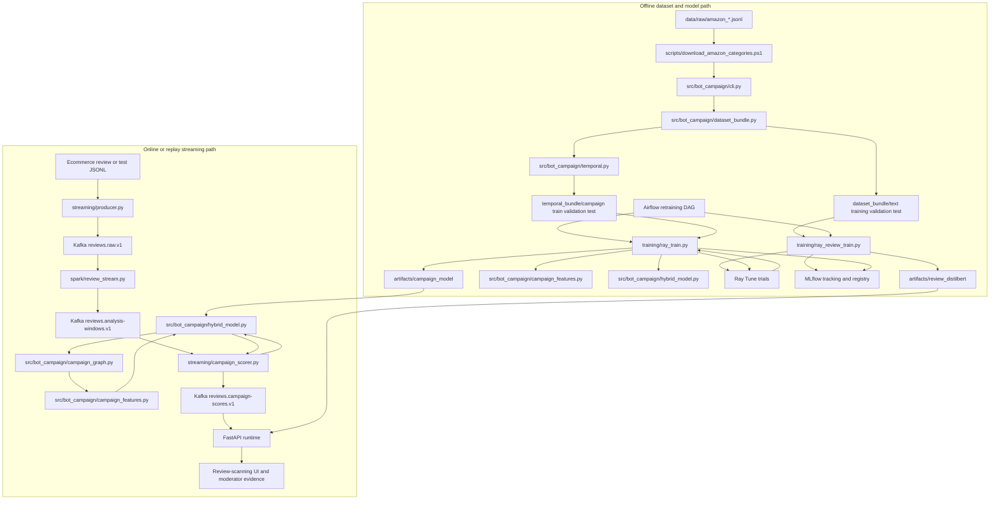

# ETL, streaming, cross-product detection, and model workflow

This document starts after `data/processed/dataset_bundle` and
`data/processed/temporal_bundle` have been generated. It explains the individual-review
DistilBERT path, the campaign model, the online Kafka/Spark scoring flow, and the
tested Docker-to-UI path. It also identifies which scripts call Python modules and
which services communicate through topics.

## Why this stage exists

A text classifier sees one review. A campaign detector must examine several reviews
together and ask whether accounts, products, language, ratings, and timing form a
coordinated pattern. This stage therefore has five responsibilities:

1. Train and version the individual-review DistilBERT model offline.
2. Train and version the hybrid campaign model offline.
3. Accept review events continuously without blocking the ecommerce application.
4. Create bounded event-time windows and infer cross-product review graphs.
5. Publish traceable review and campaign scores for the API and moderation workflow.

Kafka transports events, Spark performs distributed event-time ETL, DistilBERT builds
semantic edges, the graph stage infers groups spanning products, Ray tunes training,
and MLflow records and registers the selected model. These technologies are not
duplicates; each owns a different boundary.

## Complete script and service flow



Arrows between scripts in the offline section are direct Python or command calls.
Arrows through Kafka topics are asynchronous service integrations: the producer does
not directly call Spark, and Spark does not directly call the scorer.

## Offline model-training flow

### 1. `training/ray_review_train.py`

This is the individual-review DistilBERT training orchestrator. It:

- loads labeled ecommerce review text from the train, validation and test JSONL files;
- rejects exact normalized text shared between splits;
- requires genuine and deceptive labels in every split;
- lets Ray Tune search learning rate, weight decay, dropout, batch size, frozen encoder
  layers, sequence length, warm-up, gradient clipping, class weighting and label
  smoothing;
- chooses the best trial using validation PR-AUC;
- calibrates probabilities and chooses the decision threshold on validation data;
- evaluates the test split only after model selection;
- saves `artifacts/review_distilbert`;
- logs trials and the selected model to the `review-risk-distilbert` MLflow experiment;
- registers a calibrated MLflow PyFunc model named `review-risk-distilbert`.

The PyFunc wrapper is `ReviewPyFuncModel` in
`src/bot_campaign/review_transformer.py`. It accepts a DataFrame containing `text` and
returns `fake_probability`, `label`, and `needs_review`. The project wrapper packages
the exact API bundle and avoids the unrelated `torchvision` dependency that MLflow's
generic Transformers flavor may infer for a text-only model.

### 2. `training/ray_train.py`

This is the training orchestrator. It:

- reads the train, validation, and test paths;
- verifies that complete `scenario_group_id` values never cross splits;
- starts or attaches to Ray;
- defines the hyperparameter search space;
- runs hybrid-model trials;
- chooses the best trial using validation PR-AUC;
- selects a validation threshold satisfying the configured minimum precision;
- evaluates the test split exactly once;
- saves `artifacts/campaign_model`;
- logs parameters, metrics, lineage and artifacts to MLflow;
- creates an MLflow registered-model version.

It directly calls:

```text
campaign_features.load_campaign_groups
campaign_features.aggregate_campaign_group
hybrid_model.NumericNormalizer.fit
hybrid_model.create_tokenizer
hybrid_model.create_model
hybrid_model.encode_groups
hybrid_model.save_hybrid_bundle
```

### 3. `src/bot_campaign/campaign_features.py`

This is the single train/serve feature contract. It converts row-level reviews into one
`CampaignGroup`. Its 15 numeric features include review count, unique-user ratio,
number of products, duration, review rate, inter-arrival statistics, rating shape,
verification, helpful votes, off-hour/weekend ratios, launch proximity, and recent
product/user activity.

Scenario names, campaign IDs, split names, source labels, and provenance fields are
excluded from model inputs. That prevents label leakage. The streaming graph calls the
same aggregator, so final numeric features are not reimplemented in Spark.

### 4. `src/bot_campaign/hybrid_model.py`

This module owns:

- DistilBERT tokenization and masked-mean review embeddings;
- aggregation of several review embeddings into a group embedding;
- normalization and MLP encoding of the 15 behavioral features;
- fusion of language and behavioral branches;
- bundle save/load;
- streaming text embeddings;
- inference from already-computed graph embeddings;
- the MLflow PyFunc wrapper.

Graph discovery and classification share the same DistilBERT embedding pass during
streaming. The text is therefore not encoded twice.

### 5. Airflow, Ray and MLflow

Airflow is the outer scheduler. The DAG at
`orchestration/dags/bot_campaign_training.py` can be triggered manually or assigned a
cron. It submits the full review Ray Job, waits in reschedule mode, then submits the
full campaign Ray Job. `max_active_runs=1` prevents overlapping scheduled workflows.
It never deploys a newly registered model automatically.

Ray runs independent trials in parallel. It is not used as the event queue and it does
not replace Spark. Compose submits trainers through the Ray Jobs HTTP endpoint on port
8265; the trainer then attaches to the cluster with `--ray-address auto`. This is
intentional: a separate trainer container cannot use the head container's private
`/tmp/ray/node_ip_address.json`, and Ray Client has limitations with Tune/Train.

MLflow stores experiment history, metrics, artifacts and registered-model lineage.
Its server uses proxied artifacts with `--serve-artifacts` and
`--artifacts-destination /mlflow/artifacts`, so Ray workers never need direct access to
the MLflow container's private filesystem. The local immutable bundle lets the API and
streaming scorer start without downloading a model from MLflow for every request.

## Online ETL and scoring flow

### 1. `streaming/producer.py`

Input: canonical JSONL reviews.

Output topic: `reviews.raw.v1`.

It validates required fields, adds the schema version, keys messages by product ID,
uses Kafka idempotence and `acks=all`, polls delivery callbacks, and fails if delivery
does not finish. In production the ecommerce review service publishes the same schema;
the script exists for repeatable local replay and load testing.

### 2. `spark/review_stream.py`

Input topic: `reviews.raw.v1`.

Output topic: `reviews.analysis-windows.v1`.

Spark parses and validates events, accepts epoch-millisecond or ISO timestamps, uses
UTC event time, applies a two-hour watermark, and produces one-hour windows sliding
every ten minutes. Each event is routed three ways: by product ID, by account ID, and
by up to six meaningful normalized text tokens. Semantic-token routes are not limited
by category, so coordinated reviews across unrelated product types can reach the same
DistilBERT graph. Each window contains aligned review, account, product, category, text,
rating, launch and recent-activity fields.

Spark deliberately does not calculate final model features. It owns scalable ETL,
late-event handling, window closure and checkpoints. Final features depend on inferred
graph components, which do not exist until semantic/account edges are built.

Windows are capped at 1,000 events and carry `truncated=true` when the source count is
larger. Production should partition extremely busy categories more finely or route
truncated windows to a larger-capacity graph service rather than silently treating them
as complete.

### 3. `streaming/campaign_scorer.py`

Input topic: `reviews.analysis-windows.v1`.

Output topic: `reviews.campaign-scores.v1`.

The process loads `artifacts/campaign_model` once. For each window it:

1. embeds every review with the trained DistilBERT encoder;
2. calls `campaign_graph.discover_campaign_groups`;
3. calls the shared feature aggregator for each connected component;
4. classifies each component using its existing embeddings and numeric features;
5. publishes zero or more scored campaigns;
6. flushes successful deliveries;
7. commits the input Kafka offset synchronously.

An empty window result is valid and its offset is still committed. A malformed message
or failed output delivery raises an error and prevents the offset from being committed.

### 4. `src/bot_campaign/campaign_graph.py`

Nodes are reviews from the same routing/time window. An undirected edge is created
when at least one strong coordination relation exists:

- the same account reviews more than one product;
- DistilBERT cosine similarity exceeds the configured threshold and ratings have the
  same polarity;
- unverified reviews for the same product share rating polarity and arrive within the
  configured burst interval.

Connected components with at least three reviews become candidate campaign groups.
A component may contain one product or several products. The emitted score explicitly
sets `campaign_scope` to `single_product` or `cross_product` and includes all product
and review IDs.

## Topic contracts

| Topic | Producer | Consumer | Content |
|---|---|---|---|
| `reviews.raw.v1` | Ecommerce service or `producer.py` | Spark | One canonical review |
| `reviews.analysis-windows.v1` | Spark | Campaign scorer | Category/time window with events |
| `reviews.campaign-scores.v1` | Campaign scorer | API/moderation sink | Connected-component risk and evidence |

Schema and feature versions are checked before inference. Changing a field meaning
requires a new topic/schema version and a compatible model release.

## Run and verify the exact end-to-end stage

The following is the primary tested path on this Windows machine. Enterprise
Application Control blocks native Ray's `raylet.exe` and PyTorch DLLs such as
`shm.dll`, so run Ray, PyTorch and model serving in Linux containers. Python 3.11 is
used inside the containers.

### 1. Verify the required datasets

```powershell
Test-Path data/processed/dataset_bundle/text/training.jsonl
Test-Path data/processed/dataset_bundle/text/real/validation.jsonl
Test-Path data/processed/dataset_bundle/text/real/test.jsonl
Test-Path data/processed/temporal_bundle/campaign_v3/train.jsonl
Test-Path data/processed/temporal_bundle/campaign_v3/validation.jsonl
Test-Path data/processed/temporal_bundle/campaign_v3/test.jsonl
```

Every command should print `True`. The individual model uses the three `text` files;
the campaign model and replay path use the three `campaign_v3` files.

### 2. Start MLflow and the Ray cluster

Open Docker Desktop and wait until it reports that the engine is running. Then run:

```powershell
docker version
docker compose up -d mlflow ray-head ray-worker
docker compose ps
```

Open:

- Ray dashboard: `http://localhost:8265`
- MLflow: `http://localhost:5001`

Ray should show one head and one worker alive. Do not start the same trainer command a
second time because its terminal appears quiet; `docker compose run` buffers some
output while the Ray Job continues. Check the Ray **Jobs** page or use:

```powershell
docker exec bot-campaign-ray-head-1 ray job list `
  --address http://127.0.0.1:8265
```

### 3. Run the individual-review smoke training

```powershell
docker compose run --rm ray-review-trainer
```

This Compose service submits `training/ray_review_train.py` through the Ray Jobs API
with `--smoke`, 128 training records, 64 validation records, 64 test records and one
epoch. It verifies plumbing and lineage; its scores are not production-quality model
acceptance results.

Successful output includes:

- `artifacts/review_distilbert/bundle.json`;
- tokenizer and DistilBERT model files below `artifacts/review_distilbert`;
- Ray trial checkpoints below ignored `artifacts/ray_results`;
- an MLflow `review-risk-distilbert` experiment;
- a selected run and a registered `review-risk-distilbert` model version.

The verified local smoke produced registered-model version `1`, selected-run ID
`1dedc648f1b6486883f789e75a22671b`, threshold `0.5515659221825991`, and model version
`review-risk-distilbert-v1`. These values identify that smoke run only; a full training
release will create a new run and registered-model version.

### Resource setup before medium or full training

Full training must not use the old unconstrained scheduling behavior. Both Ray trainers
now default to `--max-concurrent-trials 1`. This matters on Docker Desktop because the
head and worker are two Ray nodes but share one physical 7.61 GiB Docker VM; their
reported resources must not be interpreted as independent machines.

The local RTX 4050 is optional. Base Compose remains CPU-compatible. To expose the GPU
only to the Ray worker, use the override file and verify CUDA before training:

```powershell
nvidia-smi

docker compose -f docker-compose.yml -f docker-compose.gpu.yml `
  up -d --force-recreate ray-worker

docker compose -f docker-compose.yml -f docker-compose.gpu.yml `
  exec ray-worker python -c `
  "import torch; print(torch.cuda.is_available(), torch.cuda.device_count())"
```

The verification must print `True 1`. If it prints `False 0`, keep
`RAY_GPUS_PER_TRIAL=0`; do not request a Ray GPU that the cluster does not advertise.

For a GPU full run, set these variables in the same PowerShell window:

```powershell
$env:RAY_MAX_CONCURRENT_TRIALS = "1"
$env:RAY_GPUS_PER_TRIAL = "1"
```

For CPU-only training, use:

```powershell
$env:RAY_MAX_CONCURRENT_TRIALS = "1"
$env:RAY_GPUS_PER_TRIAL = "0"
```

Before a full run, stop the API and unrelated Airflow or demo containers to release
memory, or raise Docker Desktop/WSL memory to at least 12-16 GiB when the host has
enough RAM. Keep MLflow, the Ray head and one Ray worker running.

To schedule this rather than running commands manually, mount `orchestration/dags`
into the Airflow 3.1 DAG directory and follow `orchestration/README.md`. Leave
`BOT_CAMPAIGN_RETRAIN_CRON` unset for manual runs initially; after acceptance testing,
set a cron such as `0 2 * * 0` for Sunday at 02:00 UTC.

### 4. Produce the campaign model required by the streaming scorer

First check whether a campaign bundle already exists:

```powershell
Test-Path artifacts/campaign_model/bundle.json
```

If it prints `False`, run a bounded campaign smoke job to validate campaign training,
MLflow registration and artifact creation:

```powershell
docker compose run --rm ray-trainer `
  ray job submit `
  --address http://ray-head:8265 `
  -- `
  python /opt/project/training/ray_train.py `
  --ray-address auto `
  --mlflow-uri http://mlflow:5000 `
  --ray-storage-path /opt/project/artifacts/ray_results `
  --train-data /opt/project/data/processed/temporal_bundle/campaign_v3/train.jsonl `
  --validation-data /opt/project/data/processed/temporal_bundle/campaign_v3/validation.jsonl `
  --test-data /opt/project/data/processed/temporal_bundle/campaign_v3/test.jsonl `
  --output /opt/project/artifacts/campaign_model `
  --smoke `
  --gpus-per-trial 0 `
  --max-concurrent-trials 1
```

For full campaign training after the smoke path passes, run the Compose service's
normal command:

```powershell
docker compose -f docker-compose.yml -f docker-compose.gpu.yml `
  run --rm ray-trainer
```

That full command uses all `campaign_v3` groups and the search settings in
`training/ray_train.py`. Do not launch the streaming scorer until
`artifacts/campaign_model/bundle.json` exists.

### 5. Build and start the API and review UI

The API image installs CPU-only PyTorch for serving. GPU/CUDA training dependencies
remain in the Ray training image. The API does not train a model during image creation;
it mounts the promoted bundle read-only. Compose also sets `WEB_DIR=/app/web` because
the installed Python package cannot infer the container UI directory reliably.

```powershell
docker compose build api
docker compose up -d --force-recreate api
docker compose ps api
docker compose logs --tail 100 api
```

Verify readiness:

```powershell
Invoke-RestMethod http://localhost:8000/health/ready
```

Submit an actual review to DistilBERT:

```powershell
$review = @{
  review_id = "readme-e2e-1"
  user_id = "demo-user"
  product_id = "demo-product"
  text = "Amazing miracle product buy now limited offer!"
  rating = 5
  timestamp = "2026-07-27T16:35:00Z"
  verified_purchase = $false
  helpful_votes = 0
  language = "en"
} | ConvertTo-Json

Invoke-RestMethod `
  -Uri http://localhost:8000/v1/reviews/score `
  -Method Post `
  -ContentType "application/json" `
  -Body $review
```

Confirm that `model_version` is `review-risk-distilbert-v1`. The first request in each
API worker cold-loads DistilBERT and may take about ten seconds on CPU. A verified warm
request completed in about 59 ms; hardware and review length will change that value.

Open:

- Review scanner UI: `http://localhost:8000`
- API documentation: `http://localhost:8000/docs`
- API metrics: `http://localhost:8000/metrics`

If the browser cached a previous blank page, use `Ctrl+F5`.

### 6. Start Kafka, Spark and the cross-product scorer

```powershell
docker compose up -d kafka spark-master spark-worker
docker compose --profile stream up -d spark-stream
docker compose --profile score up -d campaign-scorer
```

Replay the held-out campaign dataset:

```powershell
python streaming/producer.py `
  --input data/processed/temporal_bundle/campaign_v3/test.jsonl `
  --bootstrap-servers localhost:9092 `
  --rate 100
```

Inspect cross-product scores:

```powershell
docker compose exec kafka /opt/kafka/bin/kafka-console-consumer.sh `
  --bootstrap-server kafka:29092 `
  --topic reviews.campaign-scores.v1 `
  --from-beginning `
  --max-messages 10
```

Look for output such as:

```json
{
  "campaign_scope": "cross_product",
  "product_ids": ["product-a", "product-b", "product-c"],
  "campaign_risk": 0.97,
  "candidate": true
}
```

Monitor process state and lag:

```powershell
docker compose ps
docker compose logs --tail 100 spark-stream campaign-scorer
docker compose exec kafka /opt/kafka/bin/kafka-consumer-groups.sh `
  --bootstrap-server kafka:29092 `
  --describe `
  --group campaign-scorer-v1
```

## Troubleshooting the verified local path

| Symptom | Cause | Correct action |
|---|---|---|
| `failed to connect ... dockerDesktopLinuxEngine` | Docker Desktop is stopped | Start Docker Desktop, wait for **Engine running**, then rerun `docker version`. |
| Ray and MLflow open but port 8000 does not | API is absent, starting, or unhealthy | Run `docker compose ps -a` and `docker compose logs --tail 100 api`. |
| `Directory '/usr/local/lib/python3.11/web' does not exist` | Installed package inferred the wrong UI root | Keep `WEB_DIR: /app/web` in the API Compose environment and recreate the API. |
| API is healthy but first scan is slow | A worker is cold-loading DistilBERT | Wait for that request; later requests to the loaded worker are much faster. |
| `WinError 4551` for `raylet.exe` or `shm.dll` | Windows Application Control blocked native Ray/PyTorch | Use the Docker commands in this document; reinstalling the same wheel does not fix policy enforcement. |
| `node_ip_address.json` is missing | A separate container tried to attach using another container's local Ray session files | Submit through `ray job submit` as the Compose trainer services do. |
| MLflow asks for `torchvision` | Generic Transformers flavor inferred image dependencies for a text model | Use the repository's `ReviewPyFuncModel`; do not add `torchvision`. |
| MLflow artifact upload tries to write `/mlflow` from a Ray worker | The experiment uses a legacy local artifact URI | Use the proxied MLflow artifact configuration in Compose and a new experiment. |
| Ray reports memory pressure during Tune | Several DistilBERT trials or unrelated containers share the 7.61 GiB Docker VM | Keep `--max-concurrent-trials 1`, stop unrelated containers, and increase Docker memory before a full run. |
| Ray dashboard shows GPU `N/A` | The NVIDIA GPU was not passed into the worker container | Start the worker with `docker-compose.gpu.yml`, verify `torch.cuda.is_available()`, then set `RAY_GPUS_PER_TRIAL=1`. |
| Docker reports no disk space | Images, build cache or unrelated containers filled Docker storage | Inspect with `docker system df` and Windows `Get-PSDrive C`; do not prune volumes or images blindly. |

The UI is served by FastAPI on port 8000. Port 8265 is the Ray dashboard, port 5001 is
MLflow, and port 3000 is Grafana; none of those three is the review scanner.

## What is persisted and versioned

- Kafka offsets and Spark checkpoints provide processing recovery.
- `artifacts/review_distilbert/bundle.json` records the calibrated review threshold,
  model configuration and dataset/code lineage.
- `artifacts/campaign_model/bundle.json` records feature order, normalizer, threshold and
  lineage.
- Ray trial configuration and metrics are logged to MLflow.
- MLflow registers the selected PyFunc model with tokenizer and model bundle.
- Git versions the ETL, graph, model and deployment code.
- DVC versions dataset manifests and hashes rather than committing large JSONL files.

Do not interpret a campaign probability as proof. High-confidence connected components
become moderator evidence; enforcement remains a separate audited decision.
