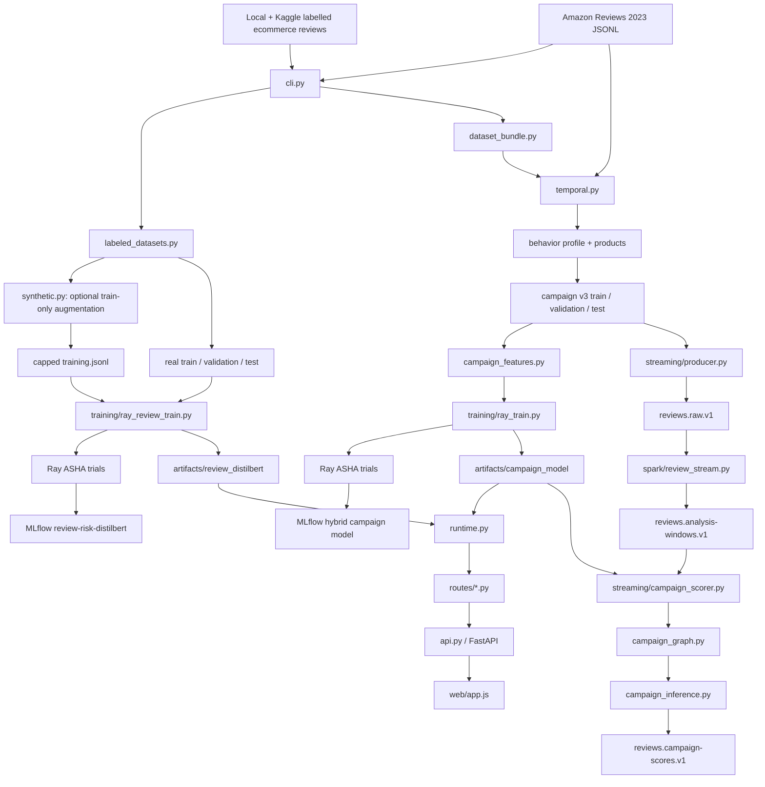

# Project script and function reference

This document is a beginner-oriented map of the active application code. Read it from
top to bottom to understand which file calls which other file. Test files are listed at
the end; generated data, caches, notebooks, and third-party packages are not executable
project source and therefore are not treated as scripts here.

## 1. Complete execution flow



## 2. Do the datasets need to be regenerated now?

### Individual-review text data: no

The current files are usable:

```text
data/processed/dataset_bundle/text/training.jsonl              49,946 rows
data/processed/dataset_bundle/text/real/validation.jsonl        9,260 rows
data/processed/dataset_bundle/text/real/test.jsonl              9,168 rows
```

They contain both labels and passed the normalized-text leakage check with no overlap.
Do not download or rebuild them merely to train the new review DistilBERT.

### Full campaign data: regenerate only when the behavior profile changes

The current leakage-safe `campaign_v3` directory is already generated from the existing
Amazon behavior profile. Reuse it for training; do not redownload the 825,000 raw
reviews or rerun text augmentation unless the source profile changes.

```powershell
python -m bot_campaign.cli generate-campaign-splits `
  --profile data/processed/temporal_bundle/behavior/profile.json `
  --products data/processed/temporal_bundle/behavior/products.jsonl `
  --output-dir data/processed/temporal_bundle/campaign_v3 `
  --count 100000 `
  --seed 42
```

If the profile changes, regenerate v3 and verify before training:

```powershell
$manifest = Get-Content `
  data/processed/temporal_bundle/campaign_v3/manifest.json | ConvertFrom-Json
$manifest.campaign_dataset_version
$manifest.split_policy
$manifest.text_holdout_policy
```

The expected version is `campaign-events-v3`.

## 3. Command entry points

### `scripts/download_amazon_categories.ps1`

This is the restartable Windows driver for all 33 Amazon categories.

- `param(...)` defines limits, output paths, Python executable, optional bundle build,
  synthetic cap, campaign count, and seed.
- `$Categories` is the canonical category list.
- `$KnownCategoryMaximumRecords` records that `Subscription_Boxes` has only 16,216
  rows; the script never duplicates rows to fake a 25,000 count.
- `Get-TextLineCount` counts a large JSONL file line by line without loading it all into
  memory.
- The main `try` block selects `.venv` Python, checks the pinned Amazon revision,
  resumes valid completed files, validates `.partial` downloads, and atomically renames
  a complete partial file.
- With `-BuildTemporalBundle`, it calls
  `python -m bot_campaign.cli build-temporal-bundle`.
- With `-BuildBundle`, it calls the combined labelled-text plus temporal build.

### `src/bot_campaign/cli.py`

`main()` parses and routes every `python -m bot_campaign.cli ...` command:

- `validate` calls `data.load_text_labels` or `data.load_review_events`.
- `train` trains the TF-IDF baseline in `model.py`; it is not the promoted DistilBERT.
- `campaigns` calls the lightweight `campaign.detect_campaigns` fallback.
- `download-amazon` calls `amazon.download_sample`.
- `build-dataset-bundle` calls `dataset_bundle.build_dataset_bundle`.
- `build-temporal-bundle` calls `dataset_bundle.build_temporal_bundle`.
- `generate-campaign-splits` calls `temporal.generate_temporal_scenarios` and is the
  correct command for the one-time v3 regeneration above.

## 4. Data loading and dataset generation

### `src/bot_campaign/data.py`

- `ValidationReport` stores accepted, rejected, duplicate, and error counts.
- `_pick` resolves alternate field names such as `reviewText` versus `text`.
- `normalize_timestamp` converts seconds, milliseconds, and ISO strings to UTC.
- `canonicalize_review_event` maps a behavioral event to the `Review` schema.
- `canonicalize_text_label` maps a supervised text row to `TextLabeledReview` without
  inventing timestamps, users, or products.
- `read_records` streams CSV, JSON, or JSONL dictionaries.
- `_load` validates rows with Pydantic and rejects duplicate IDs.
- `load_review_events` is the public behavioral-event loader.
- `load_text_labels` is the public labelled-text loader. It is called by both the CLI
  baseline and `review_transformer.load_review_split`.

### `src/bot_campaign/amazon.py`

- `canonical_amazon_review` maps Amazon fields, keeps the parent ASIN as product ID,
  preserves the observed timestamp, and records source revision/provenance.
- `stream_amazon` streams only the requested number of rows from the pinned Hugging
  Face parquet shard and handles category shards that contain fewer rows.
- `download_sample` writes canonical rows to JSONL. The PowerShell downloader writes to
  `.partial` first so a failure cannot masquerade as a complete category.

### `src/bot_campaign/labeled_datasets.py`

- `_stable_id` creates a reproducible SHA-256-derived review ID.
- `_normalized_text` collapses whitespace.
- `_deceptive_label` maps genuine/real/OR to `0` and deceptive/fake/CG to `1`; unknown
  labels are rejected instead of silently becoming neutral.
- `_normalize_category` standardizes ecommerce category names.
- `canonical_product_review` preserves observed text, label, category, and rating. Its
  `group_id` is a normalized-text fingerprint, preventing exact duplicate text from
  crossing splits.
- `_input_files` expands a file or directory into supported source files.
- `_split_name` deterministically assigns a complete text family to train, validation,
  or test from its hash and the seed.
- `prepare_product_reviews` normalizes all real labelled inputs, removes duplicates,
  writes the three real splits, and writes their manifest.
- `build_training_set` mixes real training rows with train-only generated rows, caps
  the synthetic fraction, deduplicates IDs/text, and never accepts holdout rows.

### `src/bot_campaign/synthetic.py`

- `_sentence_parts` breaks a review into reusable sentences.
- `_synonym_substitution` makes a deterministic small lexical change.
- `_augment_text` chooses between sentence recombination and synonym replacement.
- `augment_product_reviews` reads only the real training split, generates balanced
  variants for both labels, records provenance, and writes a reproducible manifest.
  It is optional; the current training file already exists.

### `src/bot_campaign/temporal.py`

- `_files` resolves one or many Amazon input paths.
- `_catalog_launches` loads actual product launch timestamps when supplied.
- `_quantiles` summarizes numerical timing distributions.
- `_distribution` converts counts into probabilities.
- `_launch_phase` maps hours since launch to a readable lifecycle bucket.
- `_add_temporal_features` sorts events by time and calculates launch age, UTC hour,
  weekday, interarrival, and prior-window counts using past rows only.
- `_profile` learns category/global hour, rating, verification, timing, and observed
  date-range distributions from Amazon behavior.
- `build_temporal_dataset` validates Amazon events, chooses catalog launch or the
  explicitly named earliest-review proxy, writes enriched events/products/profile, and
  writes data-quality lineage.
- `_holdout_text` selects text only from the sentence family reserved for that split.
- `_weighted_choice` samples a discrete Amazon profile distribution.
- `_sample_profile_quantile` samples an observed timing quantile.
- `_at_utc_hour` places a generated event at a chosen UTC hour after launch.
- `_reflect_into_observed_window` reflects an out-of-range generated timestamp back
  into the product/category observation window without piling all rows on one edge.
- `_scenario_plan` allocates organic, legitimate burst, and six campaign types.
- `_group_position` creates balanced scenario groups without tiny remainder groups.
- `_campaign_splits` orders complete groups chronologically within each scenario and
  assigns approximately 70/15/15; a group can appear in only one split.
- `generate_temporal_scenarios` creates row-level v3 events, assigns timestamps/products,
  applies split-safe text after group splitting, and writes train/validation/test plus
  hashes and policies. It is the only function that must be rerun now for full v3.

### `src/bot_campaign/dataset_bundle.py`

- `_build_temporal_components` calls `build_temporal_dataset`, then
  `generate_temporal_scenarios` exactly once.
- `build_temporal_bundle` builds behavior and campaign roles without labelled text.
- `build_dataset_bundle` orchestrates real text splitting, optional augmentation,
  capped text mixing, behavioral ETL, campaign generation, and the top-level manifest.

### `src/bot_campaign/features.py`

- `text_metadata` computes length, word count, lexical diversity, exclamation, and
  uppercase features for the TF-IDF baseline only.
- `behavioral_features` creates past-only user/product counts and means for exploratory
  analysis. These rows are not secretly fitted into the promoted review DistilBERT.

## 5. Individual-review models

### `src/bot_campaign/model.py` — retained baseline

- `build_pipeline` creates TF-IDF bigrams plus simple style features and logistic
  regression.
- `_split` makes an internal group-safe split when a separate holdout is unavailable.
- `_evaluate` calculates accuracy, precision, recall, F1, ROC-AUC, and PR-AUC.
- `train` fits/evaluates an internal baseline.
- `train_with_holdout` fits only training rows and evaluates a supplied real holdout.
- `save_bundle` writes the joblib artifact.
- `ReviewScorer.load` loads that artifact.
- `ReviewScorer.predict` returns individual text risk and clearly labels its evidence as
  baseline evidence.

### `src/bot_campaign/review_transformer.py` — promoted review model

- `ReviewTransformerConfig` versions encoder, token limit, dropout, threshold, and
  calibration temperature.
- `require_review_stack` imports PyTorch/Transformers only when this path is used.
- `create_review_model` creates DistilBERT classification with two output labels and
  applies tuned dropout to all relevant DistilBERT configuration fields.
- `create_review_tokenizer` loads the matching tokenizer.
- `load_review_split` validates a JSONL split, deterministically bounds smoke/pilot
  samples, and ensures both labels survive bounded selection.
- `assert_text_splits_are_isolated` hashes normalized text and rejects any overlap
  between train, validation, and test.
- `save_review_bundle` stores model, tokenizer, configuration, and lineage.
- `ReviewDistilBertScorer.load` loads the immutable bundle onto CUDA when available.
- `ReviewPyFuncModel.load_context` loads that same calibrated bundle for MLflow serving.
- `ReviewPyFuncModel.predict` accepts a `text` column and returns review risk plus the thresholded decision; using this project wrapper avoids unrelated image dependencies such as `torchvision`.
- `raw_probabilities` batches text and returns raw class-1 softmax probabilities.
- `calibrate` applies the validation-fitted temperature.
- `probabilities` returns calibrated probabilities.
- `predict` turns one calibrated probability into a `ReviewPrediction`; it never makes
  a campaign enforcement decision.

### `training/ray_review_train.py`

- `_git_sha` records the code commit in lineage.
- `_file_sha256` records exact train/validation/test file hashes.
- `_require_both_labels` stops invalid single-class runs.
- `_metrics` calculates discrimination, threshold, and calibration metrics.
- `_temperature` fits temperature scaling on validation probabilities only.
- `_precision_threshold` selects the highest-recall validation threshold satisfying the
  requested precision.
- `_freeze_layers` freezes a tuned number of DistilBERT layers.
- `_batch_tensors` tokenizes one training batch.
- `_evaluate` performs inference without gradients.
- `train_trial` is the function Ray runs for each configuration. It trains, reports each
  epoch, and checkpoints every epoch so ASHA-stopped trials still have usable state.
- Inner `learning_rate_factor` implements warmup followed by linear decay.
- `main` validates all splits before Ray, configures ASHA and MLflow, tunes learning
  rate, weight decay, dropout, batch size, frozen layers, max tokens, warmup, gradient
  clipping, class weighting, and label smoothing, selects by validation PR-AUC, fits
  validation calibration/threshold, evaluates test once, writes the bundle, and
  registers the model in MLflow.

## 6. Campaign feature, graph, and hybrid model

### `src/bot_campaign/campaign_features.py`

- `CampaignGroup` is one complete model example: review texts, exactly 15 numeric
  features, optional label, IDs for evidence, and window bounds.
- `CampaignGroup.as_candidate` serializes the versioned streaming contract.
- `_timestamp`, `_float`, and `_mean` safely normalize raw values.
- `aggregate_campaign_group` sorts a complete group, checks one consistent target, and
  derives counts, cross-product reach, timing, rating, verification, off-hour, weekend,
  and launch features. IDs, scenario, source, and provenance are not numeric inputs.
- `load_campaign_groups` reads row JSONL and deterministically retains complete groups
  for bounded runs; it never cuts a campaign in half.
- `iter_candidate_messages` streams saved Spark candidate JSONL.
- `campaign_group_from_candidate` validates schema/feature versions and exact feature
  presence before inference.

### `src/bot_campaign/hybrid_model.py`

- `HybridModelConfig` versions DistilBERT, review/token limits, hidden sizes, dropout,
  feature contract, and decision threshold.
- `NumericNormalizer.fit` learns mean/standard deviation from training groups only.
- `NumericNormalizer.transform` applies those stored training statistics later.
- `require_nlp_stack` imports PyTorch/Transformers lazily.
- `create_model` builds the hybrid network: shared DistilBERT review encoder, numeric
  branch, attention/masked group pooling, fusion layers, and one campaign logit.
- `create_tokenizer` loads the matching tokenizer.
- `encode_groups` pads/tokenizes a bounded number of reviews and aligns numeric data.
- `save_hybrid_bundle` writes weights, tokenizer, normalizer, config, and lineage.
- `HybridCampaignScorer.load` restores the exact bundle on CPU/GPU.
- `predict` scores offline `CampaignGroup` objects.
- `embed_texts` embeds streaming reviews once.
- `predict_with_review_embeddings` reuses those embeddings for grouped graph candidates,
  avoiding a second DistilBERT pass.
- `CampaignPyFuncModel.load_context` loads the bundle inside MLflow serving.
- `CampaignPyFuncModel.predict` adapts candidate records to MLflow PyFunc output.

### `training/ray_train.py`

- `_git_sha`, `_metrics`, and `_precision_threshold` provide lineage/evaluation/gating.
- `_freeze_encoder_layers` freezes a tuned number of DistilBERT layers.
- `_evaluate` scores validation groups.
- `train_trial` fits the numeric normalizer on training groups only, trains the hybrid
  network, reports to Ray each epoch, and always writes an ASHA-safe checkpoint.
- Inner `learning_rate_factor` supplies warmup and linear decay.
- `_validate_splits` rejects group overlap, incompatible dataset versions, and malformed
  holdouts before training starts.
- `main` tunes encoder/head learning rates, weight decay, dropout, numeric/fusion hidden
  sizes, batch size, frozen layers, review/token limits, warmup, gradient clipping, and
  class weighting. Ray selects by validation PR-AUC; test is evaluated after selection;
  MLflow stores every trial and registers the selected bundle.

### `src/bot_campaign/campaign_graph.py`

- `_timestamp` parses an event timestamp to UTC.
- `_polarity` maps ratings to negative, neutral, or positive direction.
- `_DisjointSet.find` and `union` efficiently build connected components.
- `discover_campaign_groups` validates the Spark window, computes cosine similarity on
  DistilBERT embeddings, adds account/semantic/same-product burst edges, and returns all
  components of at least the requested size. Semantic and account edges can join reviews
  across products and categories.

### `src/bot_campaign/campaign_inference.py`

- `score_campaign_window` embeds every window review once, calls graph discovery,
  scores each component with the hybrid numeric/text model, and emits versioned evidence
  including all product/review IDs and single- versus cross-product scope.

### `src/bot_campaign/campaign.py`

- `detect_campaigns` is an intentionally lightweight UI fallback used only when the
  trained hybrid artifact is absent. It uses TF-IDF similarity/account links within a
  time window and can create moderator evidence, but responses name the fallback engine.

## 7. Kafka and Spark streaming

### `streaming/producer.py`

- `produce` validates required fields, adds `reviews.raw.v1`, publishes with idempotence
  and all acknowledgements, optionally rate-limits replay, flushes, and fails on delivery
  errors.
- Inner `delivered` collects asynchronous Kafka delivery errors.
- The bottom `__main__` block parses command-line arguments and calls `produce`.

### `spark/review_stream.py`

- `_event_timestamp` parses ISO or epoch timestamps into a Spark timestamp column.
- `build_analysis_windows` validates/casts raw events, assigns event time/watermark,
  creates product/account/semantic-token routing keys, builds overlapping windows, and
  emits bounded `campaign.window.v1` messages. Multiple routes are what allow candidate
  discovery across products.
- `main` reads `reviews.raw.v1`, calls `build_analysis_windows`, and writes
  `reviews.analysis-windows.v1` with a checkpoint.

### `streaming/campaign_scorer.py`

- `run` loads the trained hybrid bundle, consumes Spark windows with auto-commit off,
  calls `score_campaign_window`, idempotently publishes scored groups, and commits the
  input offset only after output flush succeeds.
- Inner `stop` handles SIGINT/SIGTERM clean shutdown.
- The `__main__` block parses topics, model path, similarity threshold, and group size.

## 8. API, runtime, UI, and monitoring

### `src/bot_campaign/config.py`

- `Settings.from_env` creates one validated configuration object. It contains separate
  paths for TF-IDF fallback, promoted review DistilBERT, and hybrid campaign model, plus
  Git/data/feature/container/deployment lineage and safe external dashboard links.

### `src/bot_campaign/schemas.py`

- `Review` validates the live ecommerce event; its validators normalize review and
  launch timestamps to UTC.
- `TextLabeledReview` validates supervised text without fabricated behavior.
- `ReviewPrediction` keeps individual risk separate from campaign association.
- `BatchReviewRequest`, `DemoReplayRequest`, `ModerationDecision`, and `CampaignRequest`
  validate API requests.
- `CampaignAlert` validates campaign evidence and supports multiple product IDs.

### `src/bot_campaign/repository.py`

- `InMemoryRepository.__init__` creates thread-safe bounded demo storage.
- `add_review`, `recent`, and `get_review` store/read scan results.
- `campaign_candidates` retrieves bounded recent events for fallback detection.
- `upsert_campaign`, `campaigns`, `get_campaign`, and `save_campaign` manage alerts and
  moderator decisions.
- `save_replay` and `get_replay` manage demo replay status.

### `src/bot_campaign/observability.py`

- `RuntimeMetrics.__init__` initializes thread-safe rolling counters.
- `record_prediction` and `record_dismissal` update counters.
- `summary` calculates throughput, p50/p95/p99, risk, campaign, drift placeholder, and
  resource fields for the local demo. External services are never falsely health-checked.
- Inner `percentile` selects a latency percentile from the rolling window.
- `prometheus_text` converts the allow-listed summary to Prometheus exposition format.

### `src/bot_campaign/runtime.py`

- `TrustRuntime.__init__` joins settings, repository, metrics, and lazy scorers.
- `model_ready` checks promoted review bundle first, then baseline fallback.
- `model_version` exposes the actually loaded individual model version.
- `scorer` loads review DistilBERT when available; otherwise loads TF-IDF explicitly.
- `campaign_model_ready` and `campaign_scorer` validate/load the hybrid artifact.
- `score` runs individual inference, adds fallback campaign evidence from recent events,
  records latency/lineage, and stores the result.
- `replay` generates related demo reviews and uses hybrid campaign inference when its
  artifact exists; the response reports the exact engine.
- `moderate` applies confirm/dismiss/restore decisions and audit history.
- `monitoring`, `lineage`, and `operations` build allow-listed UI responses.
- `replay_reviews` creates deterministic UI examples, including cross-product replay.
- `replay_window` converts those examples to the same schema used by streaming scoring.

### `src/bot_campaign/routes/dependencies.py`

- `runtime` gets the shared `TrustRuntime` from FastAPI application state.
- `score` converts `ModelUnavailableError` to a safe HTTP 503.

### `src/bot_campaign/routes/reviews.py`

- `score_review` handles one review; `score_reviews` handles a bounded batch.
- `recent_reviews` returns the feed.
- `review_trust` returns the stored prediction/evidence.
- `prediction_lineage` returns that prediction's exact versions.

### `src/bot_campaign/routes/campaigns.py`

- `campaigns` lists alerts; `campaign` fetches one alert.
- `moderate_campaign` validates and records a moderator decision.

### `src/bot_campaign/routes/demo.py`

- `start_replay` runs a selected scenario.
- `replay_status` returns the saved replay result.

### `src/bot_campaign/routes/operations.py`

- `live` and `ready` implement liveness/readiness.
- `operations`, `monitoring`, and `lineage` serve both canonical summary endpoints and
  compatibility aliases.
- `prediction_lineage` serves `/v1/lineage/predictions/{review_id}`.
- `metrics` returns Prometheus text.

### `src/bot_campaign/api.py`

- `create_app` creates FastAPI, attaches one runtime, installs every router, and mounts
  the static frontend at `/` last so it cannot shadow API routes.
- Module-level `app` is what Uvicorn imports from `bot_campaign.api:app`.

### `web/app.js`

- `$` selects one DOM element; `setExample` fills a safe predefined example.
- `payload` reads and converts the review form.
- `resetSteps` and `animateSteps` drive the accessible eight-stage scan display.
- `fetchJson` adds timeout/error handling for API requests.
- `element` creates text-only DOM nodes; review text is never inserted as raw HTML.
- `renderResult` renders risk, evidence, latency, and lineage.
- `scanReview` animates and posts `/v1/reviews/score`.
- `replayCampaign` maps the chosen example to a replay scenario.
- `includeRecord`, `renderFeed`, and `loadFeed` implement feed filtering/rendering.
- `moderate` submits a decision; `loadCampaigns` renders campaign evidence/actions.
- `loadOps` renders services and deployed versions.
- `renderBars` creates accessible metric bars; `loadMonitoring` refreshes metrics.
- `loadLineage` renders current lineage; `health` shows readiness.
- `refreshAll` refreshes all panels without reloading the page.

### `web/index.html` and `web/styles.css`

`index.html` owns semantic sections/forms/ARIA live regions. `styles.css` owns responsive
layout and state styling. Neither contains model logic.

## 9. Deployment files

- `Dockerfile` builds the FastAPI image with the NLP runtime and a baked TF-IDF fallback.
  Compose mounts promoted artifacts at `/models/...` without hiding the fallback.
- `docker/ray.Dockerfile` builds Ray workers/trainers with PyTorch, Transformers, Ray,
  MLflow, and Kafka dependencies.
- `docker-compose.yml` connects API, Kafka, Spark, MLflow, Ray, Prometheus, and Grafana;
  optional profiles start stream, score, or training jobs. `ray-review-trainer` is the
  supported smoke-training path when Windows Enterprise Application Control blocks the
  unsigned native `raylet.exe`; Ray then runs inside the Linux Docker engine.
- `dvc.yaml` defines reproducible temporal ETL, combined-data, and TF-IDF baseline
  stages. The two Ray DistilBERT trainers are tracked in MLflow rather than DVC model
  outputs; their bundle manifests still record the DVC/data digest used for training.
- `orchestration/docker-compose.airflow.yml` runs the pinned Airflow scheduler/API and
  PostgreSQL metadata database for the checked-in DAG.
- `monitoring/prometheus.yml` tells Prometheus where to scrape `/metrics`.
- `monitoring/grafana/provisioning/` provisions the local dashboard/data source.
- `k8s/base/` contains the namespace, API/UI, Ray, ETL CronJob, MLflow, Prometheus,
  Grafana, services, persistent volumes, probes, and security settings.
- `k8s/overlays/gpu/` adds an NVIDIA GPU to Ray; `k8s/jobs/` submits full-data training.
- `deploy/argocd-application.yaml` contains GitOps application state and points Argo CD
  at the repository's `k8s` directory.
- `.github/workflows/` contains CI/CD validation and image/release automation.

## 10. Test files

| File | What it proves |
|---|---|
| `test_amazon.py` | Correct Amazon mapping, pinned streaming, bounded downloads |
| `test_data.py` | Sample labelled records validate |
| `test_labeled_datasets.py` | Label mapping, no fabricated behavior, deterministic splits, capped train-only synthesis |
| `test_synthetic.py` | Reproducible balanced train-only augmentation |
| `test_temporal.py` | Launch/proxy correctness, past-only history, bounded dates, v3 chronological/text-isolated splits |
| `test_features.py` | Past-only behavioral features and safe missing text |
| `test_model.py` | TF-IDF baseline train/save/load/predict round trip |
| `test_review_transformer.py` | Text-overlap rejection, calibration, two-class bounded loads, promoted artifact preference |
| `test_campaign_features.py` | Exact 15-feature contract, label safety, train-only normalizer, complete bounded groups |
| `test_campaign_graph.py` | Cross-product semantic graph and same-product burst graph |
| `test_campaign.py` | Lightweight fallback finds same- and cross-product examples |
| `test_streaming_scorer.py` | Scored window preserves cross-product scope and IDs |
| `test_api.py` | Health, scoring, replay, lineage, monitoring, canonical endpoints, truthful service status |
| `test_ui_contract.py` | Required scanner/operations/monitoring/lineage UI elements exist |
| `test_ui_e2e.py` | Browser scan and campaign replay; skipped unless Playwright browser is installed |

Run the complete automated check:

```powershell
python -m ruff check src tests training
python -m pytest -q -p no:cacheprovider -p no:tmpdir
```

## 11. Empty package markers

`src/bot_campaign/__init__.py` contains the package version. The route
`__init__.py` is only a package marker. Neither performs workflow work by itself.
