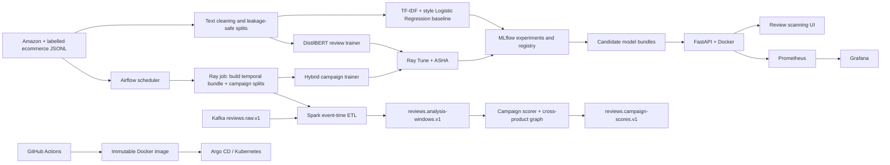

# Bot Review Campaign Detection — Technical Report

## 1. Problem statement

Ecommerce platforms receive large numbers of reviews and can be targeted by
coordinated accounts, promotional text, rating attacks, or generated content. A text
classifier is useful for moderator triage, but it cannot identify a campaign by itself.
This project therefore produces two independent decisions:

1. **Review risk** — a calibrated probability that one review needs moderator review.
2. **Campaign risk** — evidence that several reviews are coordinated in time, account,
   product, rating, and language/semantic space.

Individual review risk never applies an enforcement action. Only an authorized moderator
can confirm a campaign and apply a temporary soft limit.

## 2. Data and labels

The text pipeline consumes the ecommerce-labelled product-review files in
`data/raw/product_reviews.jsonl` and the normalized Kaggle fake-review export. Amazon
Reviews 2023 files are used as an unlabelled behavioral source. Their timestamps,
products, accounts, ratings, verification flags, and categories are retained; no fake
labels are invented for Amazon rows.

The canonical loaders in `src/bot_campaign/data.py` normalize aliases, timestamps,
ratings, IDs, missing metadata, and duplicate IDs. `labeled_datasets.py` creates
group-aware real train/validation/test splits. `temporal.py` derives past-only features
and product launch proxies. `synthetic.py` creates controlled campaign scenarios for
training only; the final evaluation split remains group-isolated and real/controlled as
declared in its manifest.

Every generated bundle contains a manifest with a schema version, seed, source
provenance, row counts, and SHA-256 digest. DVC tracks these manifests and the commands
that reproduce them; large raw files and model binaries are deliberately not committed
to Git.

## 3. Architecture



## 4. ETL and streaming

Airflow owns scheduling and retries. The DAG in
`orchestration/dags/bot_campaign_training.py` submits the data job and model jobs to the
Ray Jobs API. The data job invokes:

```text
bot_campaign.cli build-temporal-bundle
  -> bot_campaign.cli generate-campaign-splits
```

Kafka provides durable event transport (`streaming/producer.py`). Spark
(`spark/review_stream.py`) validates JSON, parses event time, applies the watermark and
window, and emits candidate windows. `streaming/campaign_scorer.py` consumes windows,
recomputes the shared feature contract, applies the hybrid model, and commits offsets
only after output delivery. `src/bot_campaign/campaign_graph.py` joins account/product/
semantic-token evidence so a campaign may span products and categories.

Spark is used for distributed event-time aggregation; Kafka is used for back-pressure,
replay, and recovery. They solve different problems and are not mocks of one another.

## 5. Model development

### Baseline

`src/bot_campaign/model.py` trains a class-balanced Logistic Regression over TF-IDF
unigrams/bigrams plus interpretable style features. It is fast, deterministic, and is a
meaningful production fallback. The CLI evaluates it on the same real-only holdout as a
candidate and refuses to promote an augmented candidate without the configured PR-AUC
lift.

### Review DistilBERT

`training/ray_review_train.py` fine-tunes `distilbert-base-uncased` for the independent
review decision. Ray Tune searches learning rate, weight decay, dropout, batch size,
sequence length, freezing, class weighting, label smoothing, and epochs. Validation
calibrates temperature and the decision threshold; the test split is read only once
after trial selection. MLflow logs each trial and registers the selected PyFunc bundle.

### Hybrid campaign model

`training/ray_train.py` combines DistilBERT embeddings with numeric temporal/behavioral
features (burst intensity, inter-arrival statistics, rating concentration, verification,
UTC-hour, weekend, launch proximity, and recent activity). Scenario IDs, labels,
provenance, and future-derived values are excluded from model inputs. Groups are kept
intact across splits to prevent campaign leakage. Ray Tune and MLflow provide the same
trial lineage and final test gate.

Required metrics are PR-AUC, ROC-AUC, precision, recall, F1, Brier/log loss, campaign
precision/recall, and legitimate-burst false-alert rate. Smoke runs verify wiring only;
they are not production quality claims.

## 6. Deployment

The FastAPI service (`src/bot_campaign/api.py`) serves the UI and versioned scoring,
campaign, lineage, health, and metrics endpoints. `Dockerfile` packages the API without
training during image build. Compose starts the local API, MLflow, Ray, Kafka, Spark,
Prometheus, and Grafana stack. Kubernetes manifests provide readiness/liveness probes,
replicas, autoscaling, disruption budgets, and immutable image references. Argo CD
applies the approved Git revision; candidate training never automatically replaces a
production model.

## 7. Monitoring and governance

FastAPI exports request count, latency, errors, prediction counts, and model-load status
at `/metrics`. Prometheus scrapes these metrics and Grafana supplies dashboards. Kafka
consumer lag, Spark checkpoints, model availability, drift, alert rate, and moderator
dismissals are operational signals. Logs are structured and safe for Kibana/Elastic
shipping. A prediction includes Git SHA, image digest, MLflow model/run, DVC/data
manifest, feature contract, and schema versions, making every decision traceable.

Security controls include non-root containers where supported, Trivy image scanning,
Vault/Kubernetes secret boundaries, RBAC, escaped review text, and no infrastructure
mutation from the public UI.

## 8. CI/CD and version control

`.github/workflows/ci.yml` runs lint, unit/API/UI tests, a training smoke gate, Docker
BuildKit packaging, and Trivy scanning. Pushes to the protected branch publish an image
tagged with the immutable Git SHA. Conventional Commits and semantic release tags are
used; DVC metadata, manifests, source, tests, and deployment files are committed while
raw datasets, credentials, checkpoints, local MLflow state, and model binaries remain
ignored.

## 9. Reproducible demonstration

The 10-minute demonstration should show, in this order:

1. `git log` and the protected feature branch.
2. Airflow DAG trigger and successful temporal ETL task.
3. Ray dashboard trials and the MLflow experiment/registered model.
4. Docker Compose health, FastAPI `/docs`, and the review scanner UI.
5. Kafka producer → Spark window → campaign scorer output.
6. Prometheus/Grafana latency and prediction metrics.
7. GitHub Actions result and the immutable image tag.

Use the commands in `README.md`, `docs/ETL_STREAMING_MODEL.md`, and
`orchestration/README.md`. Report smoke metrics separately from full-data acceptance
metrics and never present a synthetic-only result as real-world performance.

## 10. Limitations and future work

The public datasets do not provide verified campaign ground truth. Controlled campaign
scenarios are therefore used to test coordination logic, while Amazon behavior remains
unlabelled. Future work should add moderator-confirmed labels, multilingual encoders,
online feature stores, stronger account graph algorithms, privacy reviews, and a
shadow-mode production canary before enforcement.
