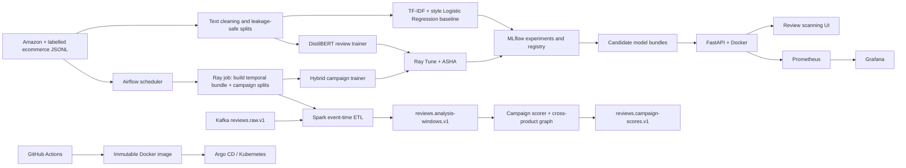

# Bot Review Campaign Detection — Technical Report

## 1. Problem statement

Ecommerce platforms receive large numbers of reviews and can be targeted by
coordinated accounts, promotional text, rating attacks, or generated content. A text
classifier is useful for moderator triage, but it cannot identify a campaign by itself.
This project therefore produces two independent decisions:

1. **Review risk** — a calibrated probability that one review needs moderator review.
2. **Campaign risk** — evidence that several reviews are coordinated in time, account,
   product, rating, and language/semantic space.

Individual review risk never applies an enforcement action. Only an authorized moderator
can confirm a campaign and apply a temporary soft limit.

## 2. Data and labels

The text pipeline consumes the ecommerce-labelled product-review files in
`data/raw/product_reviews.jsonl` and the normalized Kaggle fake-review export. Amazon
Reviews 2023 files are used as an unlabelled behavioral source. Their timestamps,
products, accounts, ratings, verification flags, and categories are retained; no fake
labels are invented for Amazon rows.

The canonical loaders in `src/bot_campaign/data.py` normalize aliases, timestamps,
ratings, IDs, missing metadata, and duplicate IDs. `labeled_datasets.py` creates
group-aware real train/validation/test splits. `temporal.py` derives past-only features
and product launch proxies. `synthetic.py` creates controlled campaign scenarios for
training only; the final evaluation split remains group-isolated and real/controlled as
declared in its manifest.

Every generated bundle contains a manifest with a schema version, seed, source
provenance, row counts, and SHA-256 digest. DVC tracks these manifests and the commands
that reproduce them; large raw files and model binaries are deliberately not committed
to Git.

## 3. Architecture



## 4. ETL and streaming

Airflow owns scheduling and retries. The DAG in
`orchestration/dags/bot_campaign_training.py` submits the data job and model jobs to the
Ray Jobs API. The data job invokes:

```text
bot_campaign.cli build-temporal-bundle
  -> bot_campaign.cli generate-campaign-splits
```

Kafka provides durable event transport (`streaming/producer.py`). Spark
(`spark/review_stream.py`) validates JSON, parses event time, applies the watermark and
window, and emits candidate windows. `streaming/campaign_scorer.py` consumes windows,
recomputes the shared feature contract, applies the hybrid model, and commits offsets
only after output delivery. `src/bot_campaign/campaign_graph.py` joins account/product/
semantic-token evidence so a campaign may span products and categories.

Spark is used for distributed event-time aggregation; Kafka is used for back-pressure,
replay, and recovery. They solve different problems and are not mocks of one another.

## 5. Model development

### Baseline

`src/bot_campaign/model.py` trains a class-balanced Logistic Regression over TF-IDF
unigrams/bigrams plus interpretable style features. It is fast, deterministic, and is a
meaningful production fallback. The CLI evaluates it on the same real-only holdout as a
candidate and refuses to promote an augmented candidate without the configured PR-AUC
lift.

### Review DistilBERT

`training/ray_review_train.py` fine-tunes `distilbert-base-uncased` for the independent
review decision. Ray Tune searches learning rate, weight decay, dropout, batch size,
sequence length, freezing, class weighting, label smoothing, and epochs. Validation
calibrates temperature and the decision threshold; the test split is read only once
after trial selection. MLflow logs each trial and registers the selected PyFunc bundle.

### Hybrid campaign model

`training/ray_train.py` combines DistilBERT embeddings with numeric temporal/behavioral
features (burst intensity, inter-arrival statistics, rating concentration, verification,
UTC-hour, weekend, launch proximity, and recent activity). Scenario IDs, labels,
provenance, and future-derived values are excluded from model inputs. Groups are kept
intact across splits to prevent campaign leakage. Ray Tune and MLflow provide the same
trial lineage and final test gate.

Required metrics are PR-AUC, ROC-AUC, precision, recall, F1, Brier/log loss, campaign
precision/recall, and legitimate-burst false-alert rate. Smoke runs verify wiring only;
they are not production quality claims.

## 6. Deployment

The FastAPI service (`src/bot_campaign/api.py`) serves the UI and versioned scoring,
campaign, lineage, health, and metrics endpoints. `Dockerfile` packages the API without
training during image build. Compose starts the local API, MLflow, Ray, Kafka, Spark,
Prometheus, and Grafana stack. Kubernetes manifests provide readiness/liveness probes,
replicas, autoscaling, disruption budgets, and immutable image references. Argo CD
applies the approved Git revision; candidate training never automatically replaces a
production model.

## 7. Monitoring and governance

FastAPI exports request count, latency, errors, prediction counts, and model-load status
at `/metrics`. Prometheus scrapes these metrics and Grafana supplies dashboards. Kafka
consumer lag, Spark checkpoints, model availability, drift, alert rate, and moderator
dismissals are operational signals. Logs are structured and safe for Kibana/Elastic
shipping. A prediction includes Git SHA, image digest, MLflow model/run, DVC/data
manifest, feature contract, and schema versions, making every decision traceable.

Security controls include non-root containers where supported, Trivy image scanning,
Vault/Kubernetes secret boundaries, RBAC, escaped review text, and no infrastructure
mutation from the public UI.

## 8. CI/CD and version control

`.github/workflows/ci.yml` runs lint, unit/API/UI tests, a training smoke gate, Docker
BuildKit packaging, and Trivy scanning. Pushes to the protected branch publish an image
tagged with the immutable Git SHA. Conventional Commits and semantic release tags are
used; DVC metadata, manifests, source, tests, and deployment files are committed while
raw datasets, credentials, checkpoints, local MLflow state, and model binaries remain
ignored.

## 9. Reproducible demonstration

The 10-minute demonstration should show, in this order:

1. `git log` and the protected feature branch.
2. Airflow DAG trigger and successful temporal ETL task.
3. Ray dashboard trials and the MLflow experiment/registered model.
4. Docker Compose health, FastAPI `/docs`, and the review scanner UI.
5. Kafka producer → Spark window → campaign scorer output.
6. Prometheus/Grafana latency and prediction metrics.
7. GitHub Actions result and the immutable image tag.

Use the commands in `README.md`, `docs/ETL_STREAMING_MODEL.md`, and
`orchestration/README.md`. Report smoke metrics separately from full-data acceptance
metrics and never present a synthetic-only result as real-world performance.

## 10. Limitations and future work

The public datasets do not provide verified campaign ground truth. Controlled campaign
scenarios are therefore used to test coordination logic, while Amazon behavior remains
unlabelled. Future work should add moderator-confirmed labels, multilingual encoders,
online feature stores, stronger account graph algorithms, privacy reviews, and a
shadow-mode production canary before enforcement.

## 11. Executive summary

This project implements an on-premises ecommerce trust platform for detecting suspicious
reviews and coordinated review campaigns. The central product decision is deliberately
split into two outputs. A single-review DistilBERT classifier produces calibrated review
risk for moderator triage. A separate hybrid campaign model combines review language
with product, account, rating, event-time, launch-proximity, and burst features. This
prevents a high text score from being treated as proof of abuse or as an automatic
enforcement decision.

The completed system includes an Airflow-orchestrated data pipeline, Kafka and Spark
streaming components, leakage-safe preprocessing, a TF-IDF Logistic Regression baseline,
Ray Tune distributed DistilBERT training, MLflow tracking, DVC metadata, FastAPI serving,
Docker packaging, Prometheus/Grafana monitoring, Evidently drift hooks, GitHub Actions,
and Kubernetes/Argo CD deployment manifests. The web console makes the complete path
visible: scan stages, evidence, campaign membership, service health, metrics, and
prediction lineage.

The promoted review model is `review-risk-distilbert-v1`. Its selected full-data Ray
trial achieved PR-AUC 0.9353, ROC-AUC 0.9215, F1 0.8308, precision 0.8005, recall 0.8635,
Brier score 0.1305, and log loss 0.4443 on the held-out validation evaluation recorded
by the training run. The untouched test result must be reported from the final evaluation
artifact when preparing the submission. Campaign metrics are reported separately because campaign
scenarios are controlled and do not represent verified platform abuse labels.

## 12. Course-requirement compliance matrix

| Requirement | Implementation in this project | Evidence |
|---|---|---|
| Git/GitHub | Feature branches, Conventional Commits, protected `main`, release tags | `git log`, GitHub repository |
| Airflow | Scheduled DAG submits ETL and training jobs with retries and single active run | `orchestration/dags/bot_campaign_training.py` |
| Additional data tool | Kafka transports review events; Spark performs event-time windows and watermarks | `streaming/`, `spark/` |
| Data processing | Canonicalization, missing-value defaults, duplicate rejection, UTC normalization, feature contracts | `src/bot_campaign/data.py`, `temporal.py` |
| Imbalance/augmentation | Class weights and train-only deterministic synthetic scenarios capped by policy | `labeled_datasets.py`, `synthetic.py` |
| Two models | TF-IDF/style Logistic Regression baseline and DistilBERT review model; separate hybrid campaign model | `model.py`, `ray_review_train.py`, `ray_train.py` |
| Metrics | PR-AUC, ROC-AUC, precision, recall, F1, Brier score, log loss, latency | Ray results, MLflow, API metrics |
| MLflow | Experiment tracking, run parameters, metrics, selected model registration | MLflow at `http://localhost:5001` |
| DVC | Pipeline metadata, lockfile workflow, remote storage instructions | `dvc.yaml`, `.dvc/`, DVC guide |
| FastAPI | Versioned score, replay, campaign, operations, lineage, health, and metrics endpoints | `src/bot_campaign/api.py`, `routes/` |
| Docker | Reproducible API, Ray, MLflow, Kafka, Spark, Prometheus, and Grafana services | `Dockerfile`, `docker-compose.yml` |
| Monitoring | Prometheus metrics, Grafana dashboards, logs, latency/prediction logging, drift fields | `observability.py`, monitoring guide |
| CI/CD | GitHub Actions quality gates, image scan, GHCR image, Kubernetes staging rollout | `.github/workflows/ci.yml`, `cd.yml` |
| Documentation | Root README, ETL/model guide, monitoring guide, Git/DVC guide, this report | `README.md`, `docs/` |

## 13. Dataset inventory and provenance

The project keeps labelled text data separate from unlabelled temporal behavior. This is
important because Amazon Reviews 2023 contains timestamps and ecommerce metadata but does
not provide a trustworthy deceptive-review label. Assigning fake labels to those rows
would create label leakage and false confidence.

| Dataset/output | Role | Current documented size |
|---|---|---:|
| Ecommerce labelled product reviews | Text supervision | Manifest-controlled; normalized by the labelled loader |
| Kaggle fake-review export | Additional ecommerce fake/real text labels | Normalized into the same schema |
| Amazon Reviews 2023 category files | Product, account, rating, timestamp and launch-behavior source | 816,216 verified downloaded rows in the current run |
| Text training split | DistilBERT training | 49,946 rows |
| Real validation split | Calibration and threshold selection | 9,260 rows |
| Real test split | Final individual-review evaluation | 9,168 rows |
| Campaign train split | Group-level hybrid campaign training | 571,312 groups |
| Campaign validation split | Campaign threshold selection | 122,405 groups |
| Campaign test split | Controlled campaign evaluation | 122,499 groups |

Every canonical event has a stable review ID, product ID, user ID, text, rating, UTC
timestamp, verified-purchase flag, helpful votes, language, category, source provenance,
and label where a label is genuinely available. Temporal features are computed from past
events only. Product launch is represented by an observed or explicitly named proxy, not
by looking into the future.

## 14. Data processing and leakage controls

The processing sequence is:

1. Load JSONL/CSV/Parquet sources through source-specific adapters.
2. Map aliases into the canonical ecommerce review schema.
3. Normalize Unicode text, whitespace, IDs, ratings, languages, and UTC timestamps.
4. Fill safe metadata defaults and reject malformed or duplicate records.
5. Build product profiles and event-time aggregates from observed history.
6. Generate controlled scenarios with deterministic seeds and provenance fields.
7. Split text by normalized-text hash and campaign data by complete scenario group.
8. Fit calibration, normalization, and class-weight parameters on training/validation data.
9. Evaluate the untouched test split only after trial selection.

The split guard stores pairwise-disjoint normalized-text SHA-256 sets. Campaign groups are
never divided across train, validation, and test. Future timestamps, scenario IDs,
expected labels, and post-event aggregates are excluded from model inputs. Synthetic text
is limited to the training policy; final evaluation is not augmented with generated text.

## 15. Model development and experiment tracking

The baseline is a class-balanced Logistic Regression over TF-IDF unigrams/bigrams and
interpretable style indicators such as repetition, uppercase ratio, punctuation density,
and promotional terms. It is fast and useful as a regression/fallback model.

The promoted review model fine-tunes DistilBERT. Ray Tune explores learning rate, weight
decay, dropout, batch size, maximum tokens, frozen encoder layers, warm-up, gradient
clipping, label smoothing, class-weight multiplier, and epochs. The best trial is chosen
using validation PR-AUC. Temperature scaling and a validation-derived threshold are
stored in `bundle.json`; the current threshold is approximately 0.7606.

The hybrid campaign model encodes up to six review texts and fuses the embedding with
numeric group features: review count, user/product uniqueness, duration, review rate,
inter-arrival statistics, rating concentration, verification ratio, helpful votes,
off-hour/weekend activity, and launch proximity. This model is not interchangeable with
the individual review classifier.

Ray provides distributed trial execution and checkpoint/resume. MLflow records the same
trial parameters, metrics, lineage tags, and selected model artifact. The Ray dashboard
shows scheduling and resource usage; MLflow is the authoritative experiment and registry
view.

### Measured result from the promoted review trial

| Metric | Value |
|---|---:|
| PR-AUC | 0.9353 |
| ROC-AUC | 0.9215 |
| F1 | 0.8308 |
| Precision | 0.8005 |
| Recall | 0.8635 |
| Brier score | 0.1305 |
| Log loss | 0.4443 |
| Epochs | 2 |
| Encoder | `distilbert-base-uncased` |
| Maximum tokens | 192 |

The repository also contains `reports/generated/baseline_metrics.json`. Its current
internal holdout contains only four records and reports 1.0 for several metrics; it is a
smoke artifact, not a statistically meaningful generalization claim. Before final
submission, regenerate the baseline on the same complete real-only test split and add the
baseline row beside the DistilBERT row. This avoids presenting a tiny smoke result as a
production comparison.

Controlled campaign trials can also produce perfect scores because their scenarios are
explicitly generated and separated by group. Those scores validate pipeline wiring and
campaign-feature behavior, not real-world prevalence or causal truth.

## 16. API and user interface

The FastAPI application serves the static console and these major endpoints:

| Endpoint | Purpose |
|---|---|
| `POST /v1/reviews/score` | Score one review with DistilBERT and campaign context |
| `POST /v1/demo/replay` | Replay controlled campaign events for demonstration |
| `GET /v1/campaigns` | List campaign evidence |
| `POST /v1/campaigns/{id}/decision` | Authorized moderator decision |
| `GET /v1/ops/summary` | Allow-listed service and lineage status |
| `GET /v1/monitoring` | Operational summary metrics |
| `GET /v1/lineage` | Current code/model/data/schema lineage |
| `GET /health/live` and `/health/ready` | Liveness and model readiness |
| `GET /metrics` | Prometheus exposition |

The primary UI flow visibly validates input, analyzes language, creates embeddings, loads
behavior, searches similar reviews, calculates review risk, checks campaign membership,
and returns evidence. Review text is inserted with DOM text APIs, never raw HTML. The UI
shows a warning that risk is evidence for human review and not proof of deception.

## 17. Deployment strategy

For local execution, Docker Compose mounts the final model bundle read-only at
`/models/review_distilbert`. The API loads the bundle lazily on the first score and then
reuses it for warm inference. MLflow is available at host port 5001, Grafana at 3000,
Prometheus at 9090, and the Ray dashboard at 8265.

The production Kubernetes manifest specifies three API replicas, resource limits,
readiness/liveness probes, an HPA, a disruption budget, non-root execution, and immutable
Git-SHA image references. Model artifact provisioning must be configured for the target
cluster (for example, a protected object-store download or model PVC); the image should
not silently fall back to an untracked model in production.

## 18. Monitoring and responsible operation

Prometheus tracks throughput, latency, errors, prediction counts, campaign alerts, and
resource signals. Grafana presents dashboards. Kafka lag and Spark checkpoint age detect
streaming failure. Logs can be shipped to Elastic/Kibana. Evidently consumes reference and
current feature/embedding distributions for drift reports.

Initial alert thresholds are p95 latency above 150 ms, API errors above 1%, Kafka lag
beyond the processing window, any model version mismatch, significant drift, campaign
alert spikes, moderator dismissal spikes, and GPU saturation. These are operational
triggers, not automatic enforcement rules. A campaign must be confirmed by an authorized
moderator before a temporary soft limit is applied.

## 19. CI/CD and reproducibility

A pull request runs installation, smoke training, Airflow compilation, Ruff, tests,
Docker BuildKit, and Trivy. A semantic release tag builds and publishes a Git-SHA image,
scans it, renders Kubernetes manifests, deploys staging, waits for rollout, and calls
`/health/ready`. Git stores source and metadata; DVC stores large content; MLflow stores
experiments and model versions.

The reproducible order is: obtain pinned source data, run the dataset command with the
recorded seed, validate manifests and split guards, run baseline and Ray training, inspect
MLflow, publish the bundle, start the API, run smoke/load tests, and observe before any
promotion. Commands are consolidated in `docs/END_TO_END_RUNBOOK.md`.

## 20. Challenges and lessons learned

The main engineering challenges were large Amazon downloads and disk pressure, temporal
leakage, Ray memory pressure on a laptop, Windows execution-policy restrictions, model
cold-start latency, and keeping local Docker service status distinct from production
health. The solutions were bounded/resumable downloads, past-only features, group-safe
splits, four-gigabyte Ray shared memory, checkpoint resume, explicit container service
names, lazy model loading, and allow-listed operations endpoints.

The project also exposed an important modeling lesson: review language alone cannot
identify a campaign. Time, account behavior, product overlap, rating concentration, and
semantic similarity must be combined at the group level. Conversely, numeric campaign
features should not be silently appended to the individual text classifier because that
would change its decision semantics and create difficult leakage boundaries.

## 21. Future improvements

1. Collect moderator-confirmed campaign labels and evaluate on a real-world temporal holdout.
2. Regenerate the full baseline comparison on the final real-only test split.
3. Provision model artifacts through a secured MLflow/object-storage Kubernetes init flow.
4. Add multilingual encoders and language-specific calibration.
5. Add a privacy-reviewed account graph feature store and online feature freshness checks.
6. Add shadow-mode canary evaluation and automated rollback gates.
7. Add cost-sensitive thresholding using moderator workload and false-alert costs.
8. Expand load testing to verify the target throughput and latency under realistic hardware.

## 22. Conclusion

Bot Review Campaign Detection demonstrates a complete production-style MLOps workflow for
ecommerce trust. The architecture separates individual review triage from coordinated
campaign evidence, uses event-time data engineering for behavior, tracks experiments and
lineage, serves a real model through FastAPI and Docker, and exposes operational health
through monitoring and CI/CD. Its measured DistilBERT result is strong on the available
held-out data, while the report explicitly identifies controlled-data and ground-truth
limitations. This separation between what is measured, what is simulated, and what still
requires production validation is central to responsible deployment.
